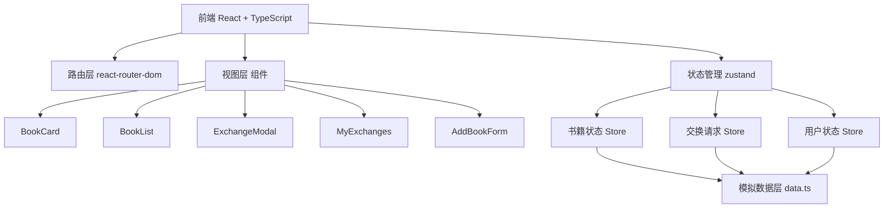
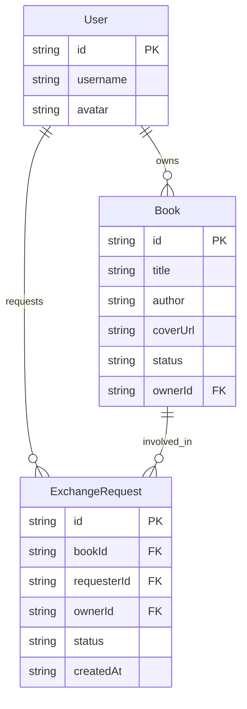

## 1. 架构设计



## 2. 技术说明

- 前端：React@18 + TypeScript + Vite
- 初始化工具：vite-init（react-ts 模板）
- 样式：Tailwind CSS + 自定义CSS动画
- 状态管理：Zustand
- 路由：react-router-dom
- 唯一ID生成：uuid
- 后端：无（纯前端模拟数据）
- 数据库：无（内存模拟数据）

## 3. 路由定义

| 路由 | 用途 |
|------|------|
| / | 首页，书籍列表+搜索+详情面板+添加书籍 |
| /exchanges | 我的交换页面，查看发起和收到的交换请求 |

## 4. 数据模型

### 4.1 数据模型定义



### 4.2 类型定义

- **Book**: id, title, author, coverUrl, status('available'|'pending'|'exchanged'), ownerId
- **User**: id, username, avatar
- **ExchangeRequest**: id, bookId, requesterId, ownerId, status('pending'|'accepted'|'rejected'), createdAt
- **BookStatus**: 'available' | 'pending' | 'exchanged'
- **ExchangeStatus**: 'pending' | 'accepted' | 'rejected'

## 5. 状态管理设计

使用 Zustand 创建以下 Store：

- **useBookStore**: 管理书籍列表、搜索过滤、添加书籍、更新书籍状态
- **useExchangeStore**: 管理交换请求列表、创建请求、接受/拒绝请求
- **useUserStore**: 管理当前登录用户信息

## 6. 组件结构

```
src/
├── types.ts          # 类型定义
├── data.ts           # 模拟数据和CRUD函数
├── store/
│   ├── bookStore.ts  # 书籍状态管理
│   ├── exchangeStore.ts  # 交换请求状态管理
│   └── userStore.ts  # 用户状态管理
├── components/
│   ├── BookCard.tsx   # 书籍卡片
│   ├── BookList.tsx   # 书籍列表（含搜索）
│   ├── ExchangeModal.tsx  # 交换请求弹窗
│   ├── AddBookForm.tsx    # 添加书籍表单
│   └── BookDetailPanel.tsx # 书籍详情面板
├── pages/
│   ├── HomePage.tsx   # 首页
│   └── MyExchanges.tsx # 我的交换
├── App.tsx            # 根组件+路由
└── main.tsx           # 入口文件
```
