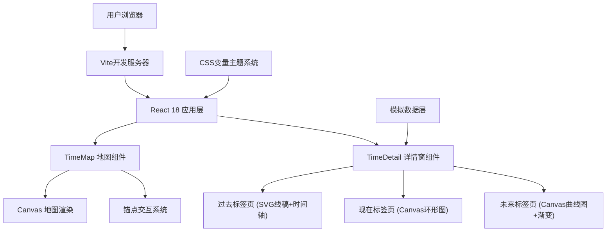

## 1. 架构设计



## 2. 技术描述

- **前端框架**：React@18 + TypeScript@5 + Vite@5
- **构建工具**：Vite 5，配置React插件和TypeScript支持
- **地图渲染**：原生Canvas 2D API实现，无需第三方地图库，轻量高性能
- **动画系统**：CSS transitions + requestAnimationFrame + 自定义弹性缓动函数
- **数据层**：内置模拟数据生成器，模拟天气、空气质量、历史年份、气候预测数据
- **依赖包**：
  - react, react-dom: 核心UI框架
  - typescript: 类型系统
  - vite, @vitejs/plugin-react: 构建工具
  - uuid: 生成唯一锚点ID
  - axios: 预留HTTP请求能力（当前用于模拟延迟请求）

## 3. 项目结构

```
├── index.html                 # 入口HTML
├── package.json              # 项目依赖
├── vite.config.js            # Vite构建配置
├── tsconfig.json             # TypeScript配置
└── src/
    ├── main.tsx              # React应用入口
    ├── App.tsx               # 根组件（状态管理）
    ├── types/
    │   └── index.ts          # 类型定义
    ├── data/
    │   └── mockData.ts       # 模拟数据
    ├── utils/
    │   ├── geo.ts            # 地理计算工具
    │   └── animation.ts      # 动画缓动函数
    ├── styles/
    │   └── global.css        # 全局样式与CSS变量
    └── components/
        ├── TimeMap.tsx       # 地图组件
        └── TimeDetail.tsx    # 详情窗组件
```

## 4. 核心组件接口

### 4.1 TimeMap 组件
```typescript
interface TimeMapProps {
  anchors: AnchorPoint[];
  onAnchorSelect: (cityId: string) => void;
}

interface AnchorPoint {
  id: string;
  cityName: string;
  description: string;
  lat: number;      // 纬度 -90 ~ 90
  lng: number;      // 经度 -180 ~ 180
}
```

### 4.2 TimeDetail 组件
```typescript
interface TimeDetailProps {
  cityId: string | null;
  onClose: () => void;
}

type TabType = 'past' | 'present' | 'future';

interface CityDetailData {
  id: string;
  cityName: string;
  past: HistoricalData[];
  present: PresentData;
  future: FutureData[];
}
```

## 5. 性能优化策略

### 5.1 地图渲染优化
- 使用Canvas 2D而非SVG渲染地图，减少DOM节点
- 地图平移时使用`transform: translate()`而非重绘
- 缩放宽高比锁定，避免频繁重计算
- 锚点点击检测使用空间分区，O(1)复杂度

### 5.2 动画优化
- 所有数值动画使用`requestAnimationFrame`
- 环形图、曲线图使用离屏Canvas预渲染
- CSS动画使用`transform`和`opacity`，触发GPU加速
- 时间轴滑块使用节流，限制每秒60次更新

### 5.3 加载优化
- 组件按需懒加载
- SVG资源内联，避免额外网络请求
- 首次加载优先级：地图骨架屏 → 锚点标记 → 详情窗资源

## 6. 响应式断点

| 断点 | 描述 | 布局变化 |
|------|------|----------|
| ≥1024px | 桌面端 | 详情窗右侧滑入，占45%宽度 |
| 768px-1024px | 平板 | 详情窗右侧滑入，占60%宽度 |
| <768px | 移动端 | 详情窗底部滑入，全屏宽度，标签可横向滚动 |
