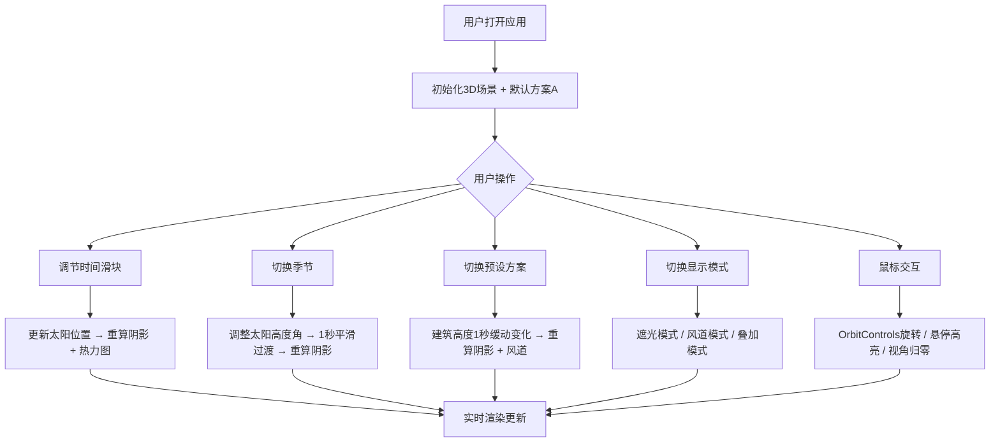

## 1. 产品概述

数字孪生城市建筑遮光与风道模拟应用，为城市规划师提供交互式3D可视化工具，直观评估不同建筑高度方案对日照时长和通风路径的影响，支持多方案快速对比分析。

- 目标用户：城市规划师、建筑师、环境评估人员
- 核心价值：实时3D遮光分析与风道模拟，多方案一键切换对比，降低方案评估时间成本

## 2. 核心功能

### 2.1 功能模块

1. **3D场景主页**：建筑群3D展示、地面网格、日照阴影、风道粒子、热力密度图、交互控制面板

### 2.2 页面详情

| 页面名称 | 模块名称 | 功能描述 |
|---------|---------|---------|
| 3D场景主页 | 建筑群管理 | 8栋不同高度矩形建筑按行列均匀分布，每栋顶部显示高度标签，支持增删改 |
| 3D场景主页 | 遮光分析 | 太阳位置随时间滑块变化，地面实时阴影投射，阴影边缘柔化，叠加橙色到蓝色热力密度图 |
| 3D场景主页 | 风道模拟 | 500个白色粒子沿流场运动，遇建筑产生涡流回旋，风速可调 |
| 3D场景主页 | 控制面板 | 时间滑块、季节选择、建筑高度预设方案A/B/C、显示模式切换、重置按钮 |
| 3D场景主页 | 交互操作 | OrbitControls旋转视角、视角归零、悬停建筑高亮+信息弹窗 |
| 3D场景主页 | 动画过渡 | 季节切换1秒平滑过渡、预设方案1秒缓动动画、背景色渐变 |

## 3. 核心流程

用户进入应用后，默认显示叠加模式下的3D建筑群场景。通过左侧控制面板调节时间滑块观察不同时段阴影变化，切换季节观察太阳轨迹差异，选择预设方案A/B/C快速对比不同建筑布局的遮光与通风效果。三种显示模式可随时切换：遮光密度图模式专注阴影分析，风道流线模式专注通风评估，叠加模式同时展示两者。

## 4. 用户界面设计

### 4.1 设计风格

- 主色调：深灰科技感渐变（#1a1a2e → #16213e）
- 辅助色：淡蓝网格线（#3a6b8c）、白灰建筑（#e0e0e0）、橙色热力（#ff6b35）、深蓝热力（#003f5c）、蓝绿粒子（#40e0d0）
- 控制面板：半透明毛玻璃卡片，滑块带微光晕效果，按钮0.2秒按压反馈
- 字体：无衬线字体，统一14px
- 布局：全屏3D场景，左下角控制面板浮层

### 4.2 页面设计概览

| 页面名称 | 模块名称 | UI元素 |
|---------|---------|--------|
| 3D场景主页 | 3D视口 | 深色渐变背景、20x20淡蓝网格地面、白灰金属质感建筑、半透明红色线框辅助体、高度标签 |
| 3D场景主页 | 阴影与热力图 | 实时阴影投射（柔化边缘）、橙→蓝渐变半透明热力密度图叠加 |
| 3D场景主页 | 风道粒子 | 500个蓝绿色半透明点粒子流线，建筑背风侧涡流回旋 |
| 3D场景主页 | 控制面板 | 毛玻璃卡片、时间滑块06:00-18:00、季节选择下拉、预设方案A/B/C按钮、显示模式切换、重置按钮 |
| 3D场景主页 | 建筑信息弹窗 | 悬停时黄色高亮线框，弹窗显示建筑ID、高度、阴影面积百分比 |

### 4.3 响应式适配

- 桌面优先，目标1920x1080分辨率
- 3D场景自动填满窗口剩余空间，窗口缩放时自适应
- 控制面板固定定位，不随窗口缩放扭曲

### 4.4 3D场景指引

- 环境：深色天空渐变，无HDRI，半球光+方向光模拟日光
- 光照：黄色点光源模拟太阳，白色半球光模拟天光，启用阴影映射
- 相机：透视相机，OrbitControls交互，支持归零到正上方俯视
- 交互：鼠标拖拽旋转、悬停建筑高亮+信息弹窗
- 性能预算：主循环≥30fps，阴影重算≤100ms，粒子更新≤10ms/frame
