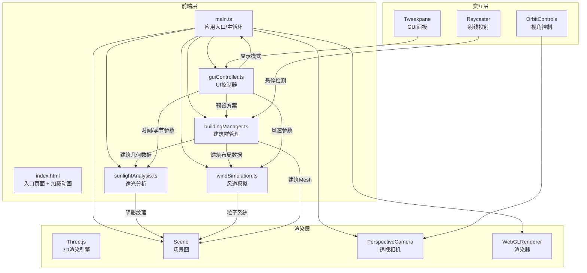

## 1. 架构设计



## 2. 技术说明

- 前端：TypeScript + Three.js@0.160.0 + Vite
- 初始化工具：Vite
- 后端：无
- 数据库：无，所有数据前端内存管理

### 数据流向

1. **用户输入** → guiController 捕获参数变化 → 通知 main.ts
2. **main.ts** → 调用 buildingManager 更新建筑数据
3. **buildingManager** → 输出建筑几何数据 → sunlightAnalysis 和 windSimulation
4. **sunlightAnalysis** → 计算阴影映射 + 热力密度图纹理 → 叠加到场景地面
5. **windSimulation** → 更新粒子位置 → 渲染到场景
6. **main.ts** → 每帧循环：更新动画 → 更新遮光 → 更新风道粒子 → 渲染

## 3. 路由定义

| 路由 | 用途 |
|-----|------|
| / | 单页3D场景应用，无路由切换 |

## 4. 文件结构

```
├── package.json          # 依赖：three@0.160.0, typescript, vite, @types/three, tweakpane
├── vite.config.js        # 构建配置，base='./'，glslify支持
├── tsconfig.json         # 严格模式，目标ES2020
├── index.html            # 入口页面，深色背景，加载动画
└── src/
    ├── main.ts           # 应用入口，初始化+主循环+模块调度
    ├── buildingManager.ts # 建筑群管理，增删改+线框辅助体
    ├── sunlightAnalysis.ts # 遮光分析，阴影映射+热力密度图
    ├── windSimulation.ts  # 风道模拟，粒子平流+涡流效果
    └── guiController.ts   # UI控制器，Tweakpane面板+参数管理
```

## 5. 模块接口定义

### buildingManager.ts

```typescript
interface BuildingData {
  id: number;
  position: { x: number; z: number };
  size: { width: number; depth: number };
  height: number;
  rotation: number;
}

class BuildingManager {
  buildings: BuildingData[];
  addBuilding(data: BuildingData): void;
  removeBuilding(id: number): void;
  updateBuilding(id: number, updates: Partial<BuildingData>): void;
  getBuildingMeshes(): THREE.Mesh[];
  getBuildingData(): BuildingData[];
  applyPreset(preset: 'A' | 'B' | 'C'): BuildingData[];
}
```

### sunlightAnalysis.ts

```typescript
interface SunlightParams {
  time: number;        // 6-18
  season: 'spring' | 'summer' | 'autumn' | 'winter';
}

class SunlightAnalysis {
  updateSunPosition(params: SunlightParams): void;
  computeShadowMap(buildings: BuildingData[]): void;
  generateHeatmap(): THREE.Texture;
  getShadowArea(buildingId: number): number;
}
```

### windSimulation.ts

```typescript
interface WindParams {
  speed: number;       // 0.5-3.0
  buildings: BuildingData[];
}

class WindSimulation {
  updateParticles(params: WindParams, deltaTime: number): void;
  getParticleSystem(): THREE.Points;
  setDisplayMode(mode: string): void;
}
```

### guiController.ts

```typescript
interface GUIState {
  time: number;
  season: string;
  preset: string;
  displayMode: string;
  windSpeed: number;
  onChange: (key: string, value: any) => void;
}

class GUIController {
  getState(): GUIState;
  dispose(): void;
}
```
