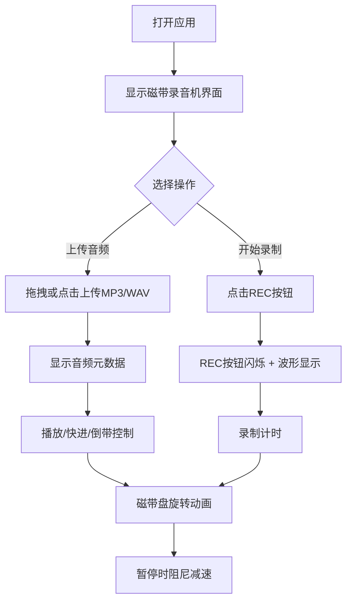

## 1. 产品概述

复古磁带录音机Web应用，为电子音乐爱好者和播客制作者提供沉浸式的磁带录制、播放和混音体验。通过精拟真的3D复古界面设计，将经典磁带录音机的操作感带到浏览器中。

- 目标用户：电子音乐爱好者、播客制作者、复古科技爱好者
- 核心价值：在网页上重现真实磁带录制、倒带和混音的怀旧体验

## 2. 核心功能

### 2.1 用户角色
| 角色 | 注册方式 | 核心权限 |
|------|----------|----------|
| 普通用户 | 无需注册 | 使用所有录音机功能，上传本地音频文件 |

### 2.2 功能模块
1. **磁带录音机界面**：3D风格渲染，双磁带盘、磁头组件、金属旋钮
2. **录制功能**：REC按钮闪烁、波形可视化、录制时长显示
3. **播放控制**：播放/暂停、快进、倒带，带阻尼动画效果
4. **音频上传**：支持MP3/WAV格式，拖拽加载，元数据显示

### 2.3 页面详情
| 页面名称 | 模块名称 | 功能描述 |
|----------|----------|----------|
| 主页面 | 磁带录音机主体 | 3D风格界面渲染，包含双磁带盘、磁头、旋钮 |
| 主页面 | 控制面板 | 播放/暂停、REC、快进、倒带按钮 |
| 主页面 | 音频可视化 | 绿色渐变波形条，峰值保持效果 |
| 主页面 | 数码管显示 | 录制/播放时长，MM:SS格式 |
| 主页面 | 文件上传区 | 拖拽上传音频文件，显示元数据 |

## 3. 核心流程

用户打开应用 → 看到复古磁带录音机界面 → 上传音频文件/开始录制 → 播放/快进/倒带控制 → 体验磁带旋转和波形动画

## 4. 用户界面设计

### 4.1 设计风格
- **主色调**：暖黄色 (#F5DEB3) 与深棕色 (#3E2723)
- **点缀色**：铜色金属质感
- **背景**：仿木纹纹理（CSS重复渐变生成）
- **按钮风格**：3D金属质感，圆形旋钮，红色REC按钮
- **字体**：复古数码管字体 + 无衬线正文
- **布局**：居中卡片式布局，磁带录音机为视觉焦点
- **动效**：磁带盘旋转、按钮弹性缩放、阻尼减速、画面抖动

### 4.2 页面设计概述
| 页面名称 | 模块名称 | UI元素 |
|----------|----------|--------|
| 主页面 | 磁带录音机主体 | 暖黄色机身、深棕色面板、铜色装饰、阴影浮雕效果 |
| 主页面 | 左供带盘 | 逆时针旋转、环形磁带条纹、金属高光 |
| 主页面 | 右收带盘 | 顺时针旋转、环形磁带条纹、金属高光 |
| 主页面 | 磁头组件 | 透明质感、位于两盘之间 |
| 主页面 | 控制面板 | 金属旋钮、REC红灯、播放/快进/倒带按钮 |
| 主页面 | 数码管显示屏 | 复古绿色/红色数码管风格，显示时长 |
| 主页面 | 音频可视化 | 绿色渐变条形图，峰值保持 |
| 主页面 | 文件上传区 | 卡片标签样式，拖拽发光边框提示 |

### 4.3 响应式
- Desktop-first 设计，移动端适配
- 触摸设备按钮最小 44x44px 触发区域
- 磁带录音机界面在小屏幕上自适应缩放

### 4.4 动画与交互
- 磁带盘匀速旋转（播放时）
- 暂停时 0.3 秒阻尼减速动画
- 快进/倒带时 2.5 倍速旋转 + 3px 画面抖动（10Hz）
- 倒带时顶部噪点条纹特效
- 按钮点击 0.15 秒弹性缩放反馈
- REC按钮 0.5 秒周期闪烁
- 波形峰值保持 0.2 秒
