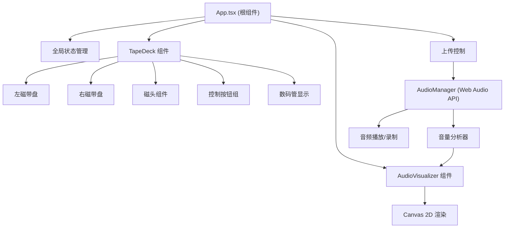

## 1. 架构设计

纯前端应用，采用 React 组件化架构，通过 Web Audio API 处理音频，CSS 动画 + Canvas 实现视觉效果。



## 2. 技术说明

- **前端框架**：React 18 + TypeScript 5
- **构建工具**：Vite 5 + @vitejs/plugin-react
- **音频处理**：Web Audio API (AudioContext, AnalyserNode, MediaRecorder)
- **可视化**：Canvas 2D API
- **样式方案**：CSS Modules / 内联样式 + CSS 动画
- **额外依赖**：html2canvas (可选截图功能)

## 3. 目录结构

```
.
├── index.html
├── package.json
├── tsconfig.json
├── vite.config.js
├── public/
└── src/
    ├── App.tsx              # 根组件，全局状态
    ├── main.tsx             # 入口文件
    ├── index.css            # 全局样式
    ├── components/
    │   ├── TapeDeck.tsx     # 磁带录音机组件
    │   └── AudioVisualizer.tsx  # 音频可视化组件
    └── utils/
        └── AudioManager.ts  # 音频管理工具
```

## 4. 核心模块说明

### 4.1 AudioManager (音频管理)
- 封装 Web Audio API 操作
- 音频加载、播放、暂停、快进、倒带
- 音量分析器创建 (AnalyserNode)
- 录制功能 (MediaRecorder API)
- 播放状态回调

### 4.2 TapeDeck 组件
- 渲染复古磁带录音机 3D 风格界面
- 双磁带盘动画（左逆右顺）
- 磁头组件
- 控制按钮组（播放/暂停、REC、快进、倒带）
- 数码管时长显示
- 拖拽上传区域

### 4.3 AudioVisualizer 组件
- Canvas 2D 实时波形绘制
- 绿色渐变条形图
- 峰值保持 0.2 秒
- requestAnimationFrame 驱动

### 4.4 App 根组件
- 全局状态：播放模式、是否录制、音频元数据
- 调度磁带盘动画和波形更新
- 文件上传处理
- 拖拽事件处理

## 5. 性能优化

- 使用 requestAnimationFrame 进行动画和波形绘制
- 音频分析和波形绘制在同一帧内完成
- 避免不必要的重渲染（React.memo, useMemo, useCallback）
- CSS 动画优先使用 transform 和 opacity
- 拖拽使用 CSS 类切换而非频繁 style 更新

## 6. 状态管理

使用 React useState/useReducer 进行状态管理，无需额外状态管理库：
- playbackState: 'idle' | 'playing' | 'paused' | 'fastForward' | 'rewind' | 'recording'
- isRecording: boolean
- audioMetadata: { fileName, duration, sampleRate }
- currentTime: number
- volumeData: Uint8Array (波形数据)
