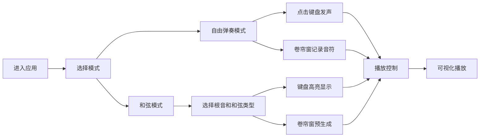

## 1. 产品概述

在线钢琴和弦生成与可视化应用，让用户通过点击虚拟琴键或键盘快捷键来弹奏和弦，并实时观察钢琴卷帘窗中音符的排列与音高变化。

- 主要用途：音乐学习、和弦探索、创意音乐制作
- 目标用户：音乐爱好者、初学者、音乐教师
- 产品价值：将抽象的音乐理论可视化，降低和弦学习门槛

## 2. 核心功能

### 2.1 功能模块

1. **钢琴键盘模块**：88键虚拟钢琴，支持鼠标点击发声
2. **钢琴卷帘窗模块**：可视化音符排列，支持编辑和播放
3. **和弦生成模块**：预置四种和弦类型，一键生成和弦音符
4. **播放控制模块**：播放/暂停/停止、BPM调节
5. **模式切换模块**：自由弹奏模式 / 和弦模式

### 2.2 功能详情

| 模块名称 | 功能描述 |
|---------|---------|
| 钢琴键盘 | 88键标准钢琴键盘，鼠标点击发声，0.2秒持续时长，按下时高亮发光，显示浮动音名气泡，底部显示当前按下的音名列表 |
| 钢琴卷帘窗 | 2小节时间轴，12个音高（C4-C5），点击绘制/擦除音符块，播放时滚动显示，30fps+帧率 |
| 和弦生成 | 支持大三、小三、属七、减七和弦，自动高亮键盘构成音，预生成卷帘窗音符块 |
| 播放控制 | 播放/暂停/停止按钮，BPM滑块（40-200），图标旋转动画 |
| 模式切换 | 自由弹奏模式和和弦模式切换，切换时显示模式名称淡入淡出动画 |

## 3. 核心流程

用户进入应用 → 选择模式（自由弹奏/和弦）→ 在键盘上点击或在卷帘窗上绘制 → 点击播放按钮试听 → 观察可视化效果

## 4. 用户界面设计

### 4.1 设计风格

- 主色调：深灰黑渐变背景（#1a1a2e → #16213e）
- 强调色：暖白（#f5e6c8）、浅蓝（#87ceeb）、暖红到冷蓝渐变（#ff6b6b → #4ecdc4）
- 按钮风格：圆角按钮，悬停放大1.1倍，带柔和阴影
- 动画风格：400ms平滑CSS过渡，弹簧生长动画，碎片飞散动画
- 字体：现代无衬线字体，清晰易读

### 4.2 页面设计

| 区域 | 模块 | UI元素 |
|------|------|--------|
| 顶部 | 模式切换标签 | 淡入淡出的模式名称 |
| 上部 | 钢琴卷帘窗 | 网格背景、音符块、播放线、时间轴 |
| 中部 | 播放控制条 | 播放/暂停/停止按钮、BPM滑块 |
| 底部 | 钢琴键盘 | 88个黑白键、浮动气泡、音名列表 |

### 4.3 响应式设计

- 桌面端优先设计
- 移动端键盘键宽等比例缩小
- 卷帘窗高度自适应
- 触控操作优化

### 4.4 动画与交互

- 琴键入场：黑键从上滑入，白键从下滑入，0.02秒间隔
- 按键反馈：0.15秒发光动画，颜色变为浅蓝
- 音符块：弹簧生长动画，悬停放大1.2倍
- 模式切换：0.3秒淡入淡出
- 播放线：发光白色竖线
- 删除动画：碎片飞散效果
