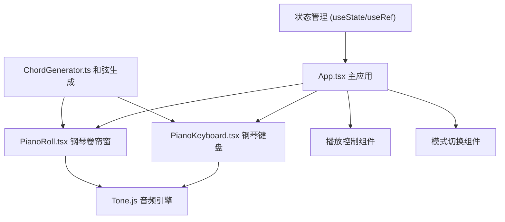

## 1. 架构设计



## 2. 技术栈说明

- 前端框架：React 18 + TypeScript
- 构建工具：Vite 5
- 音频引擎：Tone.js
- 样式方案：纯 CSS（CSS Modules / 内联样式）
- 状态管理：React useState + useRef（轻量场景）
- 动画方案：CSS transitions + keyframes + requestAnimationFrame

## 3. 文件结构

```
.
├── package.json
├── vite.config.js
├── tsconfig.json
├── index.html
└── src/
    ├── App.tsx          # 主应用组件
    ├── main.tsx         # 入口文件
    ├── index.css        # 全局样式
    ├── PianoKeyboard.tsx # 钢琴键盘组件
    ├── PianoRoll.tsx    # 钢琴卷帘窗组件
    └── ChordGenerator.ts # 和弦生成器
```

## 4. 核心数据结构

### 4.1 音符数据

```typescript
interface Note {
  pitch: string;      // 音高，如 'C4', 'D#4'
  midiNumber: number; // MIDI 编号
  isBlack: boolean;   // 是否为黑键
  frequency: number;  // 频率
}
```

### 4.2 卷帘窗音符块

```typescript
interface RollNote {
  id: string;
  pitch: string;      // 音高
  startBeat: number;  // 起始拍
  duration: number;   // 持续拍数
  velocity?: number;  // 力度
}
```

### 4.3 和弦类型

```typescript
type ChordType = 'major' | 'minor' | 'dominant7' | 'diminished7';
type RootNote = 'C' | 'C#' | 'D' | 'D#' | 'E' | 'F' | 'F#' | 'G' | 'G#' | 'A' | 'A#' | 'B';
```

## 5. 性能优化策略

- 钢琴卷帘窗使用 Canvas 或优化的 DOM 渲染
- 播放动画使用 requestAnimationFrame，确保30fps+
- 音符块数量上限128个，超出自动清除最早的
- 键盘交互响应时间低于50ms
- 使用 CSS transform 动画，避免重排重绘

## 6. 响应式适配

- 使用 CSS vh/vw 和百分比布局
- 键盘键宽根据屏幕宽度等比例缩放
- 移动端触控事件支持
- 卷帘窗高度自适应视口
