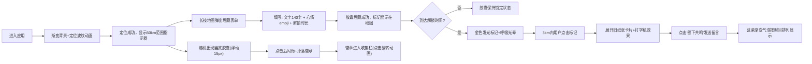

## 1. 产品概述
时间胶囊是一个基于地理位置的匿名心情共享Web应用，用户可以在任意地图位置埋下封装了文字、占位图片和心情emoji的"时间胶囊"，设定解锁时间后胶囊在未来开放给附近用户查看并留言互动。
- 核心目的：通过时间延迟与地理位置的结合，创造一种跨越时空的匿名情感连接体验
- 目标用户：喜欢记录心情、追求新奇社交体验、愿意与陌生人产生情感共鸣的年轻用户群体
- 产品价值：将当下的情绪封存到未来的某个时空节点，让心情成为被发现和珍藏的数字宝藏

## 2. 核心特性

### 2.1 用户角色
| 角色 | 注册方式 | 核心权限 |
|------|----------|----------|
| 游客用户 | 无需注册，本地存储 | 埋藏胶囊、查看已解锁胶囊、留言互动、收集徽章 |

### 2.2 功能模块
1. **地图主页面**：渐变背景地图、定位动画、50km范围指示器、胶囊标记渲染、幽灵胶囊、埋藏表单
2. **胶囊详情卡片**：展开动画、旧纸张纹理、打字机文字效果、留言气泡列表、心情徽章显示
3. **徽章收集系统**：幽灵胶囊掉落、收藏品格子、翻转动画展示

### 2.3 页面详情
| 页面名称 | 模块名称 | 功能描述 |
|-----------|-------------|---------------------|
| 地图主页面 | 渐变背景层 | 红色到蓝色径向渐变，模拟闹市到郊野的视觉过渡 |
| 地图主页面 | 定位波纹动画 | 页面加载时中心向外扩散波纹，提示定位进行中 |
| 地图主页面 | 范围指示器 | 定位成功后显示半透明圆形，半径50km |
| 地图主页面 | 埋藏表单 | 长按地图弹出，弹性动画，140字输入+6种emoji+3种解锁时长 |
| 地图主页面 | 胶囊标记 | 已解锁胶囊显示金色发光标记，2秒呼吸光晕周期 |
| 地图主页面 | 幽灵胶囊 | 灰色半透明圆点，15px上下浮动，点击后掉落徽章 |
| 胶囊详情卡片 | 卡片容器 | 旧纸张纹理背景，手写体字体，展开动画 |
| 胶囊详情卡片 | 文字呈现 | 打字机逐字效果，从左向右显示 |
| 胶囊详情卡片 | 留言系统 | 最多50字留言，回车发送，蓝紫渐变气泡，按时间排序 |
| 胶囊详情卡片 | 心情emoji | 左上角展示，带微光照射效果 |
| 徽章收集 | 收集格子 | 用户头像旁显示已收集徽章 |
| 徽章收集 | 翻转动画 | 点击徽章3D翻转展示详情 |

## 3. 核心流程
用户打开应用后，地图先显示定位波纹动画，定位成功后出现50km圆形范围。用户在范围内长按地图任意位置，弹出埋藏表单。用户填写文字（≤140字）、选择心情emoji（6种：开心/悲伤/愤怒/惊讶/平静/困惑）、设定解锁时间（24h/7天/30天），确认埋藏后胶囊标记显示在地图上。到达解锁时间后，胶囊变为金色发光标记，附近3km内的用户可点击查看。点击后展开旧纸张风格卡片，文字以打字机效果逐字呈现。用户可点击"留下共鸣"按钮发送留言（≤50字），留言以蓝紫渐变气泡显示。地图上还随机出现幽灵胶囊，点击后闪烁消失并掉落限定版徽章，徽章收入用户收集栏，点击可翻转动画查看。

## 4. 用户界面设计

### 4.1 设计风格
- **主色调**：渐变背景从深红色(#8B0000)过渡到深蓝色(#1a237e)，胶囊金色(#FFD700)，心情徽章多彩
- **辅助色**：留言气泡蓝色(#4A90D9)到紫色(#9B59B6)渐变，幽灵胶囊灰色(#888888)半透明
- **按钮风格**：圆角8px，柔和阴影，悬停微缩放，按下凹陷效果
- **字体选择**：标题手写体"Ma Shan Zheng"或"ZCOOL KuaiLe"，正文优雅衬线体
- **布局风格**：全屏沉浸式地图，卡片式浮层，中心对齐，留白充足
- **图标/emoji风格**：原生emoji+CSS光效，保持系统风格的同时增强视觉层次
- **纹理效果**：旧纸张纹理通过CSS渐变+噪声模拟，手写体字体营造怀旧感

### 4.2 页面设计概览
| 页面名称 | 模块名称 | UI元素 |
|-----------|-------------|-------------|
| 地图主页面 | 渐变背景层 | 径向渐变：中心红→边缘蓝，叠加微妙噪声纹理 |
| 地图主页面 | 定位波纹 | 4层同心圆，错开0.3s延迟，透明度0→0.6循环 |
| 地图主页面 | 范围指示器 | rgba(255,215,0,0.15)填充，金色虚线边框，脉冲动画 |
| 地图主页面 | 埋藏表单 | 白色卡片，box-shadow: 0 20px 60px rgba(0,0,0,0.3)，弹性缩放出现 |
| 地图主页面 | 胶囊标记 | 金色圆点，外发光box-shadow，scale(1→1.1→1)呼吸动画2s周期 |
| 地图主页面 | 幽灵胶囊 | rgba(128,128,128,0.5)，translateY(0→15→0)浮动3s周期 |
| 胶囊详情卡片 | 卡片容器 | 米黄色背景，paper纹理，撕裂边缘，手写体标题 |
| 胶囊详情卡片 | 打字机效果 | 逐字透明度0→1，光标闪烁，模拟打字节奏 |
| 胶囊详情卡片 | 留言气泡 | 圆角20px，线性渐变左→右蓝紫，左对齐时间线 |
| 徽章收集 | 徽章格子 | 6格网格，hover缩放，点击3D rotateY翻转 |

### 4.3 响应式设计
- **设计优先**：桌面端1920×1080优先，移动端自适应至375×667
- **地图容器**：始终100vw × 100vh全屏，触摸手势优化
- **卡片尺寸**：桌面520px宽，移动端90vw宽，高度自适应
- **触摸优化**：按钮最小44×44px触控区域，长按阈值500ms
- **断点**：≥768px桌面布局，<768px移动端单列紧凑布局
