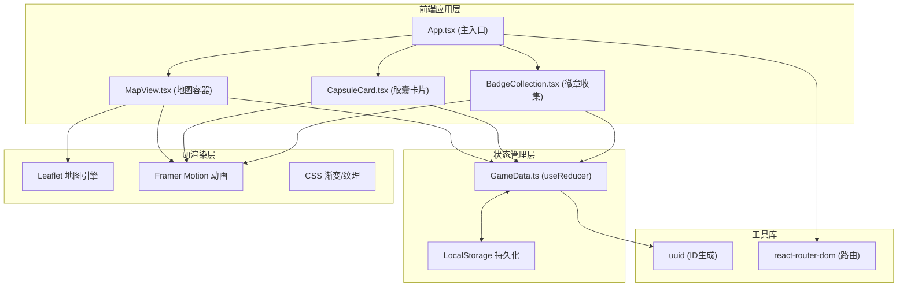
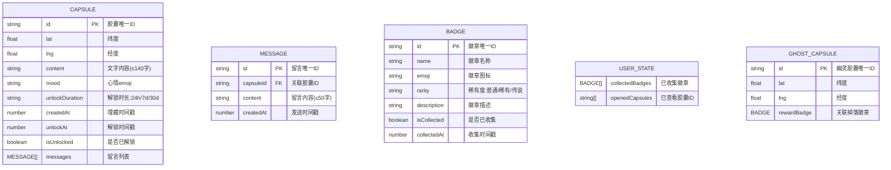

## 1. 架构设计



## 2. 技术描述

- **前端框架**: React@18 + TypeScript@5，严格类型检查
- **构建工具**: Vite@5 + @vitejs/plugin-react，热更新HMR
- **地图引擎**: Leaflet@1.9，轻量级开源地图库，移动端友好
- **动画库**: Framer Motion@11，物理动画引擎，保证30+fps流畅度
- **状态管理**: React useReducer + Context，集中管理胶囊列表和徽章状态
- **持久化**: localStorage，用户数据本地存储，无需后端
- **ID生成**: uuid@9，生成唯一胶囊ID和徽章ID
- **路由**: react-router-dom@6，支持单页面路由（当前版本单页面，为扩展预留）

## 3. 路由定义

| 路由 | 用途 |
|-------|---------|
| / | 主地图页面，包含所有交互功能 |

## 4. 数据模型

### 4.1 数据模型定义



### 4.2 TypeScript类型定义

```typescript
export type MoodType = 'happy' | 'sad' | 'angry' | 'surprised' | 'calm' | 'confused';

export type UnlockDuration = '24h' | '7d' | '30d';

export interface Message {
  id: string;
  capsuleId: string;
  content: string;
  createdAt: number;
}

export interface Capsule {
  id: string;
  lat: number;
  lng: number;
  content: string;
  mood: MoodType;
  unlockDuration: UnlockDuration;
  createdAt: number;
  unlockAt: number;
  isUnlocked: boolean;
  messages: Message[];
}

export type BadgeRarity = 'common' | 'rare' | 'legendary';

export interface Badge {
  id: string;
  name: string;
  emoji: string;
  rarity: BadgeRarity;
  description: string;
  isCollected: boolean;
  collectedAt?: number;
}

export interface GhostCapsule {
  id: string;
  lat: number;
  lng: number;
  rewardBadge: Badge;
}

export interface GameState {
  capsules: Capsule[];
  userBadges: Badge[];
  ghostCapsules: GhostCapsule[];
  userPosition: { lat: number; lng: number } | null;
}
```

## 5. 组件文件结构

```
src/
├── App.tsx              # 主应用入口，Provider包装
├── main.tsx             # React渲染入口
├── index.css            # 全局样式，字体，CSS变量
├── GameData.ts          # 类型定义 + useReducer + Context
├── MapView.tsx          # Leaflet地图容器，标记，表单
├── CapsuleCard.tsx      # 胶囊详情卡片，打字机，留言
└── types/               # (可选) 类型补充声明
```

## 6. 性能优化策略

| 性能指标 | 目标 | 实现方案 |
|---------|------|---------|
| 动画帧率 | ≥30fps | Framer Motion GPU加速属性(transform/opacity)，避免layout thrash |
| 交互延迟 | <100ms | 事件委托，避免频繁重渲染，useMemo/useCallback优化 |
| 首屏骨架屏 | <1s | SSR不适用，采用CSS渐变占位+骨架屏组件，Vite预构建优化 |
| 内存占用 | <100MB | 胶囊标记使用Canvas或Leaflet Layer聚合，及时清理动画帧 |
| 包体积 | <500KB gzip | Tree-shaking，按需导入Leaflet模块，代码分割 |

## 7. 动画实现方案

| 动画名称 | 实现方式 | 性能考虑 |
|---------|---------|---------|
| 定位波纹扩散 | Framer Motion循环动画+scale | 仅transform/opacity，GPU合成层 |
| 埋藏表单弹性弹出 | useSpring物理动画 | 单次动画，结束后清理 |
| 胶囊呼吸光晕 | CSS @keyframes | 无需JS驱动，原生CSS性能最优 |
| 幽灵胶囊浮动 | Framer Motion循环 | translateY，GPU加速 |
| 卡片展开 | 布局动画LayoutGroup | 避免reflow，FLIP技术 |
| 打字机效果 | requestAnimationFrame | 节流更新，虚拟列表优化长文本 |
| 徽章翻转 | CSS 3D transform | preserve-3d，backface-visibility |
