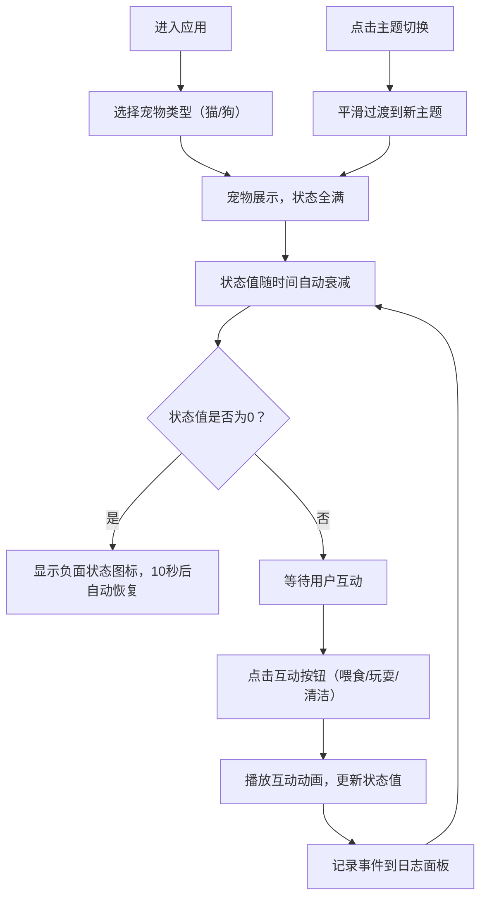

## 1. 产品概述

虚拟宠物养成Web应用，为宠物爱好者提供在浏览器中模拟养宠互动的体验。用户可领养虚拟猫或狗，通过喂食、玩耍、清洁等互动维持宠物状态，享受虚拟养宠的乐趣。

- 核心目的：解决宠物爱好者无法在网页上获得真实养宠互动体验的问题
- 目标用户：宠物爱好者、休闲游戏玩家、压力舒缓需求人群
- 产品价值：提供低门槛、无负担的虚拟养宠体验，陪伴用户并带来情感慰藉

## 2. 核心功能

### 2.1 功能模块

1. **宠物领养模块**：选择领养猫或狗，SVG动态展示
2. **状态管理模块**：饥饿值、快乐值、清洁值、活力值的实时管理与自动衰减
3. **互动操作模块**：喂食、玩耍、清洁三类互动功能
4. **日志记录模块**：记录所有互动和状态变化事件
5. **主题切换模块**：温馨日常/科幻电音双主题切换

### 2.2 页面详情

| 页面名称 | 模块名称 | 功能描述 |
|-----------|-------------|---------------------|
| 主页面 | 宠物领养区 | 弹出选择框，用户选择猫或狗，确认后宠物展示在主区域 |
| 主页面 | 宠物展示区 | 居中展示SVG宠物，包含摇尾巴、眨眼、耳朵抖动等循环动画 |
| 主页面 | 状态面板 | 左侧纵向排列四个状态条，实时显示数值和颜色渐变 |
| 主页面 | 互动按钮区 | 宠物下方横向排列喂食、玩耍、清洁三个按钮 |
| 主页面 | 日志面板 | 右侧可滚动面板，显示最近20条互动和状态事件 |
| 主页面 | 主题切换区 | 顶部或角落的主题切换按钮 |

## 3. 核心流程

## 4. 用户界面设计

### 4.1 设计风格

- **主色调（温馨日常）**：米白色背景 `#FFF8E7`，浅橙色按钮 `#FFB366`，淡绿色状态条 `#8BC34A`
- **主色调（科幻电音）**：深蓝紫渐变背景 `linear-gradient(135deg, #1a1a2e 0%, #16213e 50%, #0f3460 100%)`，霓虹蓝宠物边框 `#00D9FF`，紫色粒子效果 `#FF00FF`
- **按钮风格**：圆角 `12px`，悬停放大 `1.05倍`，点击缩放反馈 `0.15秒`
- **字体**：采用 Google Fonts 的 `Quicksand` 作为显示字体，`Nunito` 作为正文字体，营造活泼可爱的氛围
- **布局风格**：卡片式布局，宠物展示区居中占60%宽度，状态面板居左，日志面板居右，三栏式设计
- **图标风格**：使用 `react-icons` 中的 `Fa` 系列图标，线条圆润，风格统一

### 4.2 页面设计概览

| 页面名称 | 模块名称 | UI 元素 |
|-----------|-------------|-------------|
| 主页面 | 宠物展示区 | SVG宠物居中，柔和阴影，循环动画（摇尾巴2-4秒周期，眨眼和耳朵抖动随机触发），负面状态图标在头顶显示 |
| 主页面 | 状态面板 | 四个状态条纵向排列，数值从0-100，颜色从绿色渐变到红色，衰减时平滑缩短，恢复时闪烁三次 |
| 主页面 | 互动按钮区 | 三个圆角按钮横向排列，按钮包含图标和文字，悬停背景加深，点击有缩放反馈 |
| 主页面 | 日志面板 | 右侧可滚动区域，每条日志带时间戳（精确到秒），深浅交替背景，最新置顶，最多20条 |
| 主页面 | 主题切换 | 角落切换按钮，点击后1秒平滑颜色过渡动画 |

### 4.3 响应式设计

- **设计原则**：Desktop-first，移动端自适应
- **桌面端（>768px）**：三栏布局，左侧状态面板（20%），中间宠物展示区（60%），右侧日志面板（20%）
- **移动端（<=768px）**：单列布局，所有面板上下排列，按钮文字和图标自适应缩放（使用 clamp() 函数）
- **触摸优化**：按钮最小触摸区域 `44x44px`，增加触摸反馈
- **视口配置**：`<meta name="viewport" content="width=device-width, initial-scale=1.0, maximum-scale=1.0, user-scalable=no">`

### 4.4 交互动画细节

1. **喂食动画**：宠物下方出现食物托盘，食物粒子（小圆形SVG）从托盘飘入宠物嘴中，使用 `requestAnimationFrame` 控制抛物线轨迹
2. **玩耍动画**：宠物追逐一个跳跃的小球，小球按抛物线轨迹运动，速度与活力值成正比（活力值越高速度越快）
3. **清洁动画**：宠物上方出现淋浴喷头，水滴（半透明圆形）均匀下落，使用CSS keyframes实现下落动画
4. **状态更新动画**：数值滚动效果（使用CSS counter-increment或JS逐帧更新），状态条颜色渐变过渡
5. **主题切换动画**：所有颜色属性添加 `transition: all 1s ease-in-out`，实现平滑过渡
6. **负面状态恢复**：状态条快速返满（0.5秒），并闪烁三次（使用CSS animation实现opacity变化）

### 4.5 性能要求

- 所有状态计算在 `requestAnimationFrame` 循环中更新，避免使用 `setInterval` 或 `setTimeout`
- 宠物动画使用CSS transition或Canvas绘制
- 内存占用不超过100MB，运行1小时无内存泄漏
- 整体动画帧率不低于30fps
