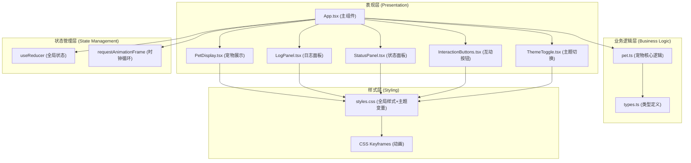

## 1. 架构设计



## 2. 技术描述

- **前端框架**: React 18 + TypeScript 5
- **构建工具**: Vite 5
- **状态管理**: React useReducer + useRef（避免不必要的重渲染）
- **图标库**: react-icons（Fa系列图标）
- **唯一ID生成**: uuid
- **动画方案**: CSS Keyframes + requestAnimationFrame + CSS Transitions
- **无后端**：纯前端应用，状态存储在内存中

### 2.1 核心技术决策

1. **使用 requestAnimationFrame 而非 setInterval/setTimeout**：
   - 确保动画流畅，与浏览器刷新率同步
   - 页面隐藏时自动暂停，节省性能
   - 状态衰减时间计算使用时间戳差值，确保准确性

2. **状态管理使用 useReducer**：
   - 统一管理复杂的状态变化
   - 状态更新可预测，便于调试
   - 与 TypeScript 类型系统完美配合

3. **宠物动画使用 SVG + CSS**：
   - SVG 矢量图形，缩放不失真
   - CSS Keyframes 控制循环动画（摇尾巴、眨眼）
   - requestAnimationFrame 控制交互动画（食物粒子、小球轨迹）

4. **主题切换使用 CSS 变量**：
   - 运行时动态切换主题变量
   - 所有颜色使用变量定义，切换时自动过渡
   - 1秒平滑过渡动画

## 3. 项目文件结构

```
e:\solo\VersionFast\tasks\auto50\
├── index.html                 # 入口HTML
├── package.json               # 项目依赖和脚本
├── tsconfig.json              # TypeScript配置
├── vite.config.js             # Vite构建配置
└── src\
    ├── types.ts               # 类型定义（PetType, StateValues, InteractionType等）
    ├── pet.ts                 # 宠物核心逻辑（状态衰减、互动处理、状态检查）
    ├── App.tsx                # 主组件（状态管理、布局渲染）
    ├── styles.css             # 全局样式和主题变量
    └── components\
        ├── PetDisplay.tsx     # 宠物展示组件（SVG+动画）
        ├── LogPanel.tsx       # 日志面板组件
        ├── StatusPanel.tsx    # 状态面板组件（四个状态条）
        └── InteractionButtons.tsx  # 互动按钮组件
```

## 4. 数据模型定义

### 4.1 类型定义 (types.ts)

```typescript
export enum PetType {
  CAT = 'cat',
  DOG = 'dog',
}

export enum InteractionType {
  FEED = 'feed',
  PLAY = 'play',
  CLEAN = 'clean',
}

export enum StateKey {
  HUNGER = 'hunger',
  HAPPINESS = 'happiness',
  CLEANLINESS = 'cleanliness',
  ENERGY = 'energy',
}

export enum NegativeState {
  HUNGRY = 'hungry',
  UNHAPPY = 'unhappy',
  DIRTY = 'dirty',
  TIRED = 'tired',
}

export enum ThemeType {
  WARM = 'warm',
  SCIFI = 'scifi',
}

export interface StateValues {
  hunger: number;
  happiness: number;
  cleanliness: number;
  energy: number;
}

export interface LogEntry {
  id: string;
  timestamp: Date;
  message: string;
  valueChanges: Partial<StateValues>;
}

export interface PetState {
  petType: PetType | null;
  states: StateValues;
  negativeStates: Set<NegativeState>;
  logs: LogEntry[];
  theme: ThemeType;
  currentInteraction: InteractionType | null;
  recoveryStates: Set<StateKey>;
}

export interface AnimationState {
  tailWagPhase: number;
  blinkPhase: number;
  earTwitchPhase: number;
}
```

### 4.2 状态衰减配置

```typescript
export const DECAY_CONFIG = {
  [StateKey.HUNGER]: { interval: 5000, amount: 1 },      // 每5秒下降1点
  [StateKey.HAPPINESS]: { interval: 8000, amount: 1 },   // 每8秒下降1点
  [StateKey.CLEANLINESS]: { interval: 10000, amount: 1 },// 每10秒下降1点
  [StateKey.ENERGY]: { interval: 3000, amount: 1 },      // 每3秒下降1点
};

export const INTERACTION_EFFECTS = {
  [InteractionType.FEED]: {
    [StateKey.HUNGER]: +10,
    [StateKey.HAPPINESS]: +5,
  },
  [InteractionType.PLAY]: {
    [StateKey.HAPPINESS]: +15,
    [StateKey.ENERGY]: -10,
  },
  [InteractionType.CLEAN]: {
    [StateKey.CLEANLINESS]: +20,
    [StateKey.HAPPINESS]: -5,
  },
};
```

## 5. 核心模块设计

### 5.1 宠物核心逻辑 (pet.ts)

**主要函数**：

1. `createInitialStates(): StateValues`
   - 创建初始状态，所有值为100

2. `decayStates(states: StateValues, elapsedMs: number, lastDecay: Record<StateKey, number>): { newStates: StateValues, newLastDecay: Record<StateKey, number>, decayedKeys: StateKey[] }`
   - 根据时间差计算状态衰减
   - 返回新状态、新的上次衰减时间戳、衰减的状态键列表

3. `handleInteraction(states: StateValues, interaction: InteractionType): { newStates: StateValues, changes: Partial<StateValues> }`
   - 处理用户互动，更新状态值
   - 返回新状态和变化值（用于日志）

4. `checkNegativeStates(states: StateValues): Set<NegativeState>`
   - 检查哪些状态值为0
   - 返回需要显示的负面状态集合

5. `clampState(value: number): number`
   - 确保状态值在0-100范围内

6. `isStateRecovering(negativeStates: Set<NegativeState>, stateKey: StateKey): boolean`
   - 检查状态是否处于恢复阶段

### 5.2 主组件 (App.tsx)

**状态管理**：
- 使用 `useReducer` 管理全局状态
- 使用 `useRef` 存储 requestAnimationFrame ID、上次更新时间戳等不触发重渲染的值
- 使用 `useEffect` 启动和停止游戏循环

**主要 reducer actions**：
- `SET_PET_TYPE`：设置宠物类型
- `UPDATE_STATES`：更新状态值（衰减或互动）
- `ADD_LOG`：添加日志条目
- `START_INTERACTION`：开始互动动画
- `END_INTERACTION`：结束互动动画
- `TOGGLE_THEME`：切换主题
- `SET_NEGATIVE_STATES`：设置负面状态
- `START_RECOVERY`：开始状态恢复动画
- `END_RECOVERY`：结束状态恢复

**游戏循环**：
```typescript
function gameLoop(timestamp: number) {
  if (!lastTimeRef.current) lastTimeRef.current = timestamp;
  const elapsed = timestamp - lastTimeRef.current;
  
  // 处理状态衰减
  const { newStates, decayedKeys } = decayStates(
    currentStates,
    elapsed,
    lastDecayRef.current
  );
  
  // 检查负面状态
  const negativeStates = checkNegativeStates(newStates);
  
  // 如有状态变化，dispatch更新
  if (decayedKeys.length > 0) {
    dispatch({ type: 'UPDATE_STATES', payload: { states: newStates } });
    decayedKeys.forEach(key => {
      dispatch({ type: 'ADD_LOG', payload: { message: '状态自然衰减', changes: { [key]: -1 } } });
    });
  }
  
  lastTimeRef.current = timestamp;
  animationFrameRef.current = requestAnimationFrame(gameLoop);
}
```

### 5.3 宠物展示组件 (PetDisplay.tsx)

**SVG 结构**：
- 猫：头部（含耳朵、眼睛、鼻子、胡须）、身体、尾巴
- 狗：头部（含耳朵、眼睛、鼻子、嘴巴）、身体、尾巴

**CSS 动画**：
- `tail-wag`：尾巴左右摇摆，周期2-4秒（随机）
- `blink`：眼睛闭合动画，随机触发，持续0.2秒
- `ear-twitch`：耳朵抖动动画，随机触发

**交互动画**（使用 requestAnimationFrame）：
- 喂食：食物粒子从底部托盘飞入宠物嘴中（抛物线轨迹）
- 玩耍：小球抛物线跳跃，速度与活力值成正比
- 清洁：水滴从顶部均匀下落

### 5.4 状态面板组件 (StatusPanel.tsx)

**每个状态条包含**：
- 状态名称和图标
- 当前数值（带滚动动画）
- 进度条（宽度百分比，颜色从绿到红渐变）

**状态条颜色计算**：
```typescript
function getBarColor(value: number): string {
  // 0: 红色 #FF5252
  // 50: 黄色 #FFEB3B
  // 100: 绿色 #8BC34A
  if (value >= 50) {
    const ratio = (value - 50) / 50;
    return interpolateColor('#FFEB3B', '#8BC34A', ratio);
  } else {
    const ratio = value / 50;
    return interpolateColor('#FF5252', '#FFEB3B', ratio);
  }
}
```

**恢复动画**：
- 状态条快速填充到100%（0.5秒）
- 闪烁三次（opacity 1→0.3→1→0.3→1→0.3→1）

## 6. 性能优化策略

1. **避免不必要的重渲染**：
   - 使用 `React.memo` 包装子组件
   - 状态更新使用不可变数据
   - 使用 `useRef` 存储不影响渲染的值

2. **动画性能**：
   - 使用 `transform` 和 `opacity` 进行动画（触发GPU加速）
   - 避免在动画中修改 `width`、`height` 等触发重排的属性
   - 使用 `will-change` 提示浏览器优化

3. **内存管理**：
   - 及时清除 `requestAnimationFrame`
   - 日志数组最多保留20条，超出自动删除最旧记录
   - 避免创建闭包循环引用

4. **requestAnimationFrame 循环优化**：
   - 页面不可见时（`document.hidden`）暂停循环
   - 时间戳差值计算确保衰减准确，不受帧率影响

## 7. 构建与部署

- **开发命令**：`npm run dev`
- **构建命令**：`npm run build`
- **构建输出目录**：`dist/`
- **base URL**：`./`（相对路径，支持任意部署路径）
