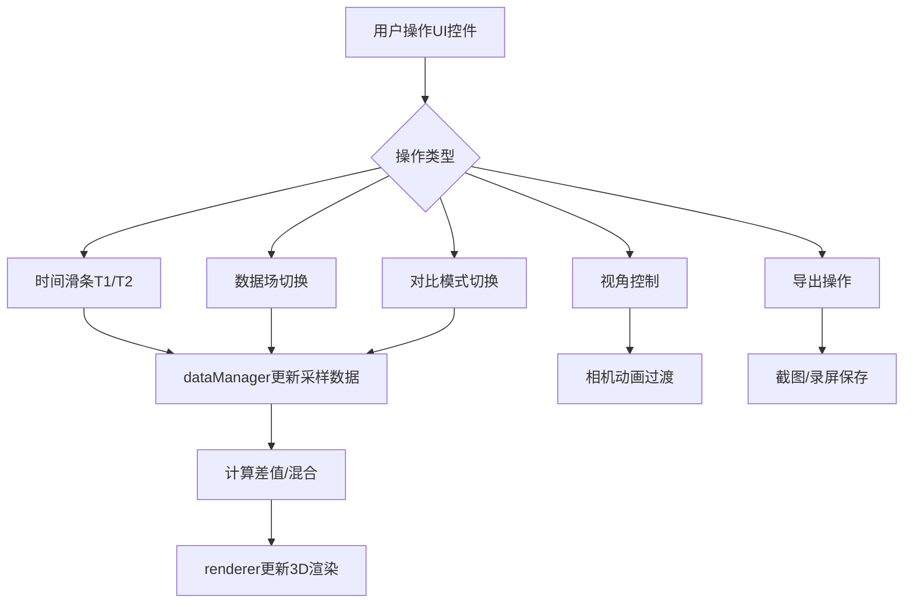

## 1. 产品概述

交互式3D气象数据时空对比可视化工具，面向气象研究者，用于直观对比不同时间点的气象数据场（温度、气压、风速），识别极端天气事件的形成与演变过程。基于Three.js构建3D渲染引擎，支持双时间点叠加显示、差值/叠加对比模式、视角控制、截图与录屏导出。

## 2. 核心功能

### 2.1 功能模块

1. **3D气象场渲染页**：半球体区域100x100x50网格，温度颜色映射、气压高度映射、风速粒子流线
2. **时空对比控制**：双时间滑条T1/T2，半透明重叠显示，差异高亮脉冲动画
3. **对比模式切换**：差值模式（T2-T1红蓝映射）和叠加模式（混合比例滑块）
4. **视角控制**：鼠标旋转/缩放/平移，重置视角，三预设视角（俯视45°、侧视、鸟瞰）
5. **数据导出**：截图PNG（1920x1080）、录屏WebM（15fps/15秒）

### 2.2 页面详情

| 页面名称 | 模块名称 | 功能描述 |
|----------|----------|----------|
| 主场景 | 3D渲染区域 | 半球体100x100x50网格，三种数据场可视化，覆盖90%视口 |
| 主场景 | 左下控制面板 | 时间滑条T1/T2、数据场切换下拉菜单、对比模式单选框、预设视角按钮 |
| 主场景 | 右上工具栏 | 导出截图按钮、录屏按钮 |
| 主场景 | 右下状态栏 | 实时FPS（绿色）、数据加载状态（加载中/就绪/无数据） |

## 3. 核心流程

用户打开应用→3D场景加载默认温度场→通过T1/T2滑条选择时间点→场景同时渲染两个半透明数据层→差异超过20%区域脉冲闪烁→切换对比模式查看差值场或混合叠加→调整视角观察→导出截图或录屏

## 4. 用户界面设计

### 4.1 设计风格

- 主色调：深空蓝渐变（#0a0a2e到#1a1a4e），冷峻科技感
- 强调色：发光蓝色边框、青紫渐变轨道
- 按钮风格：半透明深蓝背景，hover半透明白色+1.1倍放大，active按下凹陷
- 字体：等宽字体用于数据，无衬线字体用于标签
- 布局：3D场景居中覆盖90%视口，左下固定控制面板，右上工具栏

### 4.2 页面设计概述

| 页面名称 | 模块名称 | UI元素 |
|----------|----------|--------|
| 主场景 | 3D区域 | 深蓝渐变背景，粒子云+流线渲染 |
| 主场景 | 控制面板 | rgba(10,10,46,0.8)背景，12px圆角，2px发光蓝边框，时间滑条（青紫渐变轨道+18px内发光圆形滑块），下拉菜单（0.2s淡入），单选框 |
| 主场景 | 工具栏 | 半透明深蓝按钮，hover白色+1.1倍 |
| 主场景 | 状态栏 | 绿色FPS，三色状态图标 |

### 4.3 响应式

- 桌面端：左下固定控制面板
- 移动端（<768px）：折叠为底部80px固定栏，点击展开全屏面板（0.3s上滑动效）

### 4.4 3D场景指引

- 环境：深空蓝渐变背景，半球体区域
- 灯光：环境光+方向光，确保数据颜色可辨识
- 相机：透视相机，初始45度俯视，支持阻尼旋转（0.2s）
- 交互：鼠标旋转/缩放/平移，预设视角0.8s过渡动画
- 后处理：差异区域脉冲闪烁动画
- 性能：1280x720下≥25fps，交互延迟<50ms
