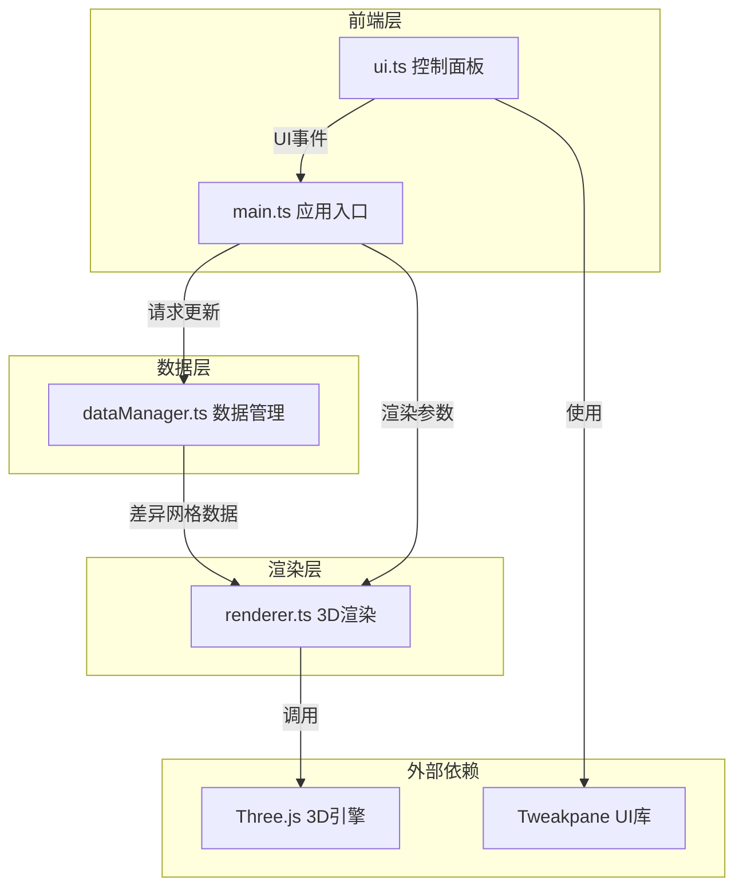

## 1. 架构设计



数据流向：UI组件 → main.ts → dataManager.ts → renderer.ts → Three.js场景

## 2. 技术说明

- 前端框架：TypeScript + Three.js@0.160.0（无React/Vue，纯Three.js 3D应用）
- 构建工具：Vite
- UI控件：Tweakpane（控制面板基础）+ 自定义CSS样式覆盖
- 类型系统：TypeScript严格模式，目标ES2020
- 无后端：所有数据为预置模拟数据，无需API

## 3. 文件结构与职责

| 文件 | 职责 | 调用关系 |
|------|------|----------|
| package.json | 依赖管理（three@0.160.0, typescript, vite, @types/three, tweakpane） | - |
| vite.config.js | 构建配置，base='./'，TypeScript支持 | - |
| tsconfig.json | 严格模式，ES2020目标 | - |
| index.html | 入口页面，深蓝渐变背景，无滚动条 | 引用src/main.ts |
| src/main.ts | 应用初始化：场景/相机/渲染器创建，接收UI事件驱动更新 | 调用dataManager, renderer, ui |
| src/dataManager.ts | 管理两个时间点采样网格数据，插值和差异计算 | 被main.ts调用，输出给renderer |
| src/renderer.ts | 3D气象场渲染：粒子云标量场、流线矢量场 | 被main.ts调用，接收dataManager数据 |
| src/ui.ts | 控制面板：时间滑条、数据场切换、对比模式、视角控制 | 触发main.ts回调 |

## 4. 数据模型

### 4.1 网格数据结构

```typescript
interface MeteoData {
  temperature: Float32Array;  // 100x100x50网格温度值
  pressure: Float32Array;     // 100x100x50网格气压值
  windU: Float32Array;        // 100x100x50网格风速U分量
  windV: Float32Array;        // 100x100x50网格风速V分量
  windW: Float32Array;        // 100x100x50网格风速W分量
}

interface DiffResult {
  diff: Float32Array;         // T2-T1差值
  threshold: number;          // 差异阈值（20%）
  highlightMask: Uint8Array;  // 差异高亮掩码
}
```

### 4.2 数据生成策略

预置10个时间步的模拟数据，通过Perlin噪声+正弦扰动生成具有空间连续性的气象场，温度范围-30~45°C，气压950~1050hPa，风速0~30m/s。

## 5. 渲染策略

### 5.1 性能优化

- 粒子系统使用BufferGeometry+Points材质，GPU实例化渲染
- 流线使用LineSegments批量渲染
- 视锥裁剪：仅渲染可见区域粒子
- 差异高亮使用自定义ShaderMaterial实现脉冲动画
- 目标：1280x720下≥25fps，内存≤500MB
