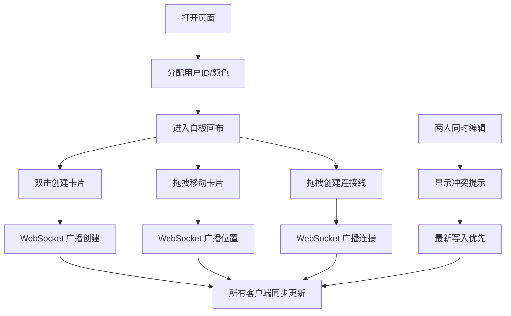

## 1. 产品概述

在线思维导图协作白板，为团队头脑风暴提供实时协作的虚拟白板体验。用户可自由创建、移动、连接想法卡片，所有操作实时同步至团队成员。

- 核心价值：打破时空限制，让远程团队协作如临现场
- 目标用户：产品团队、设计团队、敏捷开发小组
- 市场定位：轻量级、高交互的实时协作工具

## 2. 核心功能

### 2.1 用户角色
| 角色 | 注册方式 | 核心权限 |
|------|----------|----------|
| 协作用户 | 匿名加入（自动分配用户ID和颜色） | 创建/编辑/删除卡片、连接卡片、缩放平移画布 |

### 2.2 功能模块
1. **白板画布**：无限画布、缩放平移、卡片渲染、连接线渲染
2. **卡片管理**：双击创建、拖拽移动、内容编辑、颜色分配
3. **连接线**：边缘拖拽创建、贝塞尔曲线、实时跟随
4. **实时协作**：WebSocket 同步、用户头像标记、编辑冲突处理

### 2.3 页面详情
| 页面名称 | 模块名称 | 功能描述 |
|----------|----------|----------|
| 白板主页 | 画布区域 | 无限画布，支持缩放（0.5-3倍）、平移（中键拖拽）、双击创建卡片 |
| 白板主页 | 卡片组件 | 马卡龙色系、4px圆角、10px投影、拖拽弹性效果（阻力0.7）、0.15秒缓动停稳 |
| 白板主页 | 连接线组件 | 贝塞尔曲线连接、控制点动态计算、卡片移动实时跟随 |
| 白板主页 | 用户状态 | 彩色圆形头像标记编辑位置、编辑中卡片边框高亮、冲突弹窗提示 |

## 3. 核心流程

### 用户操作流程
用户打开页面 → 自动分配用户ID和颜色 → 双击画布创建卡片 → 拖拽卡片到目标位置 → 从卡片边缘拖拽连接线到另一卡片 → 实时同步给所有在线用户 → 多人同时编辑时显示冲突提示

## 4. 用户界面设计

### 4.1 设计风格
- **主色调**：极简浅色背景 #F5F5F5
- **卡片色系**：马卡龙四色随机分配（淡粉 #FFB3BA、淡蓝 #BAE1FF、淡绿 #BAFFC9、淡黄 #FFE49A）
- **强调色**：选中投影蓝色 #4A90D9
- **字体**：系统无衬线字体，卡片文字居中显示
- **卡片样式**：4px 圆角、10px 投影（模糊10px、透明度0.15）、选中时投影变为蓝色
- **交互动效**：拖拽弹性阻力0.7、松开0.15秒缓动、缩放平移0.2秒平滑过渡

### 4.2 页面设计概述
| 页面名称 | 模块名称 | UI 元素 |
|----------|----------|----------|
| 白板主页 | 画布区域 | 浅灰色背景 #F5F5F5、无限滚动、鼠标滚轮缩放、中键拖拽平移 |
| 白板主页 | 卡片组件 | 马卡龙彩色背景、4px圆角、柔和投影、"新想法"默认文字、可编辑文本 |
| 白板主页 | 连接线 | 灰色贝塞尔曲线、动态控制点、两端吸附卡片边缘 |
| 白板主页 | 用户头像 | 彩色圆形（用户专属色）、显示在正在编辑的卡片旁 |
| 白板主页 | 冲突提示 | 半透明黑色背景弹窗、白色文字"该卡片正被其他人编辑"、淡入动画 |

### 4.3 响应性
- 桌面端优先，支持全屏幕画布
- 鼠标交互：左键创建/拖拽、滚轮缩放、中键平移
- 性能保证：50张卡片同时存在时，拖拽和缩放保持30fps以上

### 4.4 性能优化
- 使用 requestAnimationFrame 确保60fps渲染
- 避免不必要的重渲染，使用 React.memo 优化组件
- 卡片拖拽使用 transform 而非 top/left 提升性能
- 连接线使用 SVG 渲染，控制点计算优化
