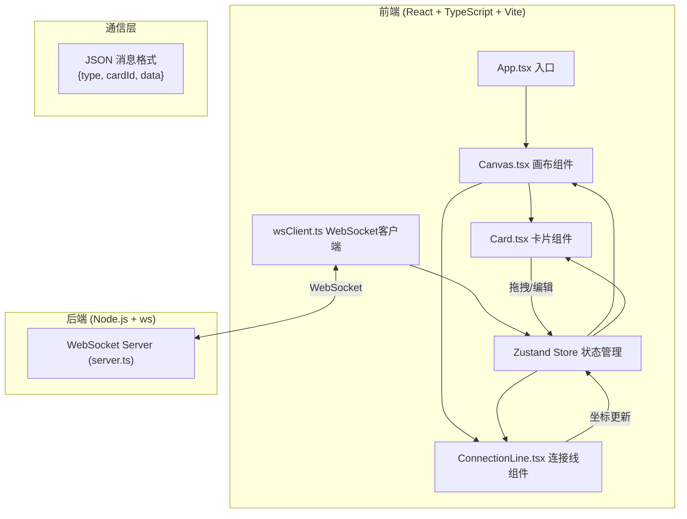

## 1. 架构设计



## 2. 技术描述

### 前端技术栈
- **框架**：React 18 + TypeScript
- **构建工具**：Vite 5
- **状态管理**：Zustand（轻量级、高性能）
- **路由**：react-router-dom
- **唯一ID**：uuid
- **WebSocket客户端**：浏览器原生 WebSocket API

### 后端技术栈
- **运行时**：Node.js
- **WebSocket库**：ws（轻量级、高性能）
- **语言**：TypeScript（编译为 JavaScript 运行）

## 3. 目录结构

```
.
├── package.json
├── vite.config.js
├── tsconfig.json
├── index.html
├── server/
│   └── server.ts          # WebSocket 服务器
├── src/
│   ├── App.tsx            # 主应用入口
│   ├── main.tsx           # React 挂载点
│   ├── store/
│   │   └── useStore.ts    # Zustand 状态管理
│   ├── components/
│   │   ├── Canvas.tsx     # 白板画布组件
│   │   ├── Card.tsx       # 卡片组件
│   │   └── ConnectionLine.tsx  # 连接线组件
│   ├── websocket/
│   │   └── wsClient.ts    # WebSocket 客户端
│   ├── types/
│   │   └── index.ts       # 类型定义
│   └── utils/
│       └── animation.ts   # 动画工具函数
└── .trae/
    └── documents/
        ├── prd.md
        └── technical-architecture.md
```

## 4. 数据模型

### 4.1 TypeScript 类型定义

```typescript
// 卡片数据结构
interface Card {
  id: string;
  x: number;
  y: number;
  content: string;
  color: CardColor;
  width: number;
  height: number;
  editingBy?: string;  // 正在编辑的用户ID
}

// 连接线数据结构
interface Connection {
  id: string;
  fromCardId: string;
  toCardId: string;
}

// 用户数据结构
interface User {
  id: string;
  color: string;
  name: string;
  cursorX?: number;
  cursorY?: number;
  editingCardId?: string;
}

// 卡片颜色（马卡龙色系）
type CardColor = '#FFB3BA' | '#BAE1FF' | '#BAFFC9' | '#FFE49A';

// WebSocket 消息类型
type WSMessageType = 
  | 'card:create'
  | 'card:update'
  | 'card:delete'
  | 'card:position'
  | 'connection:create'
  | 'connection:delete'
  | 'user:join'
  | 'user:leave'
  | 'user:cursor'
  | 'card:edit-start'
  | 'card:edit-end'
  | 'state:init';

// WebSocket 消息格式
interface WSMessage<T = any> {
  type: WSMessageType;
  senderId: string;
  timestamp: number;
  data: T;
}
```

### 4.2 WebSocket 消息示例

```typescript
// 创建卡片
{
  type: 'card:create',
  senderId: 'user-123',
  timestamp: 1718000000000,
  data: {
    id: 'card-456',
    x: 100,
    y: 200,
    content: '新想法',
    color: '#FFB3BA',
    width: 120,
    height: 80
  }
}

// 更新卡片位置
{
  type: 'card:position',
  senderId: 'user-123',
  timestamp: 1718000000001,
  data: {
    id: 'card-456',
    x: 150,
    y: 250
  }
}

// 编辑冲突提示
{
  type: 'card:edit-start',
  senderId: 'user-456',
  timestamp: 1718000000002,
  data: {
    cardId: 'card-456',
    conflict: true,
    message: '该卡片正被其他人编辑'
  }
}
```

## 5. 核心算法

### 5.1 贝塞尔曲线控制点计算
```typescript
function getBezierControlPoints(
  x1: number, y1: number, 
  x2: number, y2: number
): { cp1x: number; cp1y: number; cp2x: number; cp2y: number } {
  const dx = x2 - x1;
  const dy = y2 - y1;
  const distance = Math.sqrt(dx * dx + dy * dy);
  const offset = Math.min(distance * 0.5, 100);
  
  // 根据相对位置动态计算控制点
  if (Math.abs(dx) > Math.abs(dy)) {
    // 水平为主
    return {
      cp1x: x1 + offset,
      cp1y: y1,
      cp2x: x2 - offset,
      cp2y: y2
    };
  } else {
    // 垂直为主
    return {
      cp1x: x1,
      cp1y: y1 + offset,
      cp2x: x2,
      cp2y: y2 - offset
    };
  }
}
```

### 5.2 弹性拖拽动画
```typescript
// 拖拽时：target = current + (mouse - current) * 0.7
// 松开后：使用 requestAnimationFrame 缓动到目标位置，时长 150ms
function easeOutCubic(t: number): number {
  return 1 - Math.pow(1 - t, 3);
}
```

### 5.3 冲突解决策略
- 最新写入优先（Last Write Wins）
- 基于 timestamp 判断先后
- 冲突时向前编辑者显示提示
- 解决后自动刷新所有客户端状态

## 6. API 定义（WebSocket）

| 消息类型 | 方向 | 数据结构 | 说明 |
|----------|------|----------|------|
| `state:init` | Server → Client | `{ cards: Card[], connections: Connection[], users: User[] }` | 连接初始化时发送全量状态 |
| `card:create` | Client ↔ Server | `Card` | 创建卡片，广播给所有客户端 |
| `card:position` | Client ↔ Server | `{ id: string; x: number; y: number }` | 更新卡片位置，实时广播 |
| `card:update` | Client ↔ Server | `{ id: string; content: string }` | 更新卡片内容 |
| `card:delete` | Client ↔ Server | `{ id: string }` | 删除卡片 |
| `card:edit-start` | Client → Server | `{ cardId: string }` | 开始编辑，检查冲突 |
| `card:edit-end` | Client → Server | `{ cardId: string }` | 结束编辑 |
| `connection:create` | Client ↔ Server | `Connection` | 创建连接线 |
| `connection:delete` | Client ↔ Server | `{ id: string }` | 删除连接线 |
| `user:join` | Server → Client | `User` | 新用户加入 |
| `user:leave` | Server → Client | `{ userId: string }` | 用户离开 |
| `user:cursor` | Client → Server | `{ x: number; y: number }` | 用户光标位置 |

## 7. 性能优化策略

1. **渲染优化**：
   - 使用 React.memo 包裹 Card 和 ConnectionLine 组件
   - 卡片位置变化使用 transform 而非 top/left
   - 使用 will-change: transform 提示浏览器优化

2. **动画优化**：
   - 所有动画使用 requestAnimationFrame
   - 拖拽位置更新节流（每帧最多一次）
   - 避免在拖拽中触发重排（reflow）

3. **状态管理优化**：
   - Zustand selector 精确订阅，避免不必要重渲染
   - 位置更新使用浅比较

4. **WebSocket 优化**：
   - 位置更新节流（16ms 间隔，约60fps）
   - 批量更新减少消息数量
   - 连接状态自动重连机制

5. **Canvas 优化**：
   - 连接线使用 SVG 而非 DOM 元素
   - 贝塞尔曲线计算缓存
   - 画布虚拟化（仅渲染视口内卡片）
