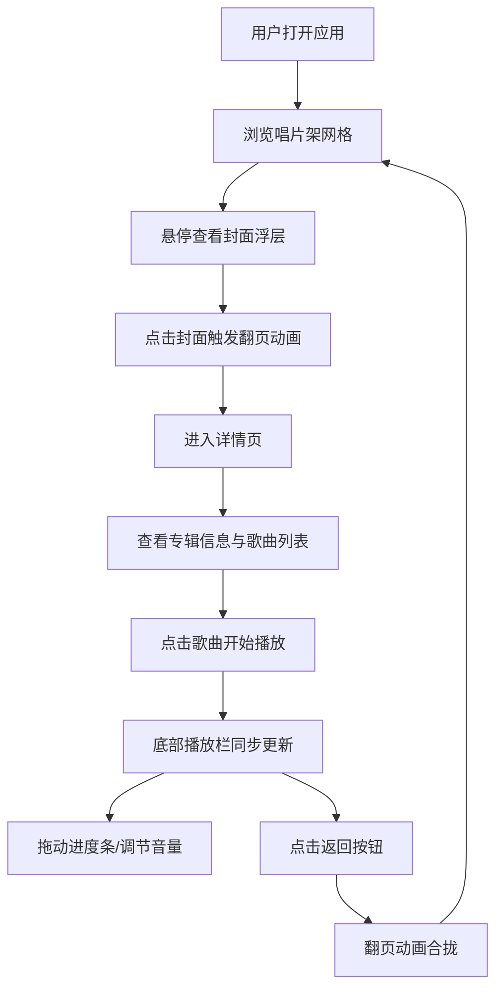

## 1. 产品概述

虚拟唱片架探索应用——为独立音乐人打造沉浸式歌单探索体验，让用户像在虚拟唱片店里翻看唱片封面一样，浏览、试听和收藏心仪的音乐作品。采用深色极简风格，以翻页动画和播放控制为核心交互亮点。

## 2. 核心功能

### 2.1 用户角色
| 角色 | 注册方式 | 核心权限 |
|------|----------|----------|
| 访客 | 无需注册 | 浏览唱片架、查看详情、试听音乐 |

### 2.2 功能模块
1. **唱片架主页**：3列网格展示12张虚拟唱片封面，支持悬停浮层和翻页动画
2. **唱片详情页**：完整专辑信息展示、歌曲列表与播放控制
3. **播放控制栏**：底部固定栏，进度条、播放/暂停、音量控制、波形动画

### 2.3 页面详情
| 页面名称 | 模块名称 | 功能描述 |
|----------|----------|----------|
| 唱片架主页 | 唱片网格 | 3列响应式网格布局展示12张唱片封面（160x160px），内阴影模拟CD盒质感，悬停放大1.1倍并显示半透明浮层（0.2秒渐入），点击触发翻页动画（0.4秒ease-in-out） |
| 唱片详情页 | 专辑信息 | 左侧放大封面（300x300px，圆角6px），右侧显示专辑名、艺术家、发行年份、歌曲列表（带序号和时长），点击歌曲触发播放，当前播放行渐变高亮 |
| 唱片详情页 | 返回按钮 | 底部"返回唱片架"按钮，点击时详情页以相反翻页动画合拢 |
| 播放控制栏 | 进度控制 | 圆角滑块进度条，紫蓝渐变色，拖动实时更新，0.1秒回弹动画 |
| 播放控制栏 | 播放/暂停 | 点击切换图标，启动/停止正弦波形动画（两条对称曲线，淡蓝色，幅值随时间变化） |
| 播放控制栏 | 音量控制 | 圆角滑块，轨道深灰色，实时调节音量增益 |

## 3. 核心流程

用户打开应用 → 浏览唱片架网格 → 悬停查看封面浮层 → 点击封面触发翻页动画 → 进入详情页查看专辑信息和歌曲列表 → 点击歌曲开始播放 → 底部播放栏同步更新 → 拖动进度条或调节音量 → 点击返回按钮翻回合拢返回唱片架

## 4. 用户界面设计

### 4.1 设计风格
- **主色调**：#1a1a2e（深紫黑）到 #16213e（深蓝）渐变
- **强调色**：#0f3460（深蓝）和 #e94560（玫红）
- **按钮风格**：圆角按钮，悬停时颜色从 #0f3460 过渡到 #e94560（0.3秒ease），点击缩放0.9倍（0.1秒回弹）
- **字体**：使用 Outfit 作为展示字体（标题、专辑名），Source Sans 3 作为正文字体（歌曲列表、描述）
- **布局风格**：卡片式网格布局，深色亚麻纹理背景
- **图标风格**：Lucide React 线性图标

### 4.2 页面设计概览
| 页面名称 | 模块名称 | UI元素 |
|----------|----------|--------|
| 唱片架主页 | 唱片网格 | 深色亚麻纹理背景，3列网格，正方形卡片（160x160px），白色背景深灰阴影（8px模糊），悬停阴影加深（12px模糊，上移5px），封面放大1.1倍，半透明浮层渐入 |
| 唱片详情页 | 专辑信息 | 左右分栏布局，左侧300x300圆角6px封面，右侧信息区，歌曲行悬停高亮，当前播放行紫蓝渐变文字 |
| 播放控制栏 | 控制区域 | 底部固定栏，半透明深色背景，紫蓝渐变进度条，圆角滑块，波形动画画布 |

### 4.3 响应式适配
- 桌面优先设计（>1200px：3列）
- 平板适配（900-1200px：2列）
- 手机适配（<900px：1列）
- 列数变化时卡片以0.4秒过渡动画重新排列
- 详情页在小屏幕下改为上下布局

### 4.4 动画性能
- 所有动画使用 CSS `will-change` 和 `transform` 优化
- 翻页动画保持60fps
- 首屏加载不超过2秒（懒加载+代码分割）
- 播放控制响应延迟低于100ms
