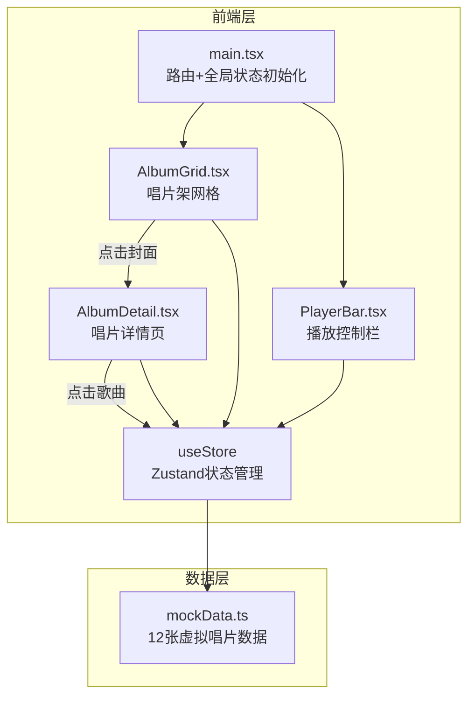

## 1. 架构设计



**数据流向**：mockData → Zustand Store → AlbumGrid / AlbumDetail / PlayerBar（单向数据流）

## 2. 技术说明
- **前端**：React 18 + TypeScript + Vite + Tailwind CSS
- **初始化工具**：vite-init（react-ts 模板）
- **后端**：无（纯前端，使用模拟数据）
- **数据库**：无（使用 mock 数据）
- **状态管理**：Zustand
- **路由**：react-router-dom
- **图标**：lucide-react

## 3. 路由定义
| 路由 | 用途 |
|------|------|
| / | 唱片架主页，展示3列网格 |
| /album/:id | 唱片详情页，展示专辑信息和歌曲列表 |

## 4. API定义

无后端API，使用模拟数据。数据结构定义如下：

```typescript
interface Song {
  id: string;
  title: string;
  duration: string;
  durationSeconds: number;
}

interface Album {
  id: string;
  title: string;
  artist: string;
  year: number;
  cover: string;
  songs: Song[];
}
```

## 5. 状态管理定义

```typescript
interface PlayerState {
  currentAlbum: Album | null;
  currentSong: Song | null;
  isPlaying: boolean;
  progress: number;
  volume: number;
  playSong: (album: Album, song: Song) => void;
  togglePlay: () => void;
  setProgress: (progress: number) => void;
  setVolume: (volume: number) => void;
}

interface UIState {
  selectedAlbumId: string | null;
  isFlipping: boolean;
  flipDirection: 'open' | 'close' | null;
  setSelectedAlbum: (id: string | null) => void;
  setFlipping: (flipping: boolean) => void;
  setFlipDirection: (direction: 'open' | 'close' | null) => void;
}
```

## 6. 文件结构

```
├── package.json
├── vite.config.js
├── tsconfig.json
├── index.html
├── src/
│   ├── main.tsx              # React挂载入口，初始化路由和全局状态
│   ├── App.tsx               # 路由配置和布局
│   ├── index.css             # 全局样式、亚麻纹理、动画关键帧
│   ├── data/
│   │   └── mockData.ts       # 12张虚拟唱片的模拟数据
│   ├── store/
│   │   └── useStore.ts       # Zustand全局状态（播放状态+UI状态）
│   ├── components/
│   │   ├── AlbumGrid.tsx     # 唱片架网格组件
│   │   ├── AlbumCard.tsx     # 单张唱片卡片（含翻页动画）
│   │   ├── AlbumDetail.tsx   # 唱片详情页组件
│   │   └── PlayerBar.tsx     # 底部播放控制栏组件
│   └── types/
│       └── index.ts          # TypeScript类型定义
```
