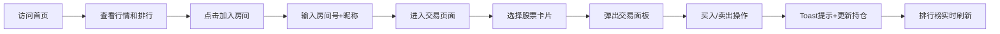

## 1. 产品概述

在线模拟股票交易大赛平台，允许朋友群体创建/加入虚拟交易房间，使用初始虚拟资金（10万美元）在模拟市场中进行股票买卖，实时追踪收益率排行。

- 目标用户：朋友群体、投资爱好者、学生群体
- 产品价值：零风险学习股票交易，社交化竞技体验，实时数据模拟真实市场

## 2. 核心功能

### 2.1 用户角色

| 角色 | 注册方式 | 核心权限 |
|------|----------|----------|
| 参赛者 | 输入房间号+昵称加入 | 浏览行情、买卖股票、查看排行和持仓 |

### 2.2 功能模块

1. **首页/比赛大厅**：K线行情图、大赛排行榜、个人持仓面板、加入房间入口
2. **交易页面**：股票选择列表、买入/卖出交易面板、Toast提示系统

### 2.3 页面详情

| 页面名称 | 模块名称 | 功能描述 |
|----------|----------|----------|
| 首页/比赛大厅 | K线行情图 | Canvas实时绘制，每分钟生成K线柱，红绿涨跌颜色，5日均线白色虚线，网格背景 |
| 首页/比赛大厅 | 排行榜 | 前3名金银铜渐变奖牌，其余灰色圆点，排名变化闪烁高亮0.5秒 |
| 首页/比赛大厅 | 持仓面板 | 股票缩略名、持股数、盈亏百分比，正绿箭头/负红箭头，数字跳动效果 |
| 首页/比赛大厅 | 加入房间 | 毛玻璃模态框，输入房间号和昵称，8px圆角输入框，蓝色聚焦发光 |
| 交易页面 | 股票列表 | 25只股票卡片，显示代码/价格/涨跌幅，悬停白底+3px阴影，点击右侧弹出交易面板 |
| 交易页面 | 交易面板 | 买入/卖出标签页，整数输入限制，买入toast提示，余额滚动动画，卖出即时到账 |

## 3. 核心流程

用户访问首页 → 查看行情K线和排行榜 → 点击"加入房间" → 输入房间号和昵称 → 进入交易页面 → 选择股票 → 买入/卖出操作 → 实时更新持仓和排行 → 比赛结束查看收益率

## 4. 用户界面设计

### 4.1 设计风格

- **主色调**：深蓝黑背景（#0a0e1a），霓虹蓝点缀（#00d4ff），荧光绿（#00ff88），警示红（#ff4757）
- **按钮风格**：圆角8px，0.3秒ease-in-out缩放和颜色过渡
- **字体**：Google Fonts 'Inter'，清晰现代无衬线字体
- **布局风格**：卡片式布局，深色主题，玻璃态模态框
- **图标风格**：SVG奖牌图标（金银铜渐变），箭头图标，CSS绘制装饰元素

### 4.2 页面设计概览

| 页面名称 | 模块名称 | UI元素 |
|----------|----------|--------|
| 首页 | K线图 | Canvas渲染，梯度绿红K线，白色虚线MA5，微弱网格纹理 |
| 首页 | 排行榜 | 金银铜渐变奖牌前3名，灰色圆点其余，排名变化闪烁高亮 |
| 首页 | 持仓面板 | 卡片列表，盈亏颜色区分，数字跳动动画，箭头指示 |
| 首页 | 加入房间模态框 | blur 12px毛玻璃，半透明黑底，蓝色聚焦发光输入框 |
| 交易页面 | 股票列表 | 暗灰卡片，悬停白底升3px阴影，25只股票网格排列 |
| 交易页面 | 交易面板 | 标签页切换，表单验证，顶部滑入toast 2.5秒消失 |

### 4.3 响应式设计

桌面端优先布局，<768px断点切换为移动端：
- 排行榜与交易面板垂直堆叠
- 股票卡片变为单列排列
- 模态框全屏显示
- 触控区域优化（最小44px高度）

### 4.4 性能要求

- 所有用户交互响应时间 ≤ 150ms
- Canvas K线图渲染帧率 ≥ 30fps
- 数字滚动动画使用requestAnimationFrame
- 排行榜变化使用CSS transform避免重排
