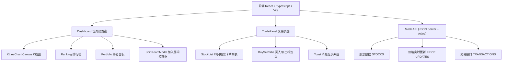
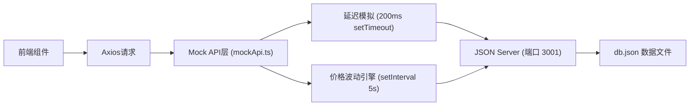
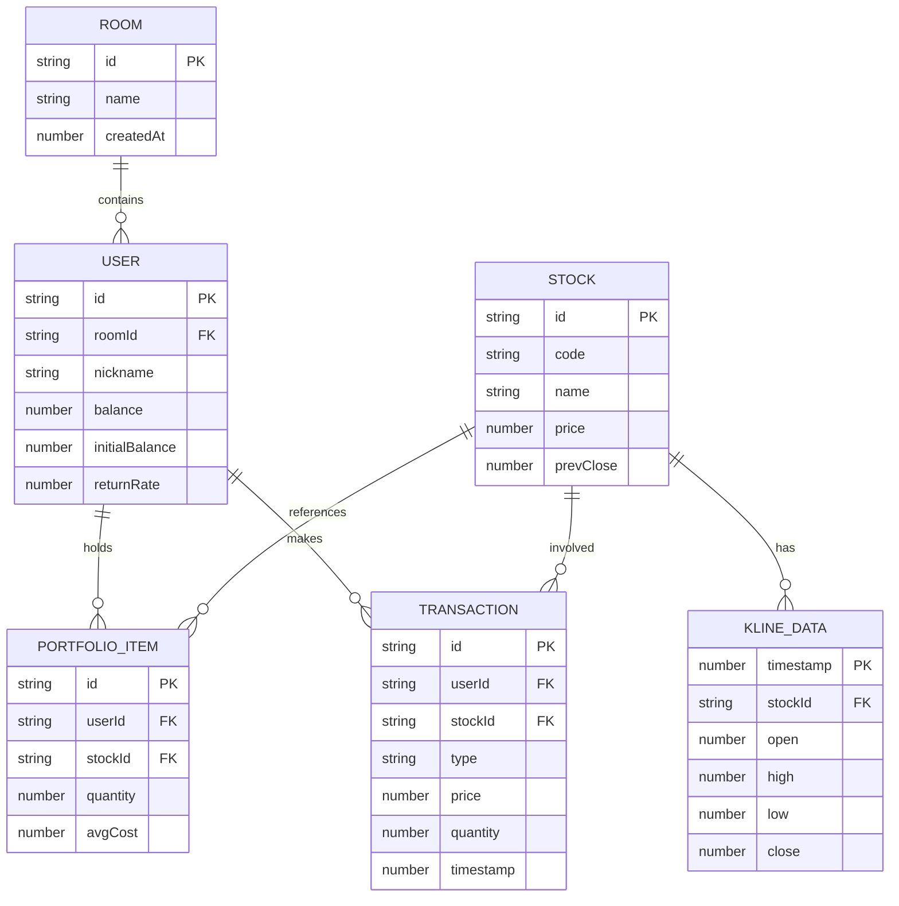

## 1. 架构设计



## 2. 技术说明

- **前端框架**：React 18 + TypeScript 5 + React Router DOM 6
- **构建工具**：Vite 5 + @vitejs/plugin-react
- **样式方案**：CSS Modules + 全局CSS变量主题
- **HTTP客户端**：Axios 1.6
- **后端模拟**：JSON Server 1.0（RESTful API模拟）
- **Canvas渲染**：原生Canvas 2D API（K线图实时绘制）
- **动画实现**：CSS transitions + requestAnimationFrame（数字滚动）

## 3. 路由定义

| 路由 | 页面组件 | 用途 |
|------|----------|------|
| `/` | Dashboard | 首页/比赛大厅，K线图+排行榜+持仓+加入入口 |
| `/room/:roomId` | TradePanel | 交易页面，股票列表+买入卖出交易面板 |

## 4. API定义（JSON Server模拟）

### 4.1 TypeScript接口定义

```typescript
// Stock 股票
interface Stock {
  id: string;
  code: string;
  name: string;
  price: number;
  prevClose: number;
  change: number;
  changePercent: number;
  volume: number;
  high: number;
  low: number;
  open: number;
}

// K线数据
interface KLineData {
  time: number;
  open: number;
  high: number;
  low: number;
  close: number;
  volume: number;
}

// Portfolio 持仓项
interface PortfolioItem {
  stockId: string;
  stockCode: string;
  stockName: string;
  quantity: number;
  avgCost: number;
  currentPrice: number;
}

// User 用户
interface User {
  id: string;
  roomId: string;
  nickname: string;
  balance: number;
  initialBalance: number;
  portfolio: PortfolioItem[];
  totalAssets: number;
  returnRate: number;
}

// Ranking 排行项
interface RankingItem {
  userId: string;
  nickname: string;
  totalAssets: number;
  returnRate: number;
  rank: number;
  prevRank?: number;
}

// Transaction 交易记录
interface Transaction {
  id: string;
  userId: string;
  roomId: string;
  stockId: string;
  stockCode: string;
  type: 'BUY' | 'SELL';
  price: number;
  quantity: number;
  amount: number;
  timestamp: number;
}
```

### 4.2 JSON Server Endpoints

| Method | Endpoint | 说明 |
|--------|----------|------|
| GET | `/stocks` | 获取所有股票列表（25只） |
| GET | `/stocks/:id` | 获取单只股票详情 |
| GET | `/users?roomId=:roomId` | 获取指定房间所有用户排行 |
| GET | `/users/:id` | 获取用户信息（余额+持仓） |
| POST | `/users` | 创建新用户（加入房间） |
| PATCH | `/users/:id` | 更新用户信息（交易后） |
| GET | `/transactions?userId=:userId` | 获取用户交易历史 |
| POST | `/transactions` | 创建交易记录 |
| GET | `/kline?stockId=:stockId` | 获取K线历史数据 |

### 4.3 db.json 初始数据结构

```json
{
  "stocks": [
    { "id": "1", "code": "AAPL", "name": "苹果", "price": 185.50, ... }
  ],
  "users": [
    { "id": "1", "roomId": "DEMO", "nickname": "演示用户", ... }
  ],
  "transactions": [],
  "kline": {}
}
```

## 5. 服务器架构（模拟层）



- **mockApi.ts**：封装所有API调用，添加200ms延迟模拟网络请求
- **价格引擎**：每5秒随机波动±3%更新所有股票价格，同步更新K线
- **K线生成**：前端每60秒生成一个K线柱（Canvas实时渲染）

## 6. 数据模型

### 6.1 ER图



### 6.2 初始数据

- **25只股票**：覆盖科技(AAPL, GOOGL, MSFT, AMZN, TSLA, META, NVDA, AMD)、金融(JPM, BAC, GS, MS)、消费(WMT, AMZN, HD, MCD, NKE)、医疗(JNJ, PFE, UNH, ABT)、能源(XOM, CVX, BP, SHEL)等板块
- **初始用户**：8个模拟用户用于排行榜展示，收益率随机分布在-15%到+35%之间
- **初始资金**：每位用户100,000美元
