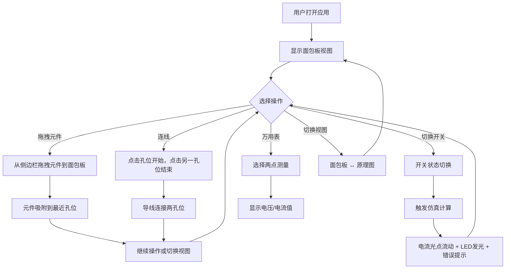

## 1. 产品概述

交互式电路实验模拟器——为电子爱好者提供浏览器端的面包板搭建与电路仿真体验，解决无法在网页上获得真实焊接与测试电路体验的问题。
- 核心目标：让用户在浏览器中拖拽元件、连线、仿真，获得接近真实的电路实验感受
- 目标用户：电子爱好者、电子工程学生、STEM教育参与者

## 2. 核心功能

### 2.1 功能模块

1. **工作区页面**：面包板视图 + 原理图视图（可切换）、侧边栏元件面板、工具栏、状态栏

### 2.2 页面详情

| 页面名称 | 模块名称 | 功能描述 |
|----------|----------|----------|
| 工作区 | 面包板视图 | 网格孔位排列，拖放元件引脚到孔位，拖拽导线连接引脚，吸附效果（15px阈值），Canvas渲染 |
| 工作区 | 原理图视图 | 根据面包板连线自动生成标准电路原理图，元件用标准符号，导线正交走线，Canvas渲染 |
| 工作区 | 侧边栏元件面板 | 左侧固定260px深色面板，卡片式元件列表（缩略图标+名称），悬停扩展5px+参数预览，5种基础元件 |
| 工作区 | 工具栏 | 元件选择、万用表工具、撤销/重做（20步）、清空按钮 |
| 工作区 | 状态栏 | 底部显示短路警告（红色闪烁）、总功耗估计值 |
| 工作区 | 万用表 | 点击两点测量电压/电流，数字表样式（黑底绿色7段数码管），单位自动切换，原理图金色渐变高亮支路 |

### 2.3 元件列表

| 元件 | 功能描述 |
|------|----------|
| 电阻 | 带色环颜色选择，阻值自动计算 |
| LED | 红黄绿三色可选，发光动画（亮度随电流增强，最大亮度0.3s脉动呼吸） |
| 电池 | 1.5V-9V可调 |
| 开关 | 单刀单掷，点击切换通断 |
| 电容 | 铝电解和瓷片两种外观 |

### 2.4 仿真功能

| 功能 | 描述 |
|------|------|
| 电流流动可视化 | 电池输出电流沿导线流动，光点8px/s速度移动 |
| LED发光 | 根据电路通断发光，强度随电流增大，最大亮度0.3s脉动呼吸 |
| 错误提示 | 电阻导线连接错误红色闪烁2Hz，持续1.5秒后熄灭 |
| 万用表测量 | 两点间电压/电流值，数字表样式，单位自动切换μA/mA/A或mV/V |

## 3. 核心流程

## 4. 用户界面设计

### 4.1 设计风格

- 主色调：深灰底色（#2a2a2e）搭配白色和亮蓝色（#3b82f6）
- 面包板背景：模拟真实塑料质感，浅灰色网格纹理，孔位深灰色圆点
- 元件拖拽：弹性跟随动画（弹性系数0.6）
- 侧边栏：左侧固定260px深色面板，卡片式排列
- 万用表：黑色背景，绿色7段数码管字体
- 按钮：圆角，亮蓝色主按钮，灰色次要按钮
- 字体：显示字体 Orbitron（科技感），正文 Rajdhani
- 布局：左侧面板 + 中央画布 + 底部状态栏

### 4.2 页面设计概览

| 页面名称 | 模块名称 | UI元素 |
|----------|----------|--------|
| 工作区 | 面包板画布 | Canvas全屏，浅灰网格纹理背景，深灰孔位圆点，深灰底色#2a2a2e |
| 工作区 | 侧边栏 | 固定260px宽，深色面板，卡片元件列表，悬停扩展+参数预览 |
| 工作区 | 工具栏 | 顶部亮蓝按钮，图标+文字，撤销/重做/清空 |
| 工作区 | 状态栏 | 底部条，短路红色闪烁警告，功耗数值 |
| 工作区 | 万用表浮层 | 黑底绿色7段数码管，单位标签 |

### 4.3 响应式适配

- 桌面优先设计
- 宽度 < 768px 时侧边栏折叠为顶部窄条
- 面包板视图自适应缩放
- 交互帧率不低于45fps

### 4.4 动效规范

| 交互 | 动效 |
|------|------|
| 元件拖拽 | 弹性跟随（系数0.6） |
| 元件放置 | 吸附动画（15px阈值） |
| 电流流动 | 光点沿导线8px/s移动 |
| LED发光 | 强度随电流，最大0.3s脉动呼吸 |
| 错误提示 | 红色闪烁2Hz，1.5s后熄灭 |
| 清空操作 | 元件依次淡出，总时长0.8s |
| 侧边栏卡片悬停 | 向右扩展5px |
