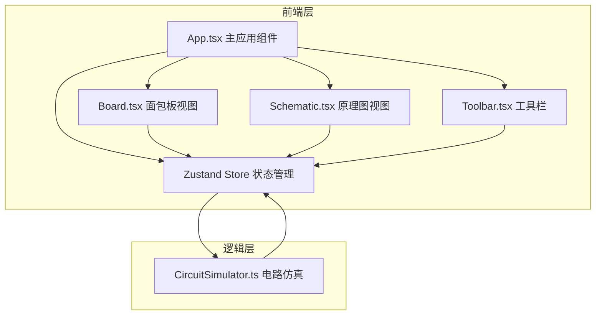

## 1. 架构设计



## 2. 技术说明

- 前端框架：React 18 + TypeScript
- 构建工具：Vite
- 状态管理：Zustand
- 渲染方式：Canvas 2D（面包板视图 + 原理图视图）
- 样式方案：CSS Modules + CSS变量
- 初始化工具：vite-init（react-ts模板）
- 后端：无
- 数据库：无（纯前端模拟）

## 3. 路由定义

| 路由 | 用途 |
|------|------|
| / | 主工作区（面包板/原理图视图切换） |

## 4. 数据模型

### 4.1 核心类型定义

```typescript
interface Component {
  id: string;
  type: 'resistor' | 'led' | 'battery' | 'switch' | 'capacitor';
  position: { row: number; col: number };
  rotation: number;
  params: ComponentParams;
  pins: Pin[];
}

interface Pin {
  id: string;
  componentId: string;
  holePosition: { row: number; col: number };
}

interface Wire {
  id: string;
  startPin: string;
  endPin: string;
  startHole: { row: number; col: number };
  endHole: { row: number; col: number };
}

interface ComponentParams {
  resistor?: { bands: [string, string, string, string]; resistance: number };
  led?: { color: 'red' | 'yellow' | 'green' };
  battery?: { voltage: number };
  switch?: { closed: boolean };
  capacitor?: { subtype: 'aluminum' | 'ceramic'; capacitance: number };
}

interface SimulationState {
  isShortCircuit: boolean;
  totalPower: number;
  pinVoltages: Map<string, number>;
  wireCurrents: Map<string, number>;
  ledBrightness: Map<string, number>;
  errors: Map<string, string>;
}

interface MultimeterReading {
  point1: { row: number; col: number };
  point2: { row: number; col: number };
  voltage?: number;
  current?: number;
  unit: string;
}
```

### 4.2 Zustand Store 状态

```typescript
interface CircuitStore {
  components: Component[];
  wires: Wire[];
  viewMode: 'breadboard' | 'schematic';
  selectedTool: string | null;
  multimeter: MultimeterReading | null;
  simulationState: SimulationState | null;
  history: { components: Component[]; wires: Wire[] }[];
  historyIndex: number;
  
  // Actions
  addComponent: (component: Component) => void;
  removeComponent: (id: string) => void;
  addWire: (wire: Wire) => void;
  removeWire: (id: string) => void;
  setViewMode: (mode: 'breadboard' | 'schematic') => void;
  toggleSwitch: (id: string) => void;
  runSimulation: () => void;
  undo: () => void;
  redo: () => void;
  clearBoard: () => void;
  measureVoltage: (p1: Position, p2: Position) => void;
  measureCurrent: (p1: Position, p2: Position) => void;
}
```

## 5. 电路仿真算法

采用简化的节点电压法：
1. 根据导线连接关系建立节点图
2. 对每个节点应用基尔霍夫电流定律
3. 求解线性方程组得到节点电压
4. 计算各支路电流和元件功率
5. 检测短路条件（电压源两端等效电阻≈0）

## 6. 文件组织

```
├── package.json
├── index.html
├── vite.config.js
├── tsconfig.json
├── src/
│   ├── main.tsx
│   ├── App.tsx
│   ├── App.css
│   ├── components/
│   │   ├── Board.tsx
│   │   ├── Schematic.tsx
│   │   └── Toolbar.tsx
│   ├── logic/
│   │   └── CircuitSimulator.ts
│   ├── store/
│   │   └── useCircuitStore.ts
│   └── types/
│       └── circuit.ts
```

## 7. 性能目标

- 面包板视图：30个元件 + 50条导线，拖拽交互 ≥ 45fps
- 仿真计算延迟 ≤ 50ms
- Canvas渲染使用requestAnimationFrame，避免不必要的重绘
- 状态变更使用Zustand的浅比较避免无效渲染
