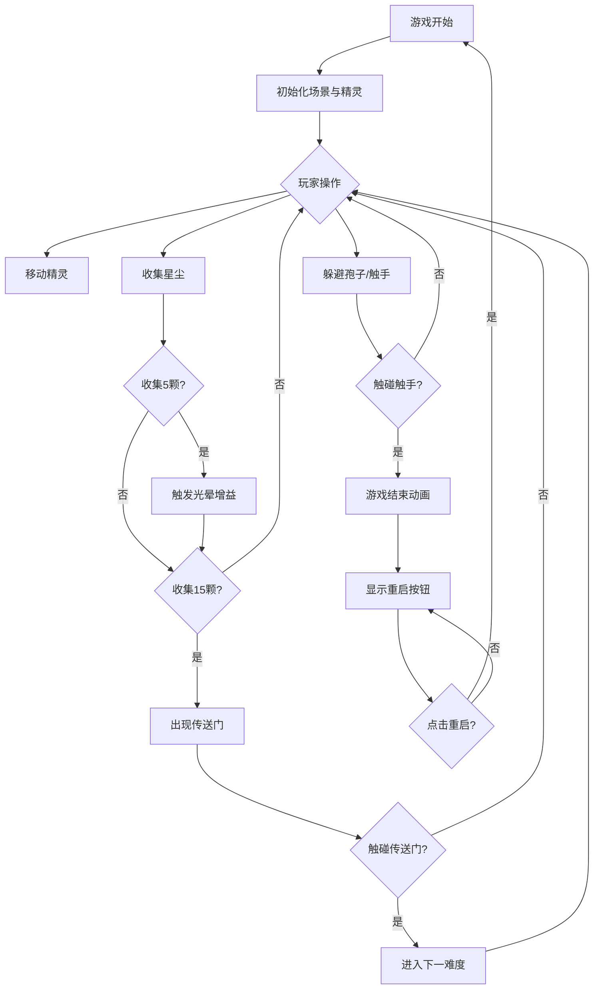

## 1. 产品概述

丛林荧光孢子采集追逐游戏是一款基于HTML5 Canvas的2D休闲动作游戏。玩家操控发光小精灵在黑暗丛林中穿梭，收集魔法星尘，躲避暗影触手，体验荧光魔幻的视觉效果。

- 核心玩法：躲避类收集游戏，考验玩家反应与操作
- 目标用户：休闲游戏玩家、视觉效果爱好者
- 产品价值：提供沉浸式荧光丛林体验，结合策略收集与躲避操作

## 2. 核心功能

### 2.1 功能模块

1. **精灵控制系统**：WASD/方向键移动，加速缓动机制
2. **蘑菇孢子系统**：荧光蘑菇散布，周期性释放减速孢子
3. **星尘收集系统**：魔法星尘随机生成，自动吸附，连击增益效果
4. **暗影触手系统**：追踪型敌怪生成与碰撞判定
5. **关卡进阶系统**：收集目标达成后传送门出现，难度递进
6. **渲染优化系统**：离屏Canvas缓存，局部重绘，30fps+性能保证

### 2.2 页面详情

| 页面名称 | 模块名称 | 功能描述 |
|-----------|-------------|---------------------|
| 游戏主界面 | 背景渲染 | 深蓝紫径向渐变 + 星星闪烁层 |
| 游戏主界面 | 精灵绘制 | 青绿光晕脉动圆形精灵 + 拖尾效果 |
| 游戏主界面 | 蘑菇系统 | 20-30颗荧光蘑菇 + 孢子粒子扩散 |
| 游戏主界面 | 星尘系统 | 金色五角星 + 自动吸附动画 |
| 游戏主界面 | 触手系统 | 深紫波浪形触手 + 波纹动画 |
| 游戏主界面 | UI显示 | 左上角星尘计数（白色10px） |
| 游戏结束层 | 结束动画 | 边缘变暗 + 中心颗粒爆炸效果 |
| 游戏结束层 | 重启按钮 | 1.5秒后显示重启选项 |
| 传送门系统 | 关卡进阶 | 发光旋转传送门 + 难度递增 |

## 3. 核心流程

游戏开始 → 玩家操控精灵移动 → 收集魔法星尘（5颗触发增益，15颗出现传送门）→ 躲避蘑菇孢子与暗影触手 → 触碰触手游戏结束 → 点击重启重新开始 / 触碰传送门进入下一难度关卡。

## 4. 用户界面设计

### 4.1 设计风格

- 主色调：深蓝（#0a0e27）→ 暗紫（#1a0a2e）径向渐变背景
- 辅助色：青绿（#00ffd5）精灵光效、金色（#ffd700）星尘、深紫（#2d0a3e）触手、紫蓝（#6b3fa0）蘑菇伞
- 字体：极简无衬线，白色，10px计数显示
- 视觉风格：荧光魔幻、暗色系、发光粒子、柔和光晕
- 动画：脉动、扩散、旋转、拖尾、波纹

### 4.2 页面设计概览

| 页面名称 | 模块名称 | UI元素 |
|-----------|-------------|-------------|
| 游戏主界面 | 背景层 | 径向渐变、星星闪烁（2-4秒周期） |
| 游戏主界面 | 蘑菇层 | 紫→蓝伞面渐变、黄绿伞柄、内发光、孢子白色粒子 |
| 游戏主界面 | 精灵层 | 青绿圆形、1秒脉动光晕、30px淡青尾迹 |
| 游戏主界面 | 星尘层 | 金色五角星、缓慢旋转、小光晕、自动吸附缩小 |
| 游戏主界面 | 触手层 | 深紫波浪形3段弯曲、波纹动画、缓慢延伸 |
| 游戏主界面 | UI层 | 左上角白色10px星尘计数 |
| 游戏结束层 | 覆盖层 | 深色半透明、中心淡紫颗粒爆炸、1.5秒后按钮 |
| 传送门 | 进阶门 | 直径60px、白-青-蓝-紫渐变光晕、缓慢旋转 |

### 4.3 响应式设计

- 全屏Canvas渲染，自适应窗口尺寸
- 实体坐标基于Canvas宽高动态调整
- 桌面端键盘控制（WASD/方向键）
