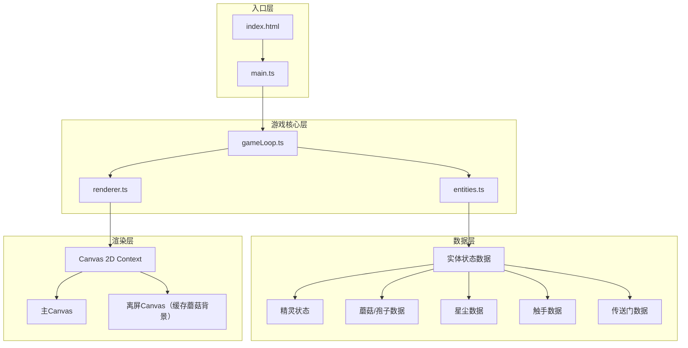

## 1. 架构设计



### 模块调用关系与数据流向

```
main.ts (入口)
  ↓ 初始化
gameLoop.ts (游戏循环控制)
  ↓ 每帧 update()
entities.ts (实体数据与逻辑)
  ↓ 返回更新后的实体状态
gameLoop.ts
  ↓ 将实体数据传递给
renderer.ts (绘制渲染)
  ↓ 输出到
Canvas Context
```

**数据流向：**
1. 用户键盘输入 → main.ts → gameLoop.ts（处理移动指令）
2. gameLoop.ts.update() → 调用各实体的 update() 方法 → 实体状态变更
3. 碰撞检测在 gameLoop.ts 中进行，结果反馈给 entities（触发收集/减速/死亡）
4. 每帧结束：gameLoop.ts 将所有实体数据传给 renderer.ts 进行渲染

## 2. 技术描述

- **前端框架**：原生 TypeScript + HTML5 Canvas（无UI框架，纯Canvas渲染）
- **构建工具**：Vite 5.x
- **语言**：TypeScript（严格模式，目标 ES2020）
- **渲染**：Canvas 2D API + 离屏Canvas缓存优化
- **性能目标**：稳定30fps+

## 3. 文件结构

| 文件路径 | 职责 | 依赖 |
|----------|------|------|
| `package.json` | 项目依赖配置（typescript、vite） | - |
| `vite.config.js` | Vite构建配置（TS启用、base='./'） | - |
| `tsconfig.json` | TypeScript配置（严格模式、ES2020） | - |
| `index.html` | 入口页面（深色背景、全屏Canvas） | - |
| `src/main.ts` | 入口文件：初始化Canvas、启动游戏循环、键盘监听 | entities.ts, gameLoop.ts, renderer.ts |
| `src/entities.ts` | 实体定义：精灵、蘑菇、孢子、星尘、触手、传送门的数据结构与创建/更新方法 | 无（纯数据+逻辑） |
| `src/renderer.ts` | 渲染层：背景渐变、蘑菇光晕、精灵轨迹、触手动画、UI绘制 | 接收entities数据 |
| `src/gameLoop.ts` | 游戏循环：update逻辑、碰撞检测、实体生命周期管理 | entities.ts |

## 4. 数据模型

### 4.1 实体接口定义

```typescript
// 位置与速度
interface Vec2 { x: number; y: number; }

// 玩家精灵
interface Player {
  pos: Vec2;
  vel: Vec2;
  radius: number;
  maxSpeed: number;          // 4px/帧
  currentSpeed: number;
  accelTime: number;         // 按键时长
  decelTime: number;         // 松开后减速时长
  glowPulse: number;         // 脉动相位 0-1
  glowRadius: number;        // 光晕半径
  isBoosted: boolean;        // 5颗星尘增益
  boostTimer: number;        // 增益剩余时间
  isSlowed: boolean;         // 孢子减速
  slowTimer: number;         // 减速剩余时间
  trail: Vec2[];             // 尾迹点数组
}

// 荧光蘑菇
interface Mushroom {
  pos: Vec2;
  capRadius: number;         // 10-15px (直径20-30px)
  stemHeight: number;
  sporeTimer: number;        // 距下次释放孢子
  isPulsing: boolean;        // 15颗星尘脉动效果
  pulseTimer: number;
}

// 孢子粒子
interface Spore {
  pos: Vec2;
  vel: Vec2;
  radius: number;            // 1-2px
  life: number;              // 剩余寿命 0.8秒
  maxLife: number;
}

// 魔法星尘
interface StarDust {
  pos: Vec2;
  vel: Vec2;                 // 抛物线速度
  size: number;              // 15px
  rotation: number;          // 当前旋转角度
  isAbsorbing: boolean;      // 是否在被吸附
  absorbTarget: Vec2 | null;
  absorbTimer: number;       // 吸附过程 0.3秒
}

// 暗影触手
interface Tentacle {
  segments: Vec2[];          // 3段弯曲控制点
  length: number;            // 50-80px
  thickness: number;         // 4px
  wavePhase: number;         // 波纹动画相位
  tipPos: Vec2;              // 触手尖端
  targetPos: Vec2;           // 目标位置（玩家）
  speed: number;             // 1.5px/帧
}

// 传送门
interface Portal {
  pos: Vec2;
  radius: number;            // 30px (直径60px)
  rotation: number;
  active: boolean;
}

// 游戏状态
interface GameState {
  player: Player;
  mushrooms: Mushroom[];
  spores: Spore[];
  starDusts: StarDust[];
  tentacles: Tentacle[];
  portal: Portal | null;
  starCount: number;         // 已收集星尘数
  level: number;             // 当前关卡
  isGameOver: boolean;
  gameOverTimer: number;     // 结束动画计时
  nextStarTimer: number;     // 下颗星尘生成倒计时
  nextTentacleTimer: number; // 下只触手生成倒计时
  dirtyRects: Rect[];        // 脏矩形列表（局部重绘优化）
}
```

### 4.2 关键常量

| 常量 | 值 | 说明 |
|------|-----|------|
| MUSHROOM_COUNT | 20-30 | 初始蘑菇数量 |
| MUSHROOM_MIN_DIST | 40px | 蘑菇最小间距 |
| SPORE_INTERVAL | 2s | 孢子释放周期 |
| SPORE_SPEED | 0.5px/帧 | 孢子扩散速度 |
| SPORE_LIFE | 0.8s | 孢子存活时间 |
| SLOW_DURATION | 1s | 孢子减速持续 |
| SLOW_FACTOR | 0.5 | 减速比例 |
| STAR_INTERVAL | 3-5s | 星尘生成间隔 |
| STAR_ABSORB_RANGE | 20px | 自动吸附范围 |
| STAR_ABSORB_TIME | 0.3s | 吸附动画时长 |
| BOOST_TRIGGER | 5颗 | 触发光晕增益 |
| BOOST_DURATION | 3s | 增益持续时间 |
| BOOST_SPEED_FACTOR | 1.3 | 增益速度倍率 |
| BOOST_GLOW_SCALE | 2 | 增益光晕倍率 |
| PORTAL_TRIGGER | 15颗 | 触发传送门 |
| TENTACLE_INTERVAL | 10-12s | 触手生成间隔 |
| TENTACLE_SPEED | 1.5px/帧 | 触手延伸速度 |
| LEVEL_MUSHROOM_ADD | +10 | 每关蘑菇增量 |
| LEVEL_TENTACLE_REDUCE | -2s | 每关触手周期缩短 |

## 5. 渲染优化策略

1. **离屏Canvas缓存**：蘑菇为静态元素，绘制到离屏Canvas缓存，每帧直接贴图
2. **脏矩形局部重绘**：追踪移动实体（精灵、星尘、触手、孢子）的上帧与本帧包围盒，仅重绘这些区域
3. **对象池复用**：孢子粒子、星尘使用对象池减少GC开销
4. **帧率控制**：使用 requestAnimationFrame，必要时跳帧保持逻辑稳定
