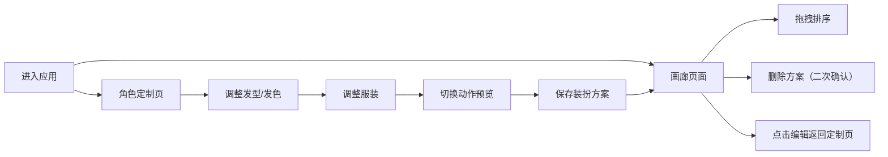

## 1. 产品概述

虚拟形象装扮与社交展示平台，允许用户在网页上自定义虚拟角色形象，调整发型、服装、配饰等元素，并将装扮方案保存至个人画廊展示。解决用户在没有物理试衣间的情况下预览穿搭效果的问题，为用户提供个性化的虚拟形象创作体验。

- 核心价值：让用户轻松创建、定制和分享个性化虚拟形象
- 目标用户：喜欢虚拟装扮、社交展示的年轻用户群体
- 市场定位：轻量级 Web 应用，无需下载即可使用

## 2. 核心功能

### 2.1 用户角色

| 角色 | 注册方式 | 核心权限 |
|------|----------|----------|
| 普通用户 | 无需注册（本地存储） | 自定义角色、保存装扮、管理画廊 |

### 2.2 功能模块

1. **角色定制页面**：左侧定制面板、右侧实时渲染画布、动作切换按钮、保存功能
2. **画廊页面**：装扮方案卡片展示、拖拽排序、删除确认、缩放预览

### 2.3 页面详情

| 页面名称 | 模块名称 | 功能描述 |
|---------|----------|----------|
| 角色定制页 | 定制面板 | 发型选择（5种+）、发色选择（色盘）、上衣（5种）、下装（5种）、鞋子（3种） |
| 角色定制页 | 渲染画布 | 实时渲染角色、动画过渡（0.3秒缓动）、3套动作系统 |
| 角色定制页 | 动作控制 | 站立待机（呼吸动画）、挥手打招呼（手臂摆动）、跳跃（身体上下） |
| 角色定制页 | 保存功能 | 输入装扮名称、保存至本地存储、最多保存10套 |
| 画廊页面 | 卡片展示 | 角色缩略图、装扮名称、悬停放大120%+阴影扩散 |
| 画廊页面 | 拖拽排序 | 拖拽时半透明、目标位置虚线占位、松开动画归位 |
| 画廊页面 | 删除功能 | 二次确认弹窗、半透明模糊遮罩、按钮按压反馈 |

## 3. 核心流程

用户进入应用 → 选择定制角色或查看画廊 → 在定制页面调整各项装扮参数 → 实时预览角色效果 → 切换动作查看动画 → 保存装扮方案 → 进入画廊查看所有方案 → 拖拽调整顺序或删除方案

## 4. 用户界面设计

### 4.1 设计风格

- **主色调**：暖橙色 #FF8C42（活力、创意）
- **辅助色**：深灰色 #2D2D2D（稳重、专业）
- **背景色**：柔和米白色 #FDF5E6（温暖、舒适）
- **按钮风格**：圆角 12px，hover 时背景渐变色并上浮 2px
- **字体**：Google Fonts Poppins，现代简洁风格
- **布局风格**：左侧窄面板 + 右侧宽画布，卡片式画廊展示
- **交互反馈**：所有动画 0.2 秒内完成，帧率不低于 30fps

### 4.2 页面设计概述

| 页面名称 | 模块名称 | UI 元素 |
|---------|----------|---------|
| 角色定制页 | 顶部导航 | Logo、页面切换按钮、汉堡菜单（移动端） |
| 角色定制页 | 左侧面板 | 分类标签、选项卡、色盘选择器、滑块/按钮 |
| 角色定制页 | 右侧画布 | Canvas 渲染区域、动作切换按钮组、保存按钮 |
| 角色定制页 | 保存弹窗 | 输入框、确认/取消按钮 |
| 画廊页面 | 卡片网格 | 响应式网格布局、装扮卡片、悬停效果 |
| 画廊页面 | 删除弹窗 | 半透明模糊背景、确认文案、双按钮 |
| 通用组件 | 空状态 | 友好提示文案、引导按钮 |

### 4.3 响应式设计

- **桌面端**：左侧固定宽度面板（320px）+ 右侧自适应画布区域
- **平板端**：面板宽度自适应，画布保持正方形比例
- **移动端**：面板折叠为抽屉式菜单，点击汉堡按钮从左侧滑出，画布占满屏幕宽度
- **触摸优化**：按钮最小尺寸 44x44px，支持触摸滑动操作

## 5. 性能要求

- 角色渲染延迟 < 100ms
- 面板交互响应 < 100ms
- 动画帧率 ≥ 30fps
- 首屏加载 < 2s
- 本地存储读写 < 50ms
