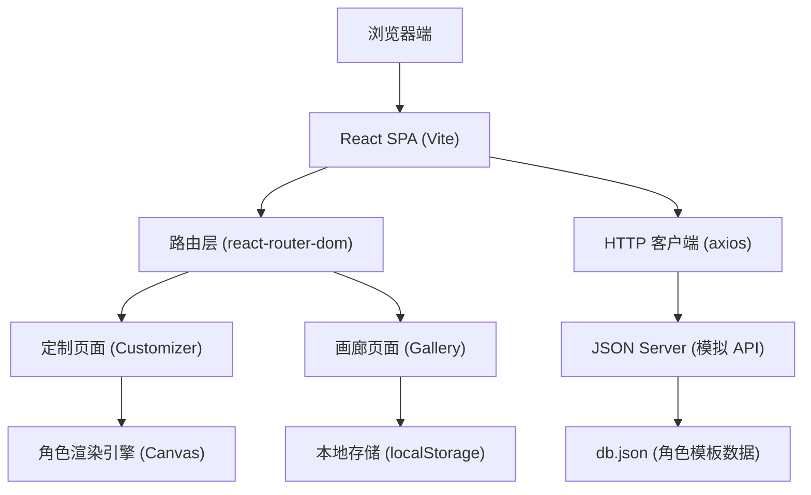
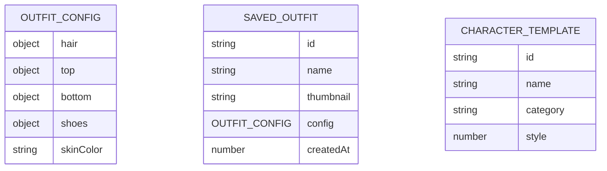

## 1. 架构设计



## 2. 技术描述

- **前端框架**：React 18 + TypeScript + Vite 5
- **状态管理**：React useState/useEffect（轻量级场景）
- **路由管理**：react-router-dom v6
- **HTTP 客户端**：axios
- **后端模拟**：JSON Server
- **渲染引擎**：HTML5 Canvas 2D API
- **构建工具**：Vite 5（@vitejs/plugin-react）
- **代码规范**：TypeScript 严格模式，ES2020 目标

## 3. 路由定义

| 路由 | 页面 | 用途 |
|------|------|------|
| `/` | 角色定制页 | 默认首页，角色装扮定制 |
| `/customize` | 角色定制页 | 角色装扮定制（与首页同组件） |
| `/gallery` | 画廊页面 | 展示和管理保存的装扮方案 |

## 4. API 定义

### 4.1 获取角色模板

```typescript
// GET /api/templates
interface CharacterTemplate {
  id: string;
  name: string;
  category: 'hair' | 'top' | 'bottom' | 'shoes';
  style: number;
  colors?: string[];
}

// 响应示例
{
  "templates": [
    { "id": "hair-1", "name": "短发", "category": "hair", "style": 1 },
    { "id": "top-1", "name": "T恤", "category": "top", "style": 1 }
  ]
}
```

### 4.2 获取默认装扮

```typescript
// GET /api/default-outfit
interface OutfitConfig {
  hair: { style: number; color: string };
  top: { style: number; color: string };
  bottom: { style: number; color: string };
  shoes: { style: number; color: string };
  skinColor: string;
}

// 响应示例
{
  "hair": { "style": 1, "color": "#2D2D2D" },
  "top": { "style": 1, "color": "#FF8C42" },
  "bottom": { "style": 1, "color": "#4A90D9" },
  "shoes": { "style": 1, "color": "#2D2D2D" },
  "skinColor": "#FDBF6F"
}
```

## 5. 项目文件结构

```
├── db.json                 # JSON Server 数据
├── package.json            # 依赖和脚本
├── vite.config.js          # Vite 配置
├── tsconfig.json           # TypeScript 配置
├── index.html              # 入口 HTML
└── src/
    ├── App.tsx             # 根组件，路由配置
    ├── main.tsx            # 应用入口
    ├── components/
    │   ├── Customizer.tsx  # 定制面板组件
    │   └── Gallery.tsx     # 画廊组件
    └── utils/
        └── avatarEngine.ts # 角色渲染引擎
```

## 6. 数据模型

### 6.1 装扮方案（SavedOutfit）

```typescript
interface SavedOutfit {
  id: string;           // uuid
  name: string;         // 装扮名称
  thumbnail: string;    // 缩略图 base64
  config: OutfitConfig; // 装扮配置
  createdAt: number;    // 创建时间戳
}

// localStorage key: 'avatar_gallery'
// 存储格式: SavedOutfit[] (最多 10 条)
```

### 6.2 角色状态（AvatarState）

```typescript
type ActionType = 'idle' | 'wave' | 'jump';

interface AvatarState {
  config: OutfitConfig;
  action: ActionType;
  animationFrame: number;
}
```

### 6.3 数据模型 ER 图



## 7. 核心技术要点

### 7.1 Canvas 渲染引擎
- 使用 requestAnimationFrame 实现流畅动画
- 分层绘制：身体 → 服装 → 发型 → 配饰
- 动作状态机管理动画过渡
- 0.3 秒缓动插值实现平滑切换

### 7.2 拖拽排序实现
- 使用 HTML5 Drag and Drop API
- 拖拽时元素半透明，视觉跟随
- 目标位置虚线占位提示
- transform 动画实现归位效果

### 7.3 性能优化
- Canvas 脏矩形渲染，只重绘变化区域
- 事件节流/防抖处理频繁操作
- localStorage 读写异步化，不阻塞 UI
- 缩略图生成使用 canvas.toDataURL 压缩

## 8. 启动命令

```bash
# 安装依赖
npm install

# 同时启动开发服务器和 JSON Server
npm run dev

# 仅启动 JSON Server
npm run server
```
