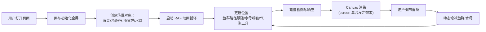

## 1. 产品概述

海底光影与鱼群迁徙交互式动态壁纸——一个沉浸式浏览器视觉体验项目，让用户打开页面如同潜入深海世界，观赏光线穿透水波、银色鱼群沿贝塞尔曲线优雅迁徙、发光水母随呼吸浮动的梦幻场景。

- 目标用户：追求视觉美感、喜爱自然动态壁纸的普通用户
- 产品价值：通过 Canvas 2D 高性能渲染技术，打造流畅、梦幻、可交互的深海视觉体验

## 2. 核心功能

### 2.1 功能模块

1. **深海背景系统**：径向渐变背景、顶部水波光斑、上升气泡粒子
2. **鱼群迁徙系统**：80+ 条银色小鱼、贝塞尔曲线路径跟随、随机偏移扰动、碰撞规避
3. **发光水母系统**：20 朵发光水母、呼吸浮动动画、伞状高光与发光触须、碰撞响应
4. **交互控制面板**：半透明磨砂玻璃滑块，动态调节鱼群和水母数量

### 2.2 页面详情

| 页面名称 | 模块名称 | 功能描述 |
|-----------|-------------|---------------------|
| 主场景 | 深海背景 | 从深蓝#0a1628到墨绿#0d2818的径向渐变，全屏铺满 |
| 主场景 | 水面光斑 | 正弦波叠加生成的青蓝色半透明动态光斑，透明度0.1-0.4脉动，45fps+ |
| 主场景 | 气泡粒子 | 40个缓慢上升气泡，大小2-6px，透明度0.1-0.3，速度1-3px/s |
| 主场景 | 鱼群系统 | 80条银白渐变三角形小鱼，沿贝塞尔曲线迁徙，60秒重生成路径，15px随机偏移 |
| 主场景 | 水母系统 | 20朵发光水母，粉紫#ff6bcb到淡蓝#6bcbff随机，3-5秒呼吸周期，8px幅度 |
| 主场景 | 碰撞检测 | 水母间圆形碰撞、鱼群驱散水母（0.8秒恢复），法线方向推开 |
| 侧边控制 | 数量滑块 | 磨砂玻璃效果滑块，动态调整鱼群/水母数量，无卡顿闪烁 |

## 3. 核心流程

用户打开页面 → 画布全屏初始化 → 背景、鱼群、水母、气泡对象创建 → requestAnimationFrame 动画循环启动（背景绘制→鱼群更新与渲染→水母更新与渲染→碰撞检测→气泡更新）→ 用户通过滑块调节数量 → 场景对象动态增减 → 持续渲染保持45fps+

## 4. 用户界面设计

### 4.1 设计风格
- **主色调**：深海蓝 #0a1628、墨绿 #0d2818、发光青蓝 #6bcbff、发光粉紫 #ff6bcb、银白渐变
- **视觉效果**：Canvas globalCompositeOperation = 'screen' 叠加发光效果，营造梦幻光晕
- **控制面板**：半透明磨砂玻璃效果（backdrop-filter: blur + rgba 半透明背景）
- **布局**：画布全屏铺满，控制滑块位于右侧垂直排列

### 4.2 页面设计概览

| 页面名称 | 模块名称 | UI 元素 |
|-----------|-------------|-------------|
| 主场景 | 背景层 | 径向渐变，顶部水波光斑脉动 |
| 主场景 | 气泡层 | 40个半透明圆形粒子缓慢上升 |
| 主场景 | 水母层 | 伞状体带高光，触须发光细线，上下浮动 |
| 主场景 | 鱼群层 | 银色三角形小鱼群，沿曲线流动如绸缎 |
| 侧边控制 | 滑块面板 | 磨砂玻璃容器，两个范围滑块，标签文字发光 |

### 4.3 响应式
- 画布自适应窗口大小，resize 事件实时更新
- 控制面板固定右侧，移动端自动调整宽度
- 所有粒子坐标基于窗口尺寸比例计算

## 5. 性能要求

- 帧率稳定 ≥ 45fps
- 鱼群/水母数量动态调整时无卡顿闪烁
- 使用对象池复用减少 GC
- 圆形碰撞检测 O(n²) 优化为分桶检测
