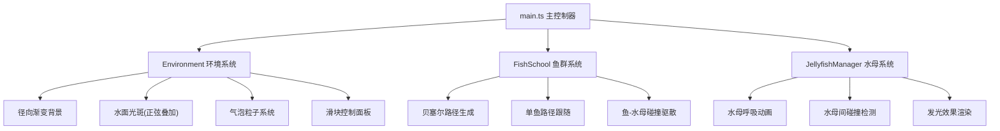

## 1. 架构设计

纯前端 Canvas 2D 渲染架构，无后端服务。采用模块化类设计，主循环驱动各子系统更新与渲染。



## 2. 技术描述

- **前端框架**：原生 TypeScript（无 UI 框架，纯 Canvas 2D）
- **构建工具**：Vite 5.x
- **TypeScript**：严格模式，target ES2020
- **渲染技术**：HTML5 Canvas 2D Context，globalCompositeOperation = 'screen' 发光叠加
- **动画驱动**：window.requestAnimationFrame，deltaTime 时间插值
- **碰撞检测**：圆形碰撞检测（半径 + 距离平方比较）

## 3. 文件结构

```
.
├── package.json          # typescript、vite 依赖，dev 脚本
├── vite.config.js        # 基础配置，开启 TypeScript
├── tsconfig.json         # 严格模式，target ES2020
├── index.html            # 入口页面，全屏黑色背景
└── src/
    ├── main.ts           # 画布初始化、动画循环、场景管理
    ├── fish.ts           # FishSchool 鱼群类
    ├── jellyfish.ts      # Jellyfish & JellyfishManager 水母类
    └── environment.ts    # Environment 环境系统（光斑/气泡/滑块）
```

## 4. 核心类与接口定义

### 4.1 fish.ts

```typescript
interface Fish {
  pathProgress: number    // 路径进度 0-1
  offsetX: number         // X 随机偏移
  offsetY: number         // Y 随机偏移
  speed: number           // 游动速度系数
  size: number            // 鱼身大小
  x: number
  y: number
  angle: number
}

class FishSchool {
  fishes: Fish[]
  pathPoints: {x:number,y:number}[]  // 贝塞尔控制点 3-5 个
  pathRegenInterval: number  // 60000ms
  lastPathRegen: number

  constructor(count: number, canvasW: number, canvasH: number)
  setCount(count: number): void
  regeneratePath(canvasW: number, canvasH: number): void
  getPointOnPath(t: number): {x:number, y:number}
  update(dt: number, jellyfishes: Jellyfish[]): void
  render(ctx: CanvasRenderingContext2D): void
}
```

### 4.2 jellyfish.ts

```typescript
interface Jellyfish {
  x: number
  y: number
  baseX: number           // 原始位置（被推开后回归目标）
  baseY: number
  radius: number          // 碰撞半径
  color: string           // #ff6bcb 或 #6bcbff
  breathPhase: number     // 呼吸相位
  breathPeriod: number    // 3000-5000ms
  breathAmp: number       // 8px
  recoveryTime: number    // 被推开后恢复计时器
  vx: number
  vy: number
}

class JellyfishManager {
  jellyfishes: Jellyfish[]

  constructor(count: number, canvasW: number, canvasH: number)
  setCount(count: number, canvasW: number, canvasH: number): void
  update(dt: number, fishes: Fish[]): void
  render(ctx: CanvasRenderingContext2D): void
  private resolveCollisions(): void
  private handleFishDispersion(fishes: Fish[]): void
}
```

### 4.3 environment.ts

```typescript
interface Bubble {
  x: number; y: number; size: number; speed: number; alpha: number
}

interface LightSpot {
  x: number; baseY: number; amp: number; freq: number; phase: number; radius: number
}

class Environment {
  bubbles: Bubble[]
  lightSpots: LightSpot[]
  fishCountSlider: HTMLInputElement
  jellyCountSlider: HTMLInputElement
  onFishCountChange: (n: number) => void
  onJellyCountChange: (n: number) => void

  constructor(canvasW: number, canvasH: number)
  initControls(): void
  update(dt: number, canvasW: number, canvasH: number): void
  renderBackground(ctx: CanvasRenderingContext2D, canvasW: number, canvasH: number): void
  renderLightSpots(ctx: CanvasRenderingContext2D, time: number): void
  renderBubbles(ctx: CanvasRenderingContext2D): void
}
```

## 5. 关键算法

### 5.1 贝塞尔曲线采样
使用 De Casteljau 算法在 n 阶贝塞尔曲线上采样，t ∈ [0,1] 映射到点坐标。

### 5.2 碰撞检测优化
- 水母间碰撞：距离平方 < (r1+r2)²，沿法线方向各推一半
- 鱼驱散水母：鱼进入水母半径 2 倍范围时，水母沿鱼运动方向法线推开，0.8s 内缓动回归 baseX/baseY

### 5.3 光斑生成
多组正弦波叠加：`y = baseY + Σ(amp[i] * sin(freq[i]*x + phase[i] + time))`，每个光斑为径向渐变圆，透明度随时间脉动。

## 6. 性能优化策略

- **距离平方比较**：避免 Math.sqrt 开方运算
- **分层渲染**：背景 → 光斑(screen) → 气泡 → 水母(screen) → 鱼群(screen)
- **对象复用**：setCount 时复用已有对象，仅增量创建/销毁
- **Canvas 状态缓存**：减少 save/restore 调用频次
