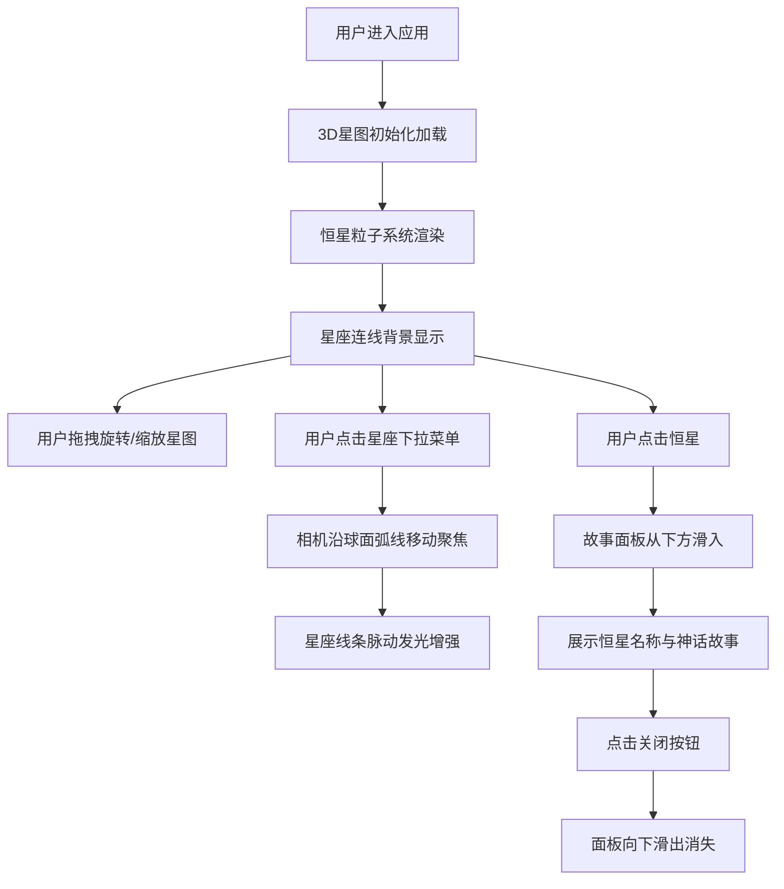

## 1. 产品概述

交互式3D古代星图与星座故事探索应用，让用户以数字人文的方式探索古老星图，体验中世纪天文台视角，了解恒星的历史位置变迁与神话故事的联系。

- 面向数字人文研究者、天文爱好者和教育领域用户
- 提供沉浸式的3D星图探索体验，融合中国古代天文学与神话传说
- 核心价值：将古老的天文知识以现代交互技术呈现，使历史星图可触可感

## 2. 核心功能

### 2.1 功能模块

1. **3D星图展示**：恒星粒子系统、星座连线、天文环装饰
2. **交互控制**：鼠标拖拽旋转、滚轮缩放、星座选择下拉菜单
3. **故事面板**：点击恒星显示中文名称、历代星官名称、神话故事
4. **星座导航**：预设8个古代星座，自动聚焦与动画过渡

### 2.2 页面详情

| 页面名称 | 模块名称 | 功能描述 |
|---------|---------|---------|
| 主页面 | 3D星图画布 | 全屏渲染2000颗恒星粒子，支持拖拽旋转和滚轮缩放 |
| 主页面 | 星座选择器 | 左上角下拉菜单，切换预设星座并自动聚焦 |
| 主页面 | 故事面板 | 底部滑入面板，展示恒星信息与神话故事 |
| 主页面 | 天文装饰环 | 星图周围淡金色旋转圆环，增强古籍氛围 |

## 3. 核心流程

## 4. 用户界面设计

### 4.1 设计风格

- **设计主题**：中世纪天文古籍风格，神秘典雅
- **主色调**：深蓝紫色（#0a0a2a）到墨色（#0f0f1a）径向渐变背景
- **强调色**：淡金色（#d4af37）用于星座连线、标签和边框
- **恒星颜色**：暖白、淡蓝、浅黄三种辉光色混合，根据光谱类型区分
- **字体**：中文使用宋体，体现古籍韵味
- **装饰元素**：淡金色天文环、磨砂玻璃下拉菜单、金色细边框

### 4.2 页面设计概述

| 页面名称 | 模块名称 | UI元素 |
|---------|---------|--------|
| 主页面 | 3D星图画布 | 全屏WebGL画布，深蓝紫色渐变背景，2000颗发光恒星粒子 |
| 主页面 | 星座选择器 | 左上角磨砂玻璃风格下拉菜单，选中项金色高亮 |
| 主页面 | 故事面板 | 底部半透明深蓝色卡片，金色边框，宋体文字，圆形金色关闭按钮 |
| 主页面 | 天文装饰环 | 星图周围淡金色圆形描边，缓慢旋转动画 |

### 4.3 响应式设计

- **桌面端（>768px）**：故事面板宽900px高400px，星座下拉菜单在左上角
- **平板端（≤768px）**：故事面板全宽、高度自适应
- **移动端（≤480px）**：星座选择下拉菜单移至底部

### 4.4 3D场景指引

- **环境**：深蓝紫色径向渐变背景，营造深邃宇宙感
- **光照**：恒星自发光效果，使用Points材质配合Additive混合模式
- **相机**：透视相机，环绕星图球面运动，支持缩放（0.5x-10x）
- **构图**：星图居中，外围有淡金色天文环装饰
- **交互**：鼠标拖拽旋转（0.7倍阻尼惯性），点击恒星触发故事面板
- **动画**：恒星轻微脉动、星座连线渐显扩散、相机平滑过渡
- **性能**：2000粒子+8组星座线，帧率≥45fps
