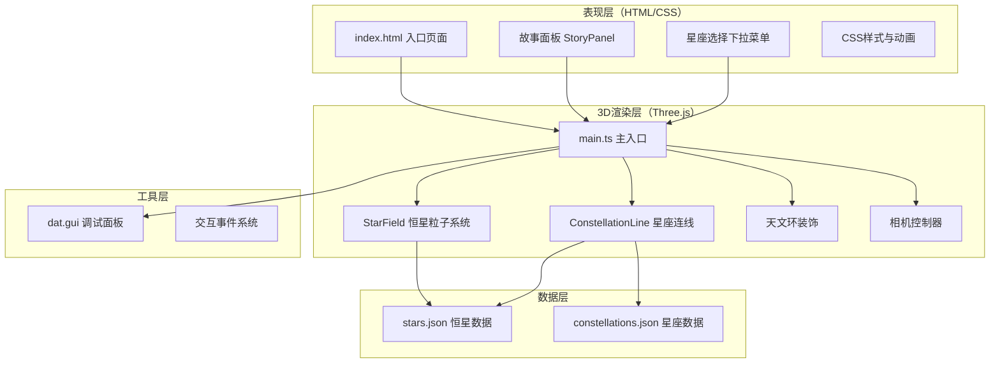

## 1. 架构设计



## 2. 技术描述

- **前端框架**：TypeScript + Three.js + Vite
- **构建工具**：Vite@5.x，TypeScript严格模式
- **3D引擎**：Three.js@0.160.0
- **调试工具**：dat.gui
- **数据格式**：JSON（恒星数据、星座数据、神话故事）
- **样式方案**：原生CSS + CSS动画
- **无后端**：纯前端应用，所有数据本地静态文件

## 3. 数据模型

### 3.1 恒星数据模型 (Star)

```typescript
interface Star {
  id: string;
  name: string;           // 中文名称
  ra: number;             // 赤经（弧度）
  dec: number;            // 赤纬（弧度）
  magnitude: number;      // 视星等
  spectrum: 'O' | 'B' | 'A' | 'K' | 'M';  // 光谱类型
  constellation: string;  // 所属星座
  ancientNames: string[]; // 历代星官名称
  story: string;          // 神话故事
}
```

### 3.2 星座数据模型 (Constellation)

```typescript
interface Constellation {
  id: string;
  name: string;           // 星座名称
  stars: string[];        // 恒星ID数组（按连线顺序）
  centerStarIndex: number; // 中心恒星索引
}
```

## 4. 文件结构与调用关系

```
project-root/
├── package.json          # 项目依赖配置
├── vite.config.js        # Vite构建配置
├── tsconfig.json         # TypeScript配置
├── index.html            # 入口HTML
└── src/
    ├── main.ts           # 主入口（初始化场景、相机、渲染器）
    ├── StarField.ts      # 恒星粒子系统模块
    ├── ConstellationLine.ts  # 星座连线模块
    ├── StoryPanel.ts     # 故事面板模块
    └── types.ts          # 类型定义（可选）
└── public/
    └── static/
        └── stars.json    # 恒星与星座数据
```

**调用关系与数据流向：**

1. `main.ts` 作为入口，读取 `public/static/stars.json` 数据
2. `main.ts` 创建 `StarField` 实例，传入恒星数据，返回粒子系统添加到场景
3. `main.ts` 创建 `ConstellationLine` 实例，传入星座数据，返回线条添加到场景
4. `main.ts` 创建 `StoryPanel` 实例，管理HTML层面板的显示隐藏
5. `main.ts` 处理鼠标交互，将点击事件传递给 `StoryPanel`
6. `main.ts` 处理星座选择事件，驱动相机聚焦动画

## 5. 性能优化策略

- **粒子系统**：使用 `THREE.Points` 批量渲染2000颗恒星，而非独立Mesh
- **材质优化**：使用 `PointsMaterial` 配合 Additive 混合，减少绘制调用
- **几何复用**：星座连线使用 `BufferGeometry` 共享顶点数据
- **动画控制**：使用 requestAnimationFrame 统一动画循环，避免多个定时器
- **射线检测优化**：点击检测时限制检测对象，减少计算量
- **响应式**：Canvas 自适应窗口大小，避免不必要的重绘

## 6. 动画与交互实现

| 动画效果 | 实现方式 | 时长/参数 |
|---------|---------|----------|
| 恒星脉动 | Shader/material opacity 正弦变化 | 周期随机，幅度10% |
| 星座连线渐显 | opacity 从 0 到 1，中心向外扩散 | 0.5秒 |
| 相机聚焦 | spherical 插值，ease-in-out 缓动 | 2秒 |
| 故事面板滑入 | CSS transform + transition | 0.4秒 ease-out |
| 天文环旋转 | THREE.Mesh rotation.y 持续增加 | 60秒/圈 |
| 鼠标拖拽阻尼 | 速度衰减系数 0.7 | 惯性旋转 |
