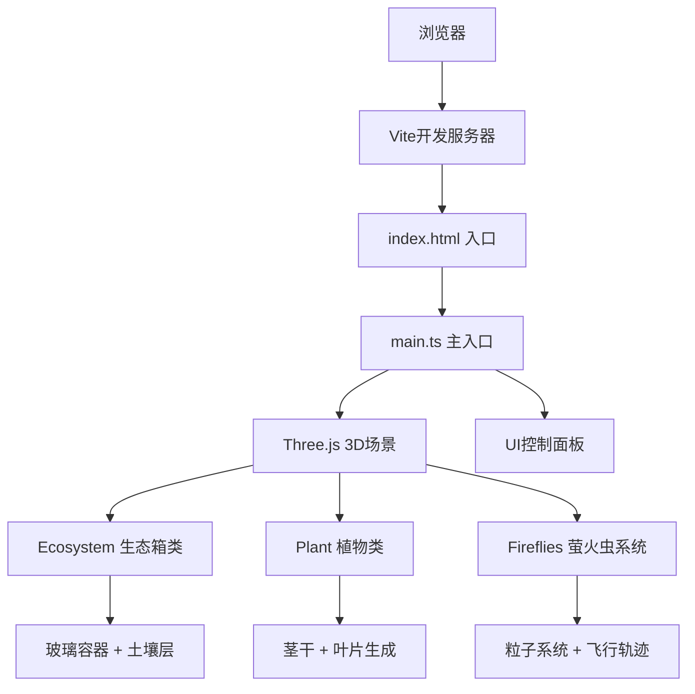

## 1. 架构设计



## 2. 技术描述
- **前端框架**：TypeScript + Three.js@0.160.0 + Vite
- **3D渲染**：Three.js原生API，手动控制场景、相机、渲染器
- **交互控制**：原生鼠标事件处理，自定义轨道控制器（拖拽旋转、滚轮缩放）
- **动画系统**：requestAnimationFrame驱动，自定义缓动函数
- **构建工具**：Vite 5.x
- **类型系统**：TypeScript 5.x 严格模式

## 3. 项目文件结构
| 文件路径 | 用途 |
|---------|------|
| package.json | 项目依赖与脚本配置 |
| vite.config.js | Vite构建配置，TypeScript支持，base: './' |
| tsconfig.json | TypeScript配置，严格模式，目标ES2020 |
| index.html | 入口页面，深色渐变背景，全屏布局 |
| src/main.ts | 入口文件，初始化场景、相机、渲染器，创建生态箱和植物，启动动画循环 |
| src/ecosystem.ts | 生态箱类，管理玻璃容器、土壤层、光照和水分状态 |
| src/plant.ts | 植物生长逻辑，生成茎干和叶片网格，更新位置和颜色 |
| src/fireflies.ts | 萤火虫粒子系统，管理生成、轨迹和闪光动画 |

## 4. 核心类与接口定义

### 4.1 Ecosystem 类
```typescript
class Ecosystem {
  glassMesh: THREE.Mesh;
  soilTopMesh: THREE.Mesh;
  soilBottomMesh: THREE.Mesh;
  lightIntensity: number;  // 0-100
  waterAmount: number;     // 0-100
  glassOpacity: number;    // 0.1-0.3
  
  constructor(scene: THREE.Scene);
  setLightIntensity(value: number): void;
  setWaterAmount(value: number): void;
  setGlassOpacity(zoomLevel: number): void;
  getGrowthFactor(): { light: number; water: number };
  update(deltaTime: number): void;
}
```

### 4.2 Plant 类
```typescript
type PlantType = 'fern' | 'succulent' | 'moss';

interface PlantState {
  name: string;
  height: number;
  leafCount: number;
  health: number;  // 0-100
}

class Plant {
  type: PlantType;
  group: THREE.Group;
  state: PlantState;
  growthProgress: number;  // 0-1
  isGrowing: boolean;
  
  constructor(type: PlantType);
  seed(scene: THREE.Scene, position: THREE.Vector3): void;
  startGrowth(): void;
  update(deltaTime: number, growthFactor: { light: number; water: number }): void;
  getState(): PlantState;
  clear(): void;
}
```

### 4.3 Fireflies 类
```typescript
interface Firefly {
  mesh: THREE.Mesh;
  light: THREE.PointLight;
  center: THREE.Vector3;
  ellipseA: number;
  ellipseB: number;
  angle: number;
  speed: number;
  yOffset: number;
  ySpeed: number;
  phase: number;
}

class Fireflies {
  fireflies: Firefly[];
  scene: THREE.Scene;
  attractTarget: THREE.Vector3 | null;
  
  constructor(scene: THREE.Scene, count: number);
  setAttractTarget(target: THREE.Vector3 | null): void;
  update(deltaTime: number): void;
  dispose(): void;
}
```

## 5. 性能优化策略

### 5.1 渲染优化
- 使用requestAnimationFrame节流，避免多余重绘
- 植物生长动画和粒子系统计算控制在16ms内
- 几何体复用，避免频繁创建销毁
- 材质共享，减少状态切换开销

### 5.2 交互优化
- 旋转惯性系数0.6，平滑过渡
- 缩放范围0.5-3倍，边界限制
- 鼠标事件使用passive选项，提升滚动性能

### 5.3 动画优化
- 叶片摆动使用正弦函数预计算
- 萤火虫轨迹使用参数方程，避免复杂物理计算
- 生长动画使用时间归一化，帧率无关

## 6. 关键算法

### 6.1 茎干正弦生长算法
```
position(t) = baseY + t * maxHeight
offset(t) = sin(t * frequency * PI) * amplitude * t
stemPoint = (x: offset(t), y: position(t), z: 0)
```

### 6.2 叶序螺旋排列算法
```
phi = (sqrt(5) - 1) / 2  // 黄金分割比
for each leaf i:
  angle = i * phi * 2 * PI
  radius = baseRadius * (1 + i * spreadFactor)
  height = baseHeight + i * heightStep
```

### 6.3 萤火虫椭圆轨迹算法
```
x = centerX + ellipseA * cos(angle)
z = centerZ + ellipseB * sin(angle)
y = centerY + yOffset * sin(yAngle)
angle += speed * deltaTime
```

## 7. 环境参数影响

### 7.1 光照影响
- 光照强度 > 80%：叶片边缘变黄（颜色偏移至黄色）
- 光照强度 < 20%：生长速度降低50%
- 正常范围(20%-80%)：健康生长

### 7.2 水分影响
- 浇水量 > 80ml：土壤表面出现积水反光（添加镜面高光层）
- 浇水量 < 20ml：生长速度降低30%
- 正常范围(20ml-80ml)：健康生长
