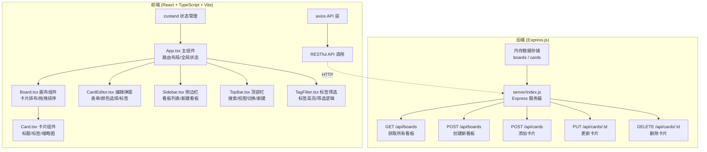
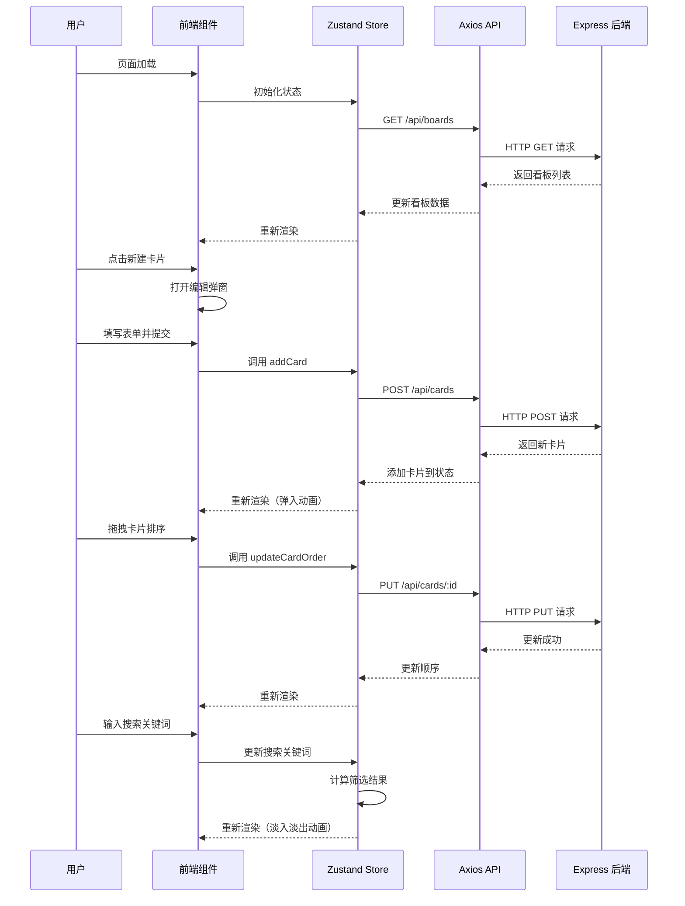
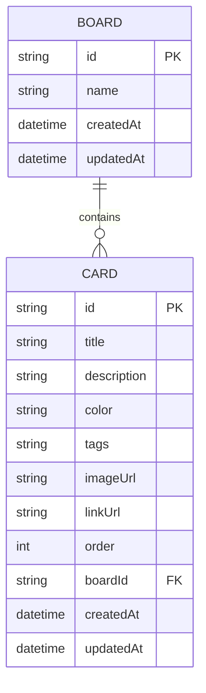

## 1. 架构设计



## 2. 技术描述

### 2.1 前端技术栈

- **框架**：React 18 + TypeScript
- **构建工具**：Vite 5
- **状态管理**：zustand
- **HTTP 客户端**：axios
- **拖拽排序**：SortableJS
- **样式方案**：CSS Modules / 内联样式
- **唯一 ID**：uuid

### 2.2 后端技术栈

- **框架**：Express 4
- **跨域**：cors
- **数据存储**：内存存储（开发/演示用）

### 2.3 开发工具

- **代码规范**：TypeScript 严格模式
- **目标环境**：ES2020

## 3. 文件结构

```
├── index.html                    # 入口页面
├── package.json                  # 项目依赖
├── vite.config.js                # Vite 配置
├── tsconfig.json                 # TypeScript 配置
├── server/
│   └── index.js                  # Express 后端服务器
└── src/
    ├── App.tsx                   # 主组件（路由布局/全局状态）
    ├── main.tsx                  # 应用入口
    ├── index.css                 # 全局样式
    ├── components/
    │   ├── Board.tsx             # 画布组件
    │   ├── Card.tsx              # 卡片组件
    │   ├── CardEditor.tsx        # 卡片编辑弹窗
    │   ├── Sidebar.tsx           # 侧边栏
    │   ├── TopBar.tsx            # 顶部导航栏
    │   └── TagFilter.tsx         # 标签筛选器
    ├── store/
    │   └── useBoardStore.ts      # zustand 状态管理
    ├── api/
    │   └── index.ts              # axios API 封装
    ├── types/
    │   └── index.ts              # TypeScript 类型定义
    └── utils/
        └── colors.ts             # 颜色预设工具
```

## 4. 数据流向



## 5. API 定义

### 5.1 类型定义

```typescript
interface Card {
  id: string;
  title: string;
  description?: string;
  color: string;
  tags: string[];
  imageUrl?: string;
  linkUrl?: string;
  order: number;
  boardId: string;
  createdAt: string;
  updatedAt: string;
}

interface Board {
  id: string;
  name: string;
  createdAt: string;
  updatedAt: string;
}
```

### 5.2 接口定义

| 方法 | 路径 | 描述 | 请求体 | 响应 |
|------|------|------|--------|------|
| GET | `/api/boards` | 获取所有看板 | - | `Board[]` |
| POST | `/api/boards` | 创建新看板 | `{ name: string }` | `Board` |
| POST | `/api/cards` | 添加卡片到看板 | `Partial<Card> & { boardId: string }` | `Card` |
| PUT | `/api/cards/:id` | 更新卡片 | `Partial<Card>` | `Card` |
| DELETE | `/api/cards/:id` | 删除卡片 | - | `{ success: boolean }` |

## 6. 数据模型

### 6.1 ER 图



### 6.2 初始数据

默认创建一个名为"我的灵感"的看板，并包含 3 个示例卡片：
- 淡蓝色卡片：标签 "创意"
- 淡粉色卡片：标签 "参考"
- 淡黄色卡片：标签 "待办"

## 7. 性能优化策略

1. **虚拟列表**：卡片数量较多时考虑使用虚拟滚动
2. **防抖搜索**：搜索输入使用 200ms 防抖
3. **CSS 动画**：优先使用 transform 和 opacity 动画，触发 GPU 加速
4. **状态按需更新**：使用 zustand 的 selector 避免不必要的重渲染
5. **拖拽性能**：SortableJS 原生实现，保证 50ms 内响应
