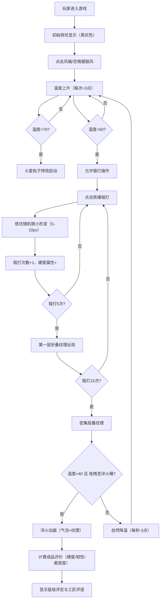

## 1. 产品概述

一款在浏览器中模拟古代匠人锻造与淬火工艺的交互式游戏。玩家化身铁匠铺学徒，通过风箱鼓风、挥锤锻打、入水淬火等步骤亲手打造剑或餐具，实时观察金属颜色变化与纹理形成，最终获得成品评价。

- 主要用途：沉浸式体验传统锻造工艺，教育与娱乐结合
- 目标用户：手工艺爱好者、历史文化爱好者、休闲游戏玩家

## 2. 核心功能

### 2.1 功能模块

1. **锻造台主界面**：复古羊皮纸质感UI，三栏布局（工具面板/锻造区/成品展示）
2. **温度控制系统**：鼓风升温、自然降温、颜色映射（黑→暗红→亮红→橙黄）
3. **锻打变形系统**：5-10px随机形变、折叠纹理生成、硬度/韧性属性累积
4. **粒子特效系统**：火星粒子（温度>70）、淬火气泡、拖尾效果
5. **淬火交互系统**：拖拽淬火、马氏体纹理、属性变化
6. **成品评价系统**：三维度评分（硬度/韧性/美观度）、星级评定、工匠评语

### 2.2 页面详情

| 页面名称 | 模块名称 | 功能描述 |
|---------|---------|---------|
| 主游戏界面 | 顶部锻造台木板栏 | 显示游戏标题、当前打造物品名 |
| 主游戏界面 | 左侧工具面板 | 风箱（鼓风升温）、铁锤（锻打变形）、火钳（拖拽） |
| 主游戏界面 | 中央Canvas锻造区 | 铁坯实时渲染、温度变色、火星粒子、锻打动画 |
| 主游戏界面 | 右侧成品展示区 | 淬火桶（拖拽目标）、成品预览、星级评价、工匠评语 |
| 主游戏界面 | 状态指示 | 温度进度条（隐藏逻辑）、锻打次数统计 |

## 3. 核心流程

玩家进入游戏 → 初始黑灰色铁坯显示在锻造区 → 点击风箱/按空格鼓风升温 → 铁坯颜色逐渐变红（温度>70出现火星）→ 温度>50时可用铁锤锻打（每次随机形变+5/15次出现纹理）→ 锻打至理想状态 → 拖拽温度>40的铁坯到淬火桶 → 淬火动画（气泡+马氏体纹理+属性重算）→ 成品星级评价与工匠评语显示

## 4. 用户界面设计

### 4.1 设计风格

- **主色调**：暖赭石（#8b5e3c）、铁灰（#4a4a4a）、浅米色背景（#f5e6cc）
- **背景纹理**：CSS repeating-linear-gradient模拟斜纹布纹
- **按钮风格**：铆钉铁皮样式，点击下沉2px再弹起（0.15s金属碰撞动画）
- **动画缓动**：4阶贝塞尔曲线模拟物理缓动
- **布局风格**：顶部木板横栏 + 三栏主布局（工具18% / 锻造64% / 展示18%）
- **字体**：复古楷体/宋体风格，标题用艺术字体

### 4.2 页面设计概览

| 模块 | UI元素 | 设计细节 |
|------|--------|---------|
| 顶部木板栏 | 深棕色渐变、木纹纹理、铆钉装饰 | 固定高度64px，阴影投射 |
| 左侧工具面板 | 三个工具按钮+图标+名称 | 垂直排列，铁皮边框，hover高亮 |
| Canvas锻造区 | 居中显示，画布背景为铁砧纹理 | 尺寸600x500px，可拖拽交互 |
| 淬火桶 | 半透明蓝色桶状，水面涟漪动画 | 右侧面板上部，dropzone高亮 |
| 成品展示 | 成品缩略图+星级（金色五角星）+评语 | 星形渐变填充实现半星，文字卷轴风格 |

### 4.3 响应式设计

- 桌面端优先（Canvas游戏需要精确鼠标操作）
- 最小支持宽度1024px
- 触控设备适配：长按空格改长按手势
