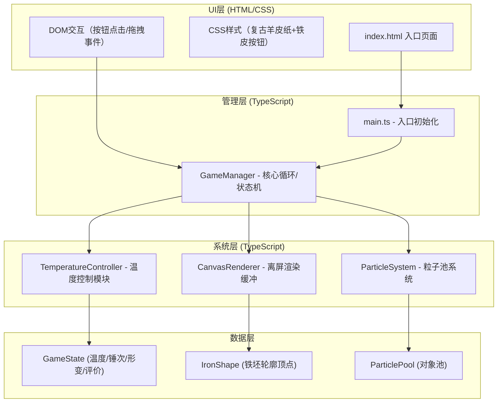

## 1. 架构设计

纯前端Canvas 2D游戏架构，采用分层设计：UI层（HTML/CSS）→ 管理层（GameManager）→ 系统层（温度/粒子/渲染）→ 工具层。



## 2. 技术说明

- **前端框架**：原生TypeScript（无React/Vue，轻量级Canvas游戏）
- **构建工具**：Vite@5.x（启用TypeScript，base='./'）
- **渲染引擎**：Canvas 2D API + 离屏Canvas（OffscreenCanvas/双缓冲）
- **动画系统**：requestAnimationFrame驱动主循环，目标60fps
- **粒子系统**：对象池模式（火星+气泡，上限300个）
- **CSS动画**：4阶贝塞尔曲线缓动 `cubic-bezier(0.25, 0.46, 0.45, 0.94)`

## 3. 项目结构

```
auto78/
├── package.json              # 依赖配置（typescript/vite）
├── vite.config.js            # Vite构建配置
├── tsconfig.json             # TypeScript严格模式配置
├── index.html                # 入口页面（全屏布局+样式）
└── src/
    ├── main.ts               # 入口，初始化Canvas，启动GameManager.run()
    ├── GameManager.ts        # 核心游戏循环，状态管理，触发系统更新
    ├── ParticleSystem.ts     # 火星粒子/淬火气泡，对象池模式
    └── TemperatureController.ts  # 鼓风/降温/颜色映射逻辑
```

## 4. 核心模块职责

### 4.1 TemperatureController

| 方法 | 说明 |
|------|------|
| `blowAir()` | 鼓风，温度+3 |
| `update(dt)` | 自然降温，每秒-3 |
| `getColor()` | 温度→颜色映射（黑灰→暗红→亮红→橙黄） |
| `canForge()` | 温度>50可锻打 |
| `canQuench()` | 温度>40可淬火 |
| `getSparkDensity()` | 温度>70返回基础密度，>90加倍 |

### 4.2 ParticleSystem

| 方法 | 说明 |
|------|------|
| `emitSpark(x, y, count)` | 发射火星粒子（边缘随机位置） |
| `emitBubble(x, y, count)` | 发射淬火气泡（水面位置） |
| `update(dt)` | 更新所有粒子位置/透明度/大小 |
| `render(ctx)` | 绘制粒子（含拖尾） |
| `recycle(particle)` | 对象池回收 |

粒子对象结构：
```typescript
interface Particle {
    x: number; y: number;
    vx: number; vy: number;
    size: number; life: number; maxLife: number;
    color: string; type: 'spark' | 'bubble';
    trail: {x:number;y:number}[];
}
```

### 4.3 GameManager

| 属性/方法 | 说明 |
|-----------|------|
| `temperature` | 当前温度（0-100） |
| `hammerCount` | 锻打次数 |
| `deformationAmount` | 累积形变量（上限初始面积15%） |
| `shapeVertices` | 铁坯轮廓顶点数组 |
| `forgeLines` | 折叠锻打纹理路径 |
| `stats: {hardness, toughness, aesthetics}` | 三维度评价 |
| `run()` | 启动主循环（requestAnimationFrame） |
| `onBlowAir()` | 风箱交互回调 |
| `onHammer()` | 铁锤交互回调（触发形变动画） |
| `onQuench()` | 淬火交互回调（触发淬火动画+评价计算） |
| `render()` | 铁坯+纹理+粒子渲染（离屏缓冲） |
| `calculateRating()` | 三维度加权→星级+评语 |

铁坯轮廓绘制：
- 初始：不规则椭圆（12-16个控制点，边缘±2px锯齿化）
- 锻打形变：每个顶点偏移5-10px，累积面积变化≤15%
- 折叠纹理：暗色细线（5次后稀疏，15次后密集层叠）
- 马氏体纹理：淬火后随机点阵灰度抖动

### 4.4 颜色映射表

| 温度范围 | 颜色值 |
|---------|--------|
| 0-20 | 黑灰色 #3a3a3a → #4a4a4a |
| 20-40 | 暗红过渡 #5a1a1a → #8b0000 |
| 40-60 | 暗红 #8b0000 → #b22222 |
| 60-80 | 亮红 #b22222 → #ff4500 |
| 80-100 | 橙黄 #ff4500 → #ffa500 → #ffcc00 |

颜色插值：RGB线性渐变

## 5. 性能指标

| 指标 | 目标值 |
|------|--------|
| 主循环帧率 | ≥50fps（requestAnimationFrame） |
| 粒子上限 | 300个（火星+气泡合计） |
| 内存占用 | Canvas缓冲使用2个离屏canvas |
| 温度更新精度 | 基于dt的时间积分（避免setInterval漂移） |
| 形变动画 | 0.3秒 ease-out |
| 按钮交互 | 0.15秒 下沉2px弹起（cubic-bezier物理缓动） |
