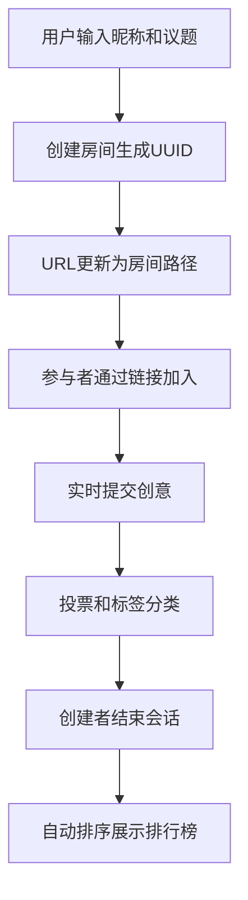

## 1. 产品概述
在线团队头脑风暴与投票决策工具，帮助团队成员实时协作提出创意并通过投票排序，最终输出最优方案。解决远程团队创意收集和决策效率低下的问题，适用于产品 brainstorm、方案评审、问题解决等场景。

## 2. 核心功能

### 2.1 用户角色
| 角色 | 注册方法 | 核心权限 |
|------|----------|----------|
| 会话创建者 | 输入昵称创建房间 | 创建议题、结束会话、管理房间 |
| 参与者 | 输入昵称加入房间 | 提交创意、投票、添加标签 |

### 2.2 功能模块
1. **首页/入口页**：昵称输入、议题描述、创建/加入房间
2. **头脑风暴会话页**：创意输入、实时创意列表、投票交互、标签分类、排行榜展示

### 2.3 页面详情
| 页面名称 | 模块名称 | 功能描述 |
|----------|----------|----------|
| 首页 | 房间创建模块 | 输入昵称（必填）、议题描述（10-100字限制）、创建/加入按钮 |
| 首页 | 房间加入模块 | 支持通过URL直接进入房间 |
| 会话页 | 议题展示区 | 顶部展示议题标题和房间ID |
| 会话页 | 创意输入区 | 左栏输入框+提交按钮，30秒限流 |
| 会话页 | 创意列表区 | 中央滚动列表，卡片滑入动画，虚拟滚动支持500+卡片 |
| 会话页 | 投票交互区 | 卡片底部投票按钮，柱状图动态显示票数 |
| 会话页 | 标签分类区 | 6种预设标签，点击弹出选择器 |
| 会话页 | 排行榜模块 | 会话结束后按票数排序，金银铜高亮，逐行淡入 |

## 3. 核心流程
用户输入昵称和议题 → 创建房间生成UUID → URL更新为带房间ID路径 → 参与者通过链接加入 → 实时提交创意（30秒限流）→ 投票（每人每创意一票）→ 添加标签分类 → 创建者结束会话 → 系统自动排序展示排行榜

## 4. 用户界面设计

### 4.1 设计风格
- 主色调：深蓝 #1e3a5f，搭配白色背景
- 卡片背景：极浅灰 #f8fafc
- 创意卡片渐变：从 #e0f2fe 到 #fce7f3（左到右）
- 投票柱状图渐变：从 #22c55e 到 #3b82f6
- 标签颜色：6种预设色自动分配
- 边框：卡通风格圆角 8px
- 字体：标题 #1e293b 加粗，使用 Playfair Display 展示字体 + Open Sans 正文字体
- 动画：所有过渡 0.3s ease-out，帧率 ≥ 50fps

### 4.2 页面设计概述
| 页面名称 | 模块名称 | UI元素 |
|----------|----------|----------|
| 首页 | Hero区域 | 深蓝渐变背景，居中加载动画，输入框聚焦发光效果 |
| 会话页 | 布局 | 左右两栏（桌面），移动端堆叠，最大宽度1024px居中 |
| 会话页 | 创意卡片 | 左滑入动画，渐变背景，圆角8px，标签显示左上角 |
| 会话页 | 投票按钮 | 点击后变已投票状态，轻微跳动动画 |
| 会话页 | 柱状图 | 从底部升起，宽度平滑过渡，与最高票数成比例 |
| 会话页 | 排行榜 | 前三名金银铜渐变背景，🏆🥈🥉图标，逐行淡入延迟0.5s |

### 4.3 响应性
- Desktop-first 设计，最大宽度 1024px 居中
- 移动端（<768px）：左右栏堆叠，全宽显示
- 触摸优化：按钮最小高度 44px，触控区域充足

### 4.4 性能优化
- 虚拟滚动：仅渲染可视区域卡片
- Socket.IO：心跳30秒，断线3秒自动重连
- 重连提示：半透明蒙层提示
