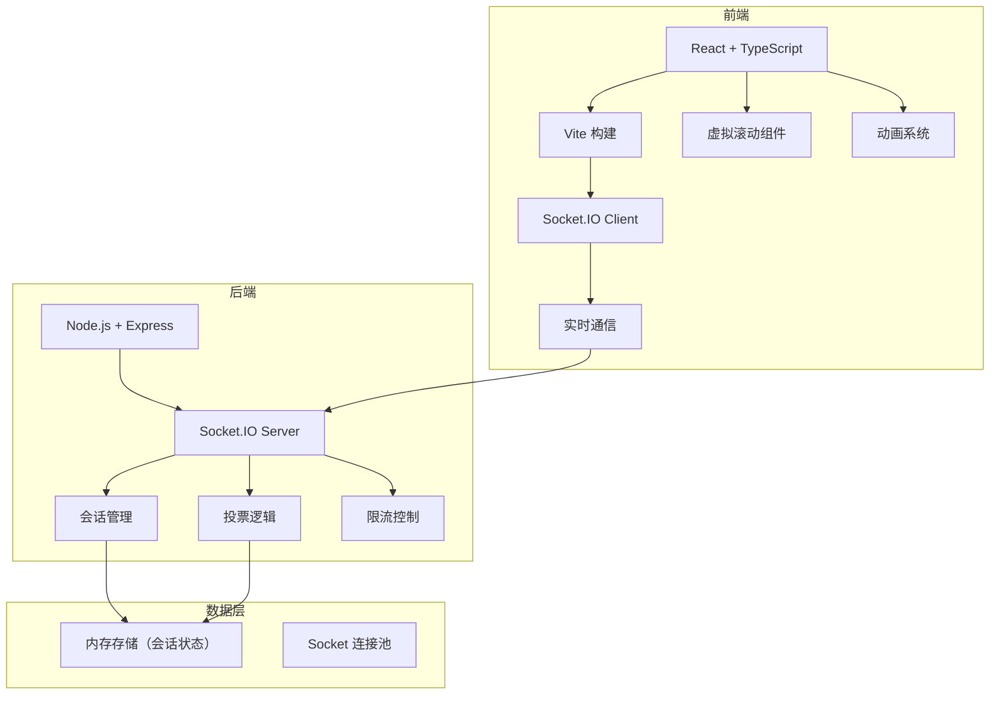
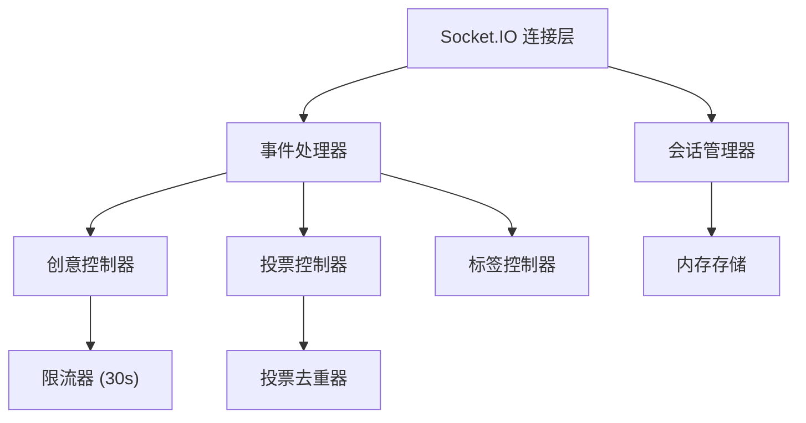
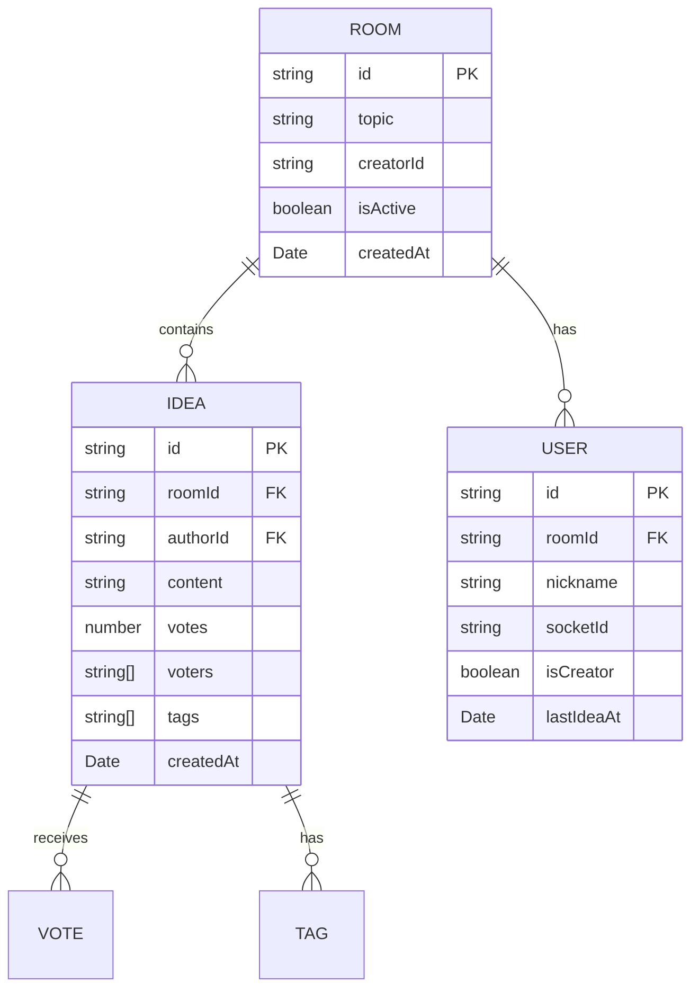

## 1. 架构设计


## 2. 技术描述
- 前端：React 18 + TypeScript 5 + Vite 5
- 状态管理：React Hooks + Context
- 实时通信：Socket.IO 4 + socket.io-client
- HTTP客户端：axios
- 后端：Node.js + Express 4 + TypeScript
- 唯一标识：uuid
- 跨域：cors
- 并发启动：concurrently

## 3. 路由定义
| 路由 | 用途 |
|------|------|
| / | 首页，创建/加入房间 |
| /room/:roomId | 头脑风暴会话页面 |

## 4. API 定义

### 4.1 Socket.IO 事件

#### 客户端 → 服务端
```typescript
// 创建房间
interface CreateRoomRequest {
  nickname: string;
  topic: string;
}

// 加入房间
interface JoinRoomRequest {
  roomId: string;
  nickname: string;
}

// 提交创意
interface SubmitIdeaRequest {
  roomId: string;
  content: string;
}

// 投票
interface VoteRequest {
  roomId: string;
  ideaId: string;
}

// 添加标签
interface AddTagRequest {
  roomId: string;
  ideaId: string;
  tag: string;
}

// 结束会话
interface EndSessionRequest {
  roomId: string;
}
```

#### 服务端 → 客户端
```typescript
// 房间创建成功
interface RoomCreatedResponse {
  roomId: string;
  topic: string;
  creatorId: string;
}

// 用户加入
interface UserJoinedResponse {
  userId: string;
  nickname: string;
  users: Array<{ id: string; nickname: string }>;
}

// 新创意
interface NewIdeaResponse {
  id: string;
  content: string;
  authorId: string;
  authorName: string;
  votes: number;
  voters: string[];
  tags: string[];
  createdAt: number;
}

// 投票更新
interface VoteUpdatedResponse {
  ideaId: string;
  votes: number;
  voters: string[];
}

// 标签更新
interface TagUpdatedResponse {
  ideaId: string;
  tags: string[];
}

// 会话结束
interface SessionEndedResponse {
  ideas: Idea[];
  rankings: RankedIdea[];
}

// 错误
interface ErrorResponse {
  message: string;
  code: string;
}
```

## 5. 服务端架构


## 6. 数据模型

### 6.1 数据模型定义


### 6.2 类型定义
```typescript
interface Room {
  id: string;
  topic: string;
  creatorId: string;
  isActive: boolean;
  createdAt: number;
  users: Map<string, User>;
  ideas: Idea[];
}

interface User {
  id: string;
  nickname: string;
  socketId: string;
  isCreator: boolean;
  lastIdeaAt: number;
}

interface Idea {
  id: string;
  content: string;
  authorId: string;
  authorName: string;
  votes: number;
  voters: string[];
  tags: string[];
  createdAt: number;
}

interface RankedIdea extends Idea {
  rank: number;
}
```

## 7. 项目结构
```
.
├── package.json
├── tsconfig.json
├── tsconfig.server.json
├── vite.config.ts
├── index.html
├── server/
│   └── src/
│       └── index.ts
└── src/
    ├── App.tsx
    ├── main.tsx
    ├── types.ts
    ├── socket.ts
    └── components/
        └── BrainstormSession.tsx
```
