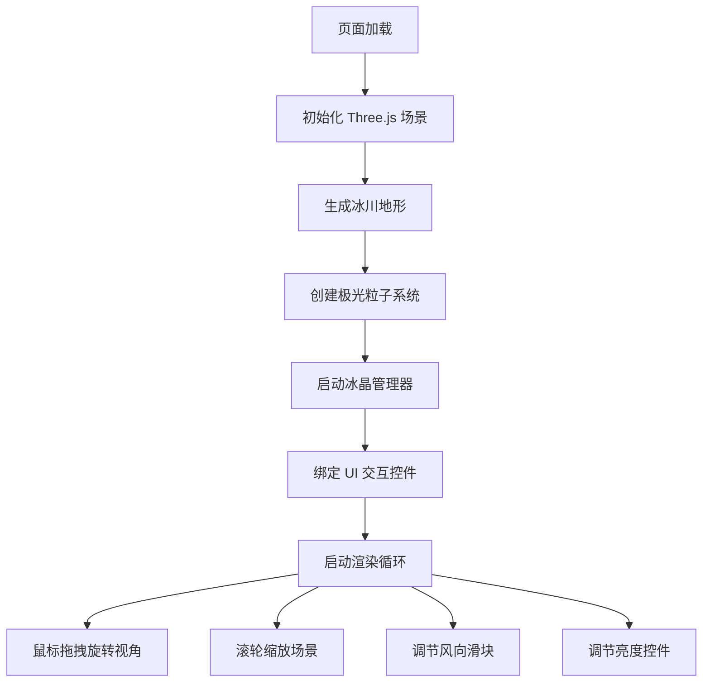

## 1. 产品概述
北极极光冰川 3D 交互式景观体验 - 让用户置身于虚拟北极冰原之上，沉浸式欣赏动态极光在星空下飘舞，感受冰晶从冰川表面碎裂并随风飘散的壮丽自然景象。

- 目标用户：自然爱好者、艺术欣赏者、教育展示场景
- 产品价值：提供沉浸式、可交互的极地极光景观体验，具有艺术欣赏与科普展示价值

## 2. 核心特性

### 2.1 功能模块
1. **3D 冰川地形场景**：程序化生成起伏的冰原地形，支持鼠标拖拽旋转视角与滚轮缩放
2. **动态极光系统**：多条半透明带状粒子构成的极光，正弦波扭曲飘动，亮度脉动
3. **冰晶弹射与飘移**：冰晶从冰川表面定时弹射升起，随风飘移并旋转消失
4. **UI 交互控制面板**：风向控制滑块、亮度调节控件，冰晶质感半透明风格

### 2.3 页面详情
| 页面名称 | 模块名称 | 功能描述 |
|-----------|-------------|---------------------|
| 主场景页 | 冰川地形 | 程序化噪声生成起伏地形，半透明青蓝色渐变，裂纹纹理贴图 |
| 主场景页 | 极光粒子 | 3-5条光带，每条200+粒子，正弦扭曲飘动，亮度0.3-0.8脉动（周期5-8s） |
| 主场景页 | 冰晶系统 | 八面体几何体，半透明白色到淡蓝渐变，5-8秒弹射，高度20-50单位 |
| 主场景页 | 视角控制 | 鼠标拖拽360°旋转（惯性0.5），滚轮缩放0.5-4倍 |
| 主场景页 | UI 面板 | 风向滑块（0-360°）、亮度调节，冰晶质感圆角半透明风格 |

## 3. 核心流程
用户进入页面后自动加载 3D 场景，通过鼠标拖拽旋转视角欣赏景观，滚轮缩放观察细节，通过侧边 UI 面板调节风向与整体亮度，体验冰晶弹射与极光飘动的动态效果。

## 4. 用户界面设计

### 4.1 设计风格
- **主色调**：深蓝紫色背景 #0b0f24，半透明青蓝色 #b0e0e6 渐变冰白色 #f0f8ff
- **极光色系**：淡绿 #7fff00 → 淡紫 #dda0dd → 淡蓝 #87ceeb
- **UI 控件**：冰晶质感圆角半透明风格（白色半透明背景，淡蓝色边框），0.3s 缓动动画
- **整体氛围**：冷色调、宁静、壮丽的极地夜空感

### 4.2 页面设计概述
| 页面名称 | 模块名称 | UI 元素 |
|-----------|-------------|-------------|
| 主场景页 | 3D 画布 | 全屏居中，深紫蓝星空背景，3D 场景渲染 |
| 主场景页 | UI 面板 | 右侧固定面板，风向滑块+数值显示，亮度滑块，半透明圆角卡片 |
| 主场景页 | 冰面反射 | 极光颜色半透明覆盖层，模拟冰面彩色反射 |

### 4.3 响应式
- 桌面端优先，画布自适应窗口大小
- UI 面板固定在右侧，移动端可自动调整布局

### 4.4 3D 场景指导
- **环境/氛围**：深蓝紫色星空背景，无光源的夜空场景，点光源模拟星点
- **光照设置**：环境光提供基础照明，方向光模拟月光，极光带自发光效果
- **相机设置**：PerspectiveCamera，初始视角略俯视冰原，OrbitControls 控制旋转缩放
- **构图与焦点**：冰川地形占画面下半部分，极光占据上方天空，冰晶在中景区域活动
- **交互与动画**：鼠标拖拽旋转（惯性0.5），滚轮缩放；极光粒子正弦波动，冰晶弹射旋转飘移
- **后处理**：半透明覆盖层模拟冰面极光反射，无需复杂后处理以保证性能
- **性能预算**：帧率 ≥ 30fps，主流浏览器流畅运行，粒子总数控制在合理范围
