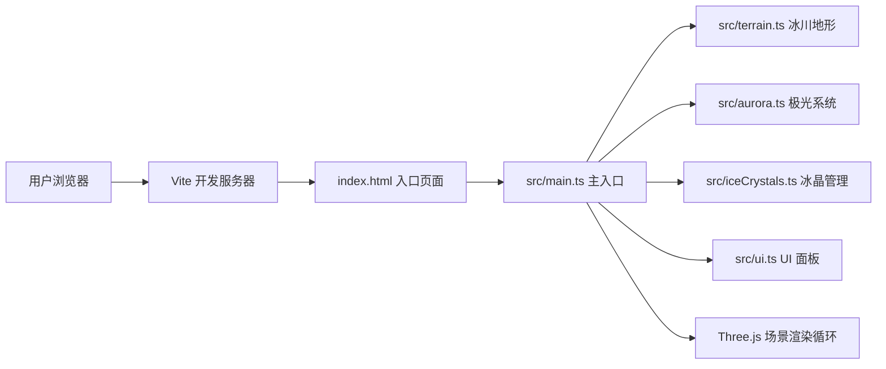

## 1. 架构设计


## 2. 技术说明
- **前端框架**: 原生 TypeScript + Three.js（无 React/Vue，用户明确指定）
- **构建工具**: Vite 5.x
- **3D 引擎**: three@0.160.0
- **类型声明**: @types/three
- **动画库**: gsap（用于缓动动画）
- **语言目标**: ES2020
- **类型检查**: TypeScript 严格模式

## 3. 文件结构与职责
| 文件路径 | 职责说明 | 导出内容 |
|----------|----------|----------|
| package.json | 项目依赖与脚本配置 | - |
| vite.config.js | Vite 构建配置（启用 TS，base='./'） | - |
| tsconfig.json | TypeScript 配置（严格模式，ES2020） | - |
| index.html | 入口页面（全屏背景，画布居中） | - |
| src/main.ts | 主入口：初始化场景/相机/渲染器，协调各模块，启动渲染循环 | 无（立即执行） |
| src/terrain.ts | 冰川地形：程序化噪声高度图，Canvas 裂纹纹理，顶点色渐变 | `createTerrain()`, `updateTerrain()` |
| src/aurora.ts | 极光粒子系统：多条光带，正弦扭曲，亮度脉动 | `createAurora()`, `updateAurora()` |
| src/iceCrystals.ts | 冰晶管理器：生成/弹射/飘移/旋转/消失逻辑 | `createIceCrystals()`, `updateIceCrystals()` |
| src/ui.ts | UI 面板：风向滑块、亮度调节，事件绑定 | `createUI()`, UI 配置对象 |

## 4. 核心数据结构

### 4.1 冰川地形模块
```typescript
interface TerrainConfig {
  size: number;           // 地形尺寸
  segments: number;       // 细分数段
  noiseScale: number;     // 噪声缩放
  heightMultiplier: number; // 高度乘数
}
interface TerrainResult {
  mesh: THREE.Mesh;
  getHeightAt: (x: number, z: number) => number;
  update: (cameraDistance: number) => void;
}
```

### 4.2 极光系统模块
```typescript
interface AuroraBand {
  particles: THREE.Points;
  basePositions: Float32Array;
  phase: number;
  amplitude: number;
  frequency: number;
}
interface AuroraResult {
  group: THREE.Group;
  update: (time: number, brightness: number) => void;
}
```

### 4.3 冰晶模块
```typescript
interface IceCrystal {
  mesh: THREE.Mesh;
  velocity: THREE.Vector3;
  angularVelocity: THREE.Vector3;
  life: number;
  maxLife: number;
  state: 'idle' | 'ejecting' | 'floating';
}
interface IceCrystalsResult {
  group: THREE.Group;
  update: (time: number, delta: number, windDirection: number) => void;
  setWindDirection: (deg: number) => void;
}
```

### 4.4 UI 模块
```typescript
interface UIConfig {
  windDirection: number;     // 0-360 度
  brightness: number;        // 整体亮度
  onWindChange: (deg: number) => void;
  onBrightnessChange: (val: number) => void;
}
```

## 5. 性能优化策略
1. **地形 LOD**：根据相机距离动态调整地形细分精度
2. **粒子复用**：冰晶与极光粒子使用对象池技术复用
3. **Draw Call 合并**：同类粒子尽量使用 Points/BatchedMesh 减少绘制调用
4. **材质复用**：相同外观几何体共享材质实例
5. **帧率目标**：确保粒子总数、三角形数量在主流设备上 ≥ 30fps
