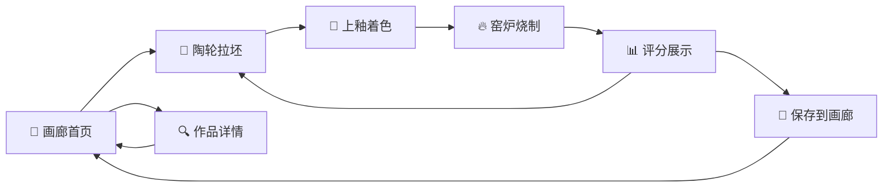

## 1. 产品概述
在线虚拟陶艺工坊，用户可在浏览器中体验完整的陶艺创作流程（揉泥→拉坯→上釉→烧制），最终生成可360度欣赏的虚拟陶器作品。
- 主要目的：为陶艺爱好者提供沉浸式的数字创作体验，降低陶艺学习门槛
- 目标用户：陶艺爱好者、艺术创作者、教育场景用户
- 市场价值：填补线上陶艺互动体验空白，可应用于艺术教育、文创展示等领域

## 2. 核心功能

### 2.1 功能模块
1. **陶轮拉坯页**：陶轮控制面板、分段圆环黏土模型、实时拖拽变形、黏土流动动画
2. **上釉操作页**：8种经典釉色盘、点击局部施釉、水滴扩散动画、撤销操作栈
3. **窑炉烧制页**：温度动画渐变、熔融光泽效果、评价卡片、雷达图评分、3D预览
4. **作品画廊页**：网格缩略图展示、悬停动效、搜索筛选
5. **作品详情页**：360度旋转预览、评分雷达图、分享功能

### 2.2 页面详情
| 页面名称 | 模块名称 | 功能描述 |
|---------|---------|---------|
| 陶轮拉坯页 | 陶轮控制面板 | 鼠标拖拽（上收/下扩/左右调高度），0.3秒黏土流动变形，响应半径20px |
| 陶轮拉坯页 | Canvas渲染引擎 | 数百分段圆环模型，深灰→浅棕厚度渐变，半透明同心圆环形纹理 |
| 上釉操作页 | 釉色盘 | 天青/霁红/秘色/兔毫/油滴/茶叶末/霁蓝/粉彩共8种经典釉色 |
| 上釉操作页 | 施釉交互 | 点击局部施釉，0.5秒ease-out水滴扩散覆盖15%面积，柔光过渡边缘 |
| 窑炉烧制页 | 温度动画 | 5秒暗红→橙黄渐变，温度200→1200逐秒递增，熔融光泽滤镜 |
| 窑炉烧制页 | 评分系统 | 施釉均匀度/器形对称性/色彩搭配三项指标，雷达图可视化，0-100综合分 |
| 作品画廊页 | 网格展示 | 缩略图悬停放大1.05倍+暖色光晕，显示截图/日期/评分 |
| 作品详情页 | 3D预览 | 拖拽旋转360度查看，雷达图复现，分享链接生成 |

## 3. 核心流程
用户进入应用首页，浏览画廊中的作品；点击"开始创作"进入陶轮拉坯环节，通过鼠标拖拽塑造陶器形状；完成拉坯后进入上釉环节，选择釉色点击陶器表面施釉；完成上釉后进入窑炉烧制，观看烧制动画并获得评分；评分完成后可选择保存作品到画廊，或重新开始创作。

## 4. 用户界面设计

### 4.1 设计风格
- **主色调**：深色渐变背景 (#1a1a2e → #16213e)，温暖陶土色点缀
- **辅助色**：陶轮棕 #8B7355，釉色盘8色，窑炉橙 #ff8c00
- **按钮风格**：圆角12px，0.2秒弹性点击反馈 (transform: scale(0.95) → 1)
- **字体**：主标题使用 "Noto Serif SC" 衬线体，正文使用 "PingFang SC"
- **布局风格**：桌面端左右分栏（操作区70% / 控制面板30%），平板端上下分栏
- **动效特色**：黏土流动变形、水滴扩散、温度渐变、旋转纹理

### 4.2 页面设计概述
| 页面名称 | 模块名称 | UI元素 |
|---------|---------|---------|
| 陶轮拉坯页 | 操作区 | Canvas画布居中，陶轮旋转动画≥30fps，同心圆纹理叠加 |
| 陶轮拉坯页 | 控制面板 | 状态提示条、操作说明、"完成拉坯"按钮、重置按钮 |
| 上釉操作页 | 陶器展示 | Canvas居中显示已成型陶坯，支持旋转查看 |
| 上釉操作页 | 色盘区 | 8色釉料圆形按钮，当前选中高亮，撤销按钮 |
| 窑炉烧制页 | 窑炉场景 | 全屏渐变背景动画，居中温度显示（大字号数字） |
| 窑炉烧制页 | 结果卡片 | 陶器3D预览区、雷达图、分项分数、综合评分徽章 |
| 画廊首页 | 作品网格 | 响应式grid布局，卡片悬浮放大+暖色光晕效果 |
| 作品详情页 | 预览区 | 大尺寸Canvas预览，拖拽旋转，分享按钮浮层 |

### 4.3 响应式适配
- **桌面端 (≥1200px)**：主操作区70%宽度，辅助控制面板30%，深色渐变背景
- **大屏平板 (768-1199px)**：上下分栏布局（上方操作区/下方控制面板）
- **核心触控优化**：拖拽区域最小44×44px，按钮点击反馈增强

### 4.4 Canvas渲染指导
- **模型构建**：陶器由60-80个水平分段圆环组成，每段32个顶点
- **着色逻辑**：径向渐变填充，厚度→颜色映射，釉色半透明叠加
- **动画策略**：requestAnimationFrame驱动，陶轮旋转角度增量计算
- **性能目标**：桌面端≥60fps，平板端≥30fps
