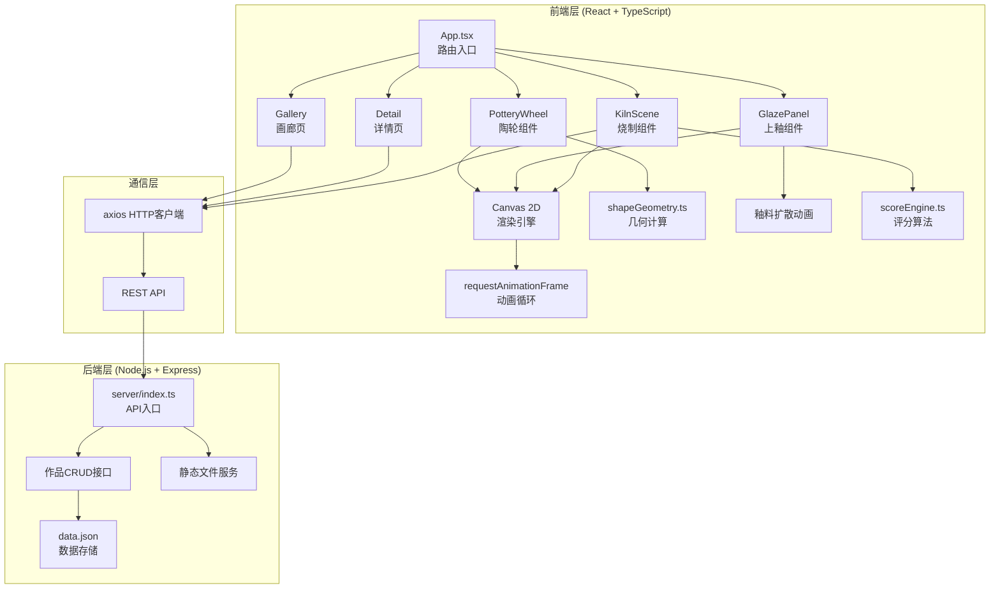
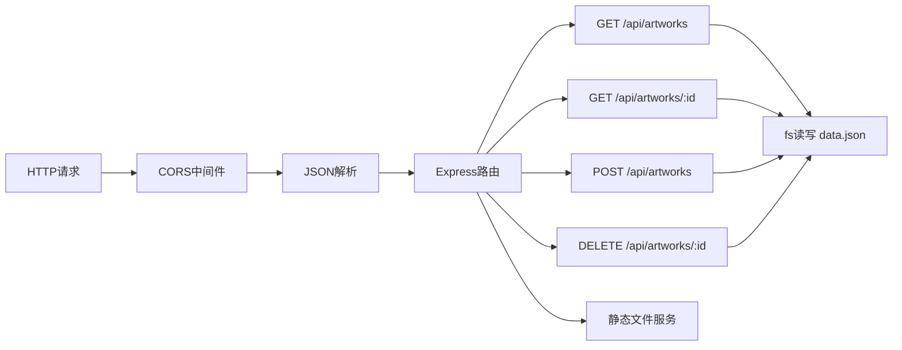
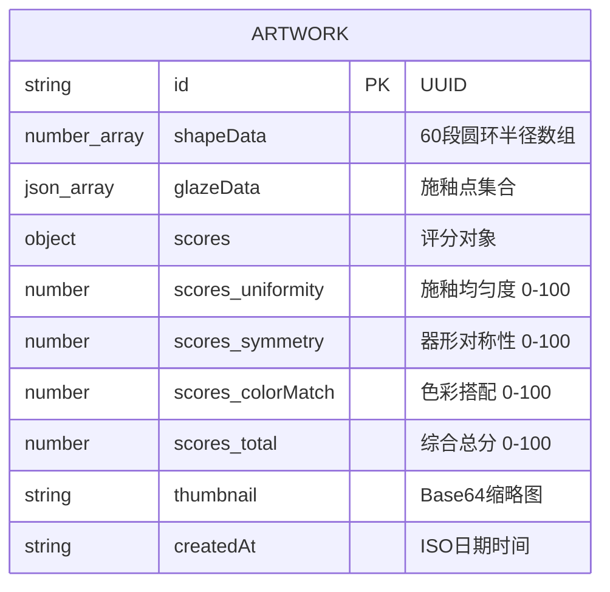

## 1. 架构设计



## 2. 技术栈说明

- **前端框架**：React@18 + TypeScript@5
- **构建工具**：Vite@5 + @vitejs/plugin-react
- **路由管理**：react-router-dom@6
- **HTTP客户端**：axios@1
- **绘图引擎**：Canvas 2D (原生API)
- **后端框架**：Express@4
- **跨域处理**：cors@2
- **数据存储**：JSON文件 + uuid@9
- **并发启动**：concurrently@8
- **初始化工具**：手动配置package.json

## 3. 路由定义

| 路由路径 | 页面/组件 | 功能说明 |
|---------|---------|---------|
| `/` | Gallery (画廊首页) | 作品网格展示，入口导航 |
| `/create` | App内状态路由 | 陶轮拉坯创作页 |
| `/glaze` | App内状态路由 | 上釉操作页 |
| `/kiln` | App内状态路由 | 窑炉烧制+评分页 |
| `/detail/:id` | Detail (作品详情) | 3D预览、评分展示、分享 |

## 4. API 定义

### 4.1 类型定义

```typescript
interface Artwork {
  id: string;
  shapeData: number[];
  glazeData: GlazeSpot[];
  scores: {
    uniformity: number;
    symmetry: number;
    colorMatch: number;
    total: number;
  };
  thumbnail: string;
  createdAt: string;
}

interface GlazeSpot {
  x: number;
  y: number;
  color: string;
  colorName: string;
  radius: number;
  timestamp: number;
}
```

### 4.2 接口列表

| 方法 | 路径 | 请求参数 | 响应格式 | 说明 |
|-----|------|---------|---------|-----|
| GET | `/api/artworks` | - | `Artwork[]` | 获取作品列表 |
| GET | `/api/artworks/:id` | path: id | `Artwork` | 获取单个作品详情 |
| POST | `/api/artworks` | body: Omit\<Artwork, 'id' \| 'createdAt'\> | `Artwork` | 创建新作品 |
| DELETE | `/api/artworks/:id` | path: id | `{ success: boolean }` | 删除作品 |
| GET | `/` | - | HTML | 前端页面静态服务 |

## 5. 服务端架构



## 6. 数据模型

### 6.1 实体关系



### 6.2 初始数据 (data.json)

预置3件示例作品，涵盖不同器形（瓶、罐、碗）和釉色搭配，用于画廊初始展示。

## 7. 核心算法说明

### 7.1 陶坯几何模型 (shapeGeometry.ts)
- 分段数：60个水平圆环，每段对应0-1的归一化高度
- 初始形状：圆柱，默认半径60px
- 变形算法：拖拽点→映射到对应高度分段→高斯函数平滑影响半径20px→lerp插值0.3秒动画
- 渲染投影：3D→2D正交投影，椭圆方程绘制每段圆环

### 7.2 评分算法 (scoreEngine.ts)
- **施釉均匀度**：将表面分成10×10网格，统计覆盖率(目标50-80%) + 每格釉层数标准差的倒数
- **器形对称性**：比较左轮廓与右轮廓镜像的MSE误差，误差越小分越高
- **色彩搭配**：提取主釉色，计算色轮上的互补度/相邻和谐度
- **综合分**：均匀度×0.4 + 对称性×0.3 + 色彩×0.3，加权求和

## 8. 文件结构

```
auto84/
├── package.json
├── index.html
├── vite.config.js
├── tsconfig.json
├── server/
│   ├── index.ts
│   └── data.json
└── src/
    ├── main.tsx
    ├── App.tsx
    ├── components/
    │   ├── PotteryWheel.tsx
    │   ├── GlazePanel.tsx
    │   └── KilnScene.tsx
    ├── pages/
    │   ├── Gallery.tsx
    │   └── Detail.tsx
    └── utils/
        ├── shapeGeometry.ts
        └── scoreEngine.ts
```
