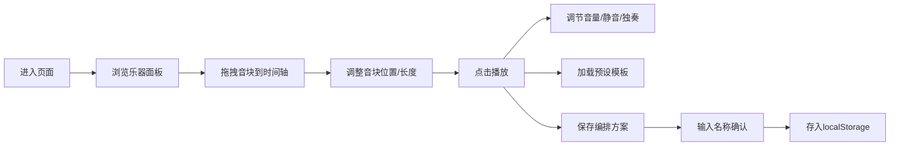

## 1. 产品概述

在线虚拟乐器合奏与节奏编排平台，让用户像乐队指挥一样通过网页拖拽不同的乐器音块到时间轴上，排列出属于自己的音乐段落，并实现所有乐器声音的实时同步播放。

- 主要用途：音乐创作、节奏编排、教育娱乐
- 目标用户：音乐爱好者、初学者、教育工作者
- 产品价值：降低音乐创作门槛，提供直观的可视化音乐编排体验

## 2. 核心功能

### 2.1 用户角色
| 角色 | 注册方式 | 核心权限 |
|------|----------|----------|
| 普通用户 | 无需注册 | 使用所有功能，本地保存编排方案 |

### 2.2 功能模块
1. **乐器面板**：展示6种乐器（钢琴、吉他、贝斯、鼓、小提琴、萨克斯），支持拖拽生成音块
2. **时间轴**：横向滚动的4/4拍时间轴，支持音块拖放、长度调节、吸附对齐
3. **播放控制**：播放/暂停、停止、节拍器、BPM调节
4. **混音控制**：每种乐器独立音量、静音、独奏控制
5. **预设模板**：摇滚、爵士、电子、布鲁斯4种节奏模板
6. **方案管理**：本地保存/加载最多5个用户编排方案

### 2.3 页面详情
| 页面名称 | 模块名称 | 功能描述 |
|----------|----------|----------|
| 主页面 | 乐器面板 | 6种乐器色块展示，悬停放大1.15倍并显示名称标签，拖拽生成音块 |
| 主页面 | 时间轴 | 深灰蓝底色(#1e2a38)，半透明白色虚线节拍线，青色(#00e5ff)播放指示线，水平微光扫过动效 |
| 主页面 | 控制条 | 毛玻璃效果(backdrop-filter: blur(12px))，播放/暂停/停止按钮，BPM滑块(60-180)，节拍器开关 |
| 主页面 | 音量控制 | 每种乐器独立音量滑块(0-100)，静音/独奏按钮，音块透明度同步变化 |
| 主页面 | 预设模板 | 4种节奏风格模板，1秒淡入动画加载并自动播放 |
| 主页面 | 保存模态框 | 深色半透明背景模糊效果，居中显示，宽500px，圆角12px，输入名称保存 |

## 3. 核心流程

用户从左侧乐器面板拖拽乐器色块到时间轴上，调整音块位置和长度，点击播放按钮试听效果。可通过预设模板快速加载典型节奏型，也可保存自己的编排方案到本地。

## 4. 用户界面设计

### 4.1 设计风格
- **主色调**：深灰蓝(#1a2332)、炭黑色(#2c3a4a)
- **点缀色**：金色(#f0c040)、青色(#00e5ff)
- **整体风格**：浓重暗色调舞台风格，专业音乐工作站感觉
- **按钮样式**：圆角矩形，悬停背景变亮，点击轻微压扁动画(0.1s scale)
- **字体**：现代无衬线字体，清晰可读
- **布局风格**：三栏式布局（左侧乐器面板 + 中间时间轴 + 底部控制条）

### 4.2 页面设计概述
| 页面名称 | 模块名称 | UI元素 |
|----------|----------|--------|
| 主页面 | 乐器面板 | 垂直固定宽320px，浅色背景+内阴影，1px半透明白色分隔线，彩色乐器色块 |
| 主页面 | 时间轴 | 深灰蓝背景，白色虚线网格，青色播放指示线，彩色音块（从底部向上渐变填充高亮） |
| 主页面 | 控制条 | 毛玻璃效果，底部固定，包含播放控制和BPM调节 |
| 主页面 | 音量条 | 每拍动态音量条，高度5-25px实时跳动，反应延迟≤50ms |
| 主页面 | 模态框 | 深色半透明背景模糊，居中卡片，输入框+确认/取消按钮 |

### 4.3 响应式
- 桌面端优先设计
- 最小支持宽度：1280px
- 时间轴区域自适应剩余宽度
- 乐器面板和控制条固定尺寸

### 4.4 动画与交互
- 乐器色块悬停：放大1.15倍 + 显示名称标签
- 时间轴滚动：水平微光扫过效果(0.5s缓动)
- 音块播放：从底部向上渐变色填充高亮
- 模板加载：1秒淡入动画
- 按钮点击：0.1秒scale压扁动画
- 音量条：实时跳动，高度5-25px变化
