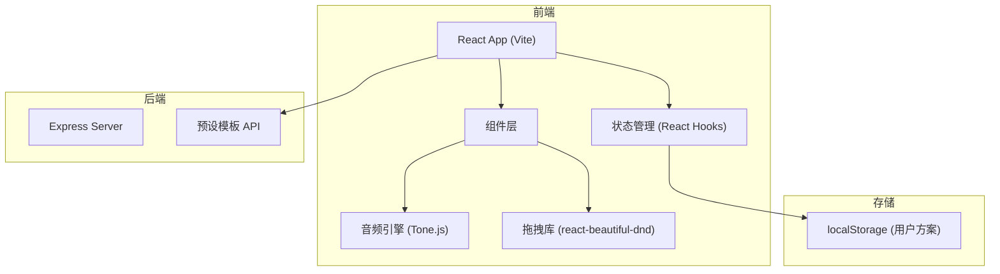

## 1. 架构设计



## 2. 技术描述
- **前端**：React 18 + TypeScript + Vite
- **音频引擎**：Tone.js (Web Audio API 封装)
- **拖拽交互**：react-beautiful-dnd
- **后端**：Express 4
- **状态管理**：React Hooks (useState, useRef, useEffect)
- **构建工具**：Vite 5
- **包管理**：npm
- **唯一ID**：uuid

## 3. 项目结构
```
.
├── package.json
├── vite.config.js
├── tsconfig.json
├── index.html
├── src/
│   ├── App.tsx              # 主组件，布局与状态管理
│   ├── InstrumentsPanel.tsx # 乐器面板组件
│   ├── Timeline.tsx         # 时间轴组件
│   ├── ControlBar.tsx       # 控制条组件
│   └── audioEngine.ts       # 音频引擎模块
└── server/
    └── server.js            # Express后端服务器
```

## 4. API 定义

### 4.1 获取预设模板列表
- **路径**：GET /api/templates
- **响应**：
```typescript
interface Template {
  id: string;
  name: string;
  genre: string;
  bpm: number;
  tracks: TemplateTrack[];
}

interface TemplateTrack {
  instrument: string;
  notes: TemplateNote[];
}

interface TemplateNote {
  beat: number;   // 起始拍数
  duration: number; // 持续拍数
}
```

### 4.2 获取单个模板详情
- **路径**：GET /api/templates/:id
- **响应**：Template 对象

## 5. 数据模型

### 5.1 乐器 (Instrument)
```typescript
interface Instrument {
  id: string;
  name: string;
  color: string;
  volume: number;    // 0-100
  muted: boolean;
  solo: boolean;
}
```

### 5.2 音块 (NoteBlock)
```typescript
interface NoteBlock {
  id: string;
  instrumentId: string;
  startBeat: number;   // 起始拍数（浮点数，支持细分）
  duration: number;    // 持续拍数（最小1，最大4）
}
```

### 5.3 编排方案 (Arrangement)
```typescript
interface Arrangement {
  id: string;
  name: string;
  createdAt: number;
  bpm: number;
  noteBlocks: NoteBlock[];
  instrumentVolumes: Record<string, number>;
}
```

## 6. 核心技术指标
- **音频同步延迟**：≤ 20ms（使用 Tone.js Transport 保证精确同步）
- **界面帧率**：≥ 50fps
- **音块数量**：支持 200+ 音块流畅滚动
- **音量条反应延迟**：≤ 50ms
- **本地存储**：最多保存 5 个编排方案

## 7. 启动脚本
- `npm run dev`：使用 concurrently 同时启动前端开发服务器和后端服务器
  - 前端：Vite dev server (默认端口 5173)
  - 后端：Express server (默认端口 3001)
