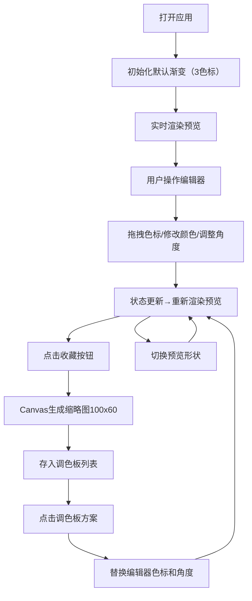

## 1. 产品概述
一款面向平面设计师的交互式渐变色合成与预览调色板应用，让用户能在浏览器中以创意方式探索、生成、混合和收藏渐变色方案，并实时预览在不同形状上的应用效果。
- 目标用户：平面设计师、UI/UX 设计师、前端开发者及创意工作者
- 核心价值：提供直观高效的渐变色编辑体验，支持多维度预览和收藏管理，加速配色设计流程

## 2. 核心功能

### 2.1 用户角色
| 角色 | 注册方式 | 核心权限 |
|------|----------|----------|
| 普通用户 | 无需注册，浏览器直接使用 | 编辑渐变、收藏方案、预览效果（数据存于本地状态） |

### 2.2 功能模块
1. **渐变编辑器**：色标增删拖拽、颜色拾取、角度选择器（圆形表盘+预设按钮）
2. **调色板面板**：收藏列表展示、缩略图预览、一键应用、删除、拖拽排序
3. **形状预览区**：三种形状切换（圆形/圆角矩形/正六边形）、SVG 渐变填充、悬停发光动画

### 2.3 页面详情
| 页面名称 | 模块名称 | 功能描述 |
|----------|----------|----------|
| 主页面 | 渐变编辑器 | 添加/删除/拖拽色标（最多8个），间距等比例映射stop位置；点击拾色；圆形角度选择器（0-360度）和预设角度按钮（0°/45°/90°/135°） |
| 主页面 | 调色板面板 | 收藏渐变方案并自动生成100x60缩略图，点击缩略图切换编辑器数据，支持删除 |
| 主页面 | 形状预览区 | SVG渲染三种形状并应用渐变填充，切换形状类型，悬停放大+发光边框 |
| 主页面 | 顶部操作栏 | 收藏按钮、当前渐变CSS代码展示（可选） |

## 3. 核心流程
用户打开应用 → 默认显示含3个色标的渐变 → 通过编辑器调整色标颜色/位置/角度 → 实时同步到形状预览 → 满意方案点击收藏生成缩略图 → 从调色板点击任意方案快速切换预览 → 切换不同形状观察渐变效果

## 4. 用户界面设计

### 4.1 设计风格
- **主色调**：极深灰背景(#121212) + 深灰面板(#1e1e1e) + 青蓝高亮(#4fc3f7) + 浅灰文字(#9e9e9e)
- **按钮风格**：圆角矩形，悬停浅灰→青蓝背景过渡(0.2s)，选中态青蓝色边框/文字
- **字体**：现代无衬线字体（推荐使用 Google Fonts: Space Grotesk + JetBrains Mono 搭配），标题加粗，正文常规
- **布局风格**：桌面端左右分栏（编辑器+调色板在左，预览在右），移动端上下堆叠
- **视觉细节**：色标区半透明网格辅助定位，预览区柔和阴影(spread 8px blur 15px)，发光边框用主色混合白色

### 4.2 页面设计概览
| 页面名称 | 模块名称 | UI 元素 |
|----------|----------|---------|
| 主页面 | 渐变编辑器 | 色条预览 + 16px圆形色标节点(可拖拽+提示) + 添加/删除色标按钮 + 圆形角度表盘(指针转动动画0.2s ease-out) + 预设角度按钮 |
| 主页面 | 调色板面板 | 横向滚动卡片列表 + 渐变缩略图(100x60) + 删除图标 + 悬停高亮 |
| 主页面 | 形状预览区 | 居中 SVG 画布(200x200) + 形状切换按钮组(图标+文字) + 悬停放大1.05倍+发光边框(5px范围,0.3s过渡) |
| 主页面 | 整体容器 | 最大宽度 1200px, 居中, padding 24px, 响应式断点 768px |

### 4.3 响应式
- **桌面优先（Desktop-first）**：默认左右两栏布局（编辑器 60% + 预览 40%）
- **断点 < 768px**：自动上下堆叠，编辑器占满宽度，预览区高度固定 300px
- **触控优化**：色标节点和按钮增加触控热区（最小 44x44px），角度选择器支持触摸拖动

### 4.4 性能约束
- 拖拽色标/调整角度：预览重新渲染延迟 ≤ 50ms（使用 requestAnimationFrame + 批量状态更新）
- 收藏面板滚动：帧率 ≥ 50fps（使用 CSS transform 3d 加速 + 虚拟滚动如有必要）
