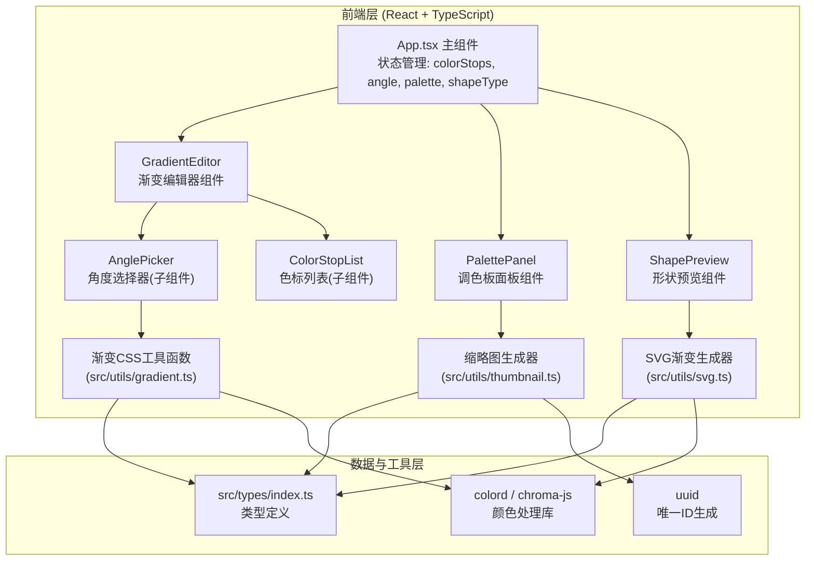

## 1. 架构设计



**数据流向说明**：
- 用户操作 GradientEditor → 通过 onChange 回调将 `{ colorStops, angle }` 传递给 App.tsx
- App.tsx 更新状态 → 将新的渐变数据通过 props 传递给 ShapePreview 重新渲染
- 用户点击收藏按钮 → App.tsx 调用 thumbnail 工具生成 dataURL → 创建新条目存入 palette 数组
- 用户点击 PalettePanel 中方案 → onSelect 回调通知 App.tsx → 将该方案的 colorStops+angle 替换到编辑器状态
- ShapePreview 内部使用渐变数据生成 SVG `<linearGradient>` 元素并应用到对应形状

## 2. 技术描述
- **前端框架**：React@18 + TypeScript@5（严格模式，target ES2020）
- **构建工具**：Vite@5 + @vitejs/plugin-react@4
- **颜色处理**：colord@2.9 + chroma-js@2.4（颜色解析、混合、亮度调整）
- **唯一ID**：uuid@9
- **样式方案**：原生 CSS + CSS Variables（暗色主题变量）+ BEM 命名规范
- **状态管理**：React useState/useCallback（轻量场景，无需 zustand）
- **初始化工具**：vite-init（react-ts 模板）

## 3. 项目文件结构与调用关系

```
e:\solo\VersionFast\tasks\auto89\
├── index.html                          ← Vite入口，深灰背景，挂载#root
├── package.json                        ← 依赖定义，npm run dev
├── vite.config.js                      ← React插件+TS支持配置
├── tsconfig.json                       ← 严格模式，target ES2020
└── src/
    ├── main.tsx                        ← React入口，渲染 <App />
    ├── App.tsx                         ← 主组件：组合三大子组件，管理所有状态
    │                                   ←   ├─→ GradientEditor (props: stops, angle, onChange)
    │                                   ←   ├─→ PalettePanel (props: palette, onSelect, onDelete, onAdd)
    │                                   ←   └─→ ShapePreview (props: stops, angle, shapeType)
    ├── types/
    │   └── index.ts                    ← ColorStop, PaletteItem, ShapeType 类型定义
    ├── utils/
    │   ├── gradient.ts                 ← 渐变CSS生成、色标排序、验证工具函数
    │   ├── color.ts                    ← 基于colord/chroma的颜色混合、亮度调整
    │   └── thumbnail.ts                ← Canvas截取100x60缩略图生成dataURL
    ├── components/
    │   ├── GradientEditor.tsx          ← 渐变编辑器：色标增删拖拽 + 角度选择
    │   │                               ←   └─ 内部子组件: AnglePicker, ColorStopNode
    │   ├── PalettePanel.tsx            ← 调色板：收藏列表、缩略图预览、删除
    │   └── ShapePreview.tsx            ← 形状预览：SVG三种形状 + 悬停动画
    └── styles/
        └── index.css                   ← 全局样式、CSS变量、响应式布局、动画
```

## 4. 核心类型定义

```typescript
// src/types/index.ts
export interface ColorStop {
  id: string;        // uuid
  color: string;     // hex/rgb/hsl
  position: number;  // 0-100 (百分比)
}

export interface PaletteItem {
  id: string;
  colorStops: ColorStop[];
  angle: number;
  thumbnail: string;  // dataURL
  createdAt: number;
}

export type ShapeType = 'circle' | 'rect' | 'hexagon';
```

## 5. 关键实现策略

### 5.1 色标拖拽（性能优化）
- 使用 Pointer Events（统一鼠标/触摸）+ Pointer Capture 保证拖拽流畅
- 拖拽中用 `requestAnimationFrame` 节流 DOM 更新，确保 ≤ 50ms 延迟
- 色标位置变更后自动排序（按 position），保证渐变 stops 顺序正确

### 5.2 角度选择器
- 圆形表盘使用 SVG 实现，指针通过 `transform: rotate()` 转动
- 转动动画：`transition: transform 0.2s ease-out`
- 预设按钮点击时瞬时更新，无过渡（用户主动操作）

### 5.3 缩略图生成
- 使用离屏 Canvas (2D)：`document.createElement('canvas')`
- 尺寸：100x60px，使用 `ctx.createLinearGradient()` 绘制渐变并填充
- 输出：`canvas.toDataURL('image/png')` 存入 PaletteItem.thumbnail

### 5.4 SVG 渐变填充
- 动态生成 `<defs><linearGradient>` 元素，id 使用组件内唯一标识
- `gradientTransform="rotate(angle)"` 应用角度
- 三种形状路径：circle（cx,cy,r）、rect（rx,ry 圆角 16）、polygon（六边形坐标点）

### 5.5 悬停发光效果
- 发光色计算：使用 `chroma(主色).brighten(0.5).alpha(0.8)` 混合白色
- CSS：`filter: drop-shadow(0 0 5px 发光色)` + `transform: scale(1.05)` + `transition: all 0.3s ease`

## 6. 性能保障清单
| 场景 | 策略 | 指标 |
|------|------|------|
| 色标拖拽 | Pointer Events + rAF 节流 + 本地 state 不阻塞 | ≤ 50ms 渲染延迟 |
| 角度调节 | CSS transform rotate，避免布局重排 | ≤ 50ms 更新 |
| 调色板滚动 | CSS `will-change: transform` + transform3d 加速 | ≥ 50fps |
| 缩略图生成 | 离屏 Canvas，异步生成，不阻塞 UI | 单次 < 10ms |
| 状态更新 | 批量合并 setState，避免重复渲染 | 预览同步无明显卡顿 |
