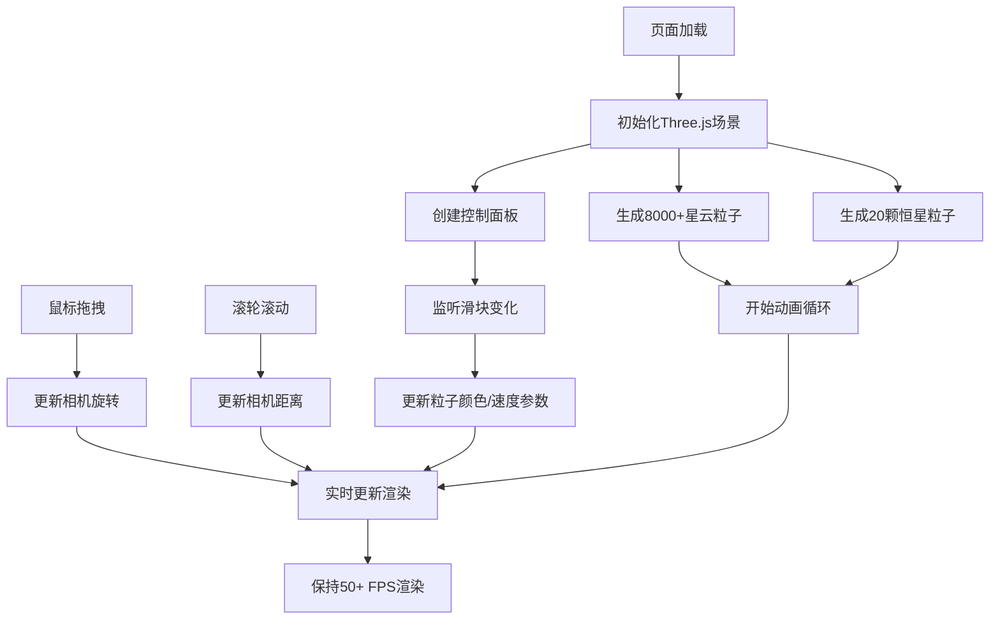

## 1. 产品概述

宇宙星云粒子系统交互式可视化应用，让用户通过鼠标拖拽和滚轮操作，像驾驶星际飞船一样在绚丽的星云气体中穿行，实时调整色彩混合效果，获得沉浸式的宇宙探索体验。

- **核心目的**：通过高性能的WebGL粒子渲染技术，在浏览器中创建逼真的宇宙星云可视化效果，提供流畅的交互式体验
- **目标用户**：天文爱好者、视觉艺术创作者、科技展示场景
- **市场价值**：展示WebGL高性能渲染能力，可用于教育科普、艺术展览、品牌展示等场景

## 2. 核心功能

### 2.1 用户角色

| 角色 | 注册方式 | 核心权限 |
|------|----------|----------|
| 访客用户 | 无需注册 | 自由探索星云、调整参数、体验交互 |

### 2.2 功能模块

1. **主场景页面**：3D星云粒子系统渲染、实时色彩融合、恒星粒子动画
2. **交互控制系统**：鼠标拖拽旋转视角、滚轮缩放、相机位置动态调整
3. **参数控制面板**：主色调调节、次色调调节、飘移速度调节

### 2.3 页面详情

| 页面名称 | 模块名称 | 功能描述 |
|----------|----------|----------|
| 主场景页面 | 星云粒子系统 | 8000+半透明粒子，从中心洋红到边缘靛蓝渐变，位置随时间飘移，大小正弦脉动 |
| 主场景页面 | 恒星粒子系统 | 20颗中心恒星，径向振荡，靠近相机时放大闪烁 |
| 主场景页面 | 色彩融合系统 | 根据距离中心半径线性插值颜色，实时响应滑块调整 |
| 交互控制系统 | 鼠标拖拽旋转 | 水平0.003 rad/px，垂直0.002 rad/px，垂直角度限制±85度，惯性系数0.5 |
| 交互控制系统 | 滚轮缩放 | 每格移动1单位，相机距离0.2-5倍，粒子大小随距离补偿调整 |
| 参数控制面板 | 主色调滑块 | 洋红→橙红渐变，范围0-1，响应延迟<50ms |
| 参数控制面板 | 次色调滑块 | 靛蓝→紫罗兰渐变，范围0-1，响应延迟<50ms |
| 参数控制面板 | 飘移速度滑块 | 范围0.0005-0.005，实时控制粒子飘移幅度 |

## 3. 核心流程

用户进入页面后，自动加载星云粒子系统，鼠标拖拽可旋转视角，滚轮可缩放远近，右下角控制面板可实时调整色彩和速度参数。

## 4. 用户界面设计

### 4.1 设计风格

- **主色调**：深空黑背景(#000000)，星云粒子从洋红(#ff00ff)到靛蓝(#4b0082)渐变，恒星亮黄(#ffffaa)
- **控制面板**：毛玻璃效果，背景rgba(255,255,255,0.1)，边框1px半透明白色，圆角8px，置于右下角
- **粒子透明度**：星云粒子0.6-0.8半透明，恒星不透明带自发光
- **整体氛围**：深邃宇宙、绚丽梦幻、沉浸式体验

### 4.2 页面设计概述

| 页面名称 | 模块名称 | UI元素 |
|----------|----------|--------|
| 主场景页面 | 3D渲染画布 | 全屏居中，黑色背景，Three.js WebGLRenderer |
| 主场景页面 | 星云粒子 | PointsMaterial渲染，大小0.5-3.0随机，AdditiveBlending混合 |
| 主场景页面 | 恒星粒子 | 大小0.8固定，亮黄色，自发光，径向振荡 |
| 控制面板 | 滑块组件 | 三个tweakpane滑块，毛玻璃容器，右下角定位 |

### 4.3 响应性

- 桌面端优先设计，自适应窗口大小变化
- 渲染画布随窗口resize实时调整
- 鼠标交互支持PC端标准操作
- 性能优化确保在主流桌面浏览器保持50+ FPS

### 4.4 3D场景指导

- **环境氛围**：纯黑深空背景，无环境光，粒子自发光效果
- **光照设置**：无场景光源，粒子使用自发光材质，通过颜色透明度实现发光效果
- **相机设置**：PerspectiveCamera，初始距离5，fov 75度，near 0.1，far 1000
- **相机运动**：鼠标拖拽控制旋转(球坐标系)，滚轮控制距离，使用球面坐标转换
- **构图焦点**：星云中心区域，恒星粒子作为视觉焦点
- **交互动画**：粒子位置飘移、大小脉动、恒星径向振荡、靠近闪烁效果
- **后期处理**：使用AdditiveBlending实现粒子发光叠加效果
- **性能预算**：粒子总数控制在8000-12000，使用BufferGeometry GPU加速更新，目标帧率≥50 FPS
