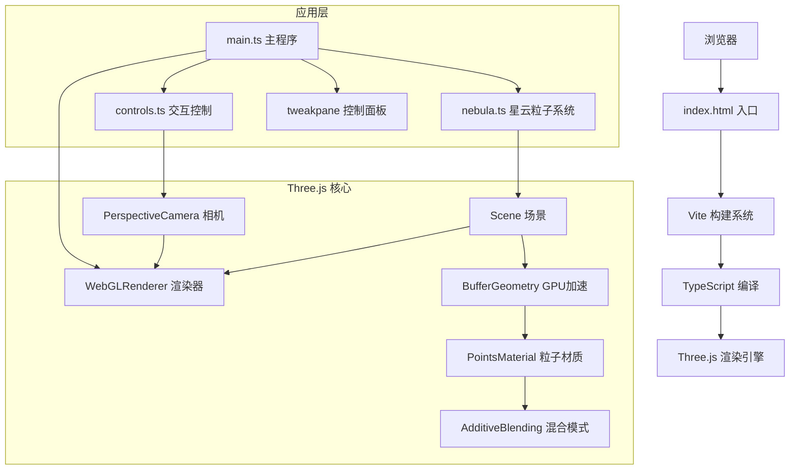

## 1. 架构设计



## 2. 技术描述

- **前端框架**: TypeScript + Three.js@0.160.0 + Vite@5.x
- **构建工具**: Vite，启用TypeScript支持，base路径设置为'./'
- **UI组件**: tweakpane 控制面板
- **类型定义**: @types/three Three.js类型声明
- **开发模式**: npm run dev 启动Vite开发服务器
- **渲染方式**: WebGL硬件加速，BufferGeometry GPU粒子更新
- **粒子混合**: AdditiveBlending加法混合实现发光效果

## 3. 项目文件结构

| 文件路径 | 用途说明 |
|----------|----------|
| package.json | 项目依赖配置，包含three、typescript、vite、@types/three、tweakpane |
| vite.config.js | Vite构建配置，启用TypeScript，设置base为'./' |
| tsconfig.json | TypeScript配置，严格模式，目标ES2020 |
| index.html | 入口页面，全屏黑色背景，canvas居中渲染 |
| src/main.ts | 主程序入口，初始化场景、相机、渲染器，绑定事件 |
| src/nebula.ts | 星云粒子系统，粒子生成、位置更新、颜色渐变、动画逻辑 |
| src/controls.ts | 鼠标交互控制，拖拽旋转、滚轮缩放、惯性效果 |

## 4. 核心数据模型

### 4.1 星云粒子数据结构

```typescript
interface NebulaParticle {
  position: THREE.Vector3;      // 粒子位置 (x, y, z)
  color: THREE.Color;           // 粒子颜色
  size: number;                 // 粒子基础大小 (0.5-3.0)
  driftOffset: THREE.Vector3;   // 飘移随机偏移
  pulsePhase: number;           // 脉动相位
  radius: number;               // 距离中心半径 (用于颜色插值)
}

interface StarParticle {
  position: THREE.Vector3;      // 恒星基础位置
  baseSize: number;             // 基础大小 0.8
  oscillationPhase: number;     // 振荡相位
  oscillationPeriod: number;    // 振荡周期 (3-7秒随机)
  isFlashing: boolean;          // 是否正在闪烁
  flashStartTime: number;       // 闪烁开始时间
}

interface ControlParams {
  primaryTone: number;          // 主色调 0-1 (洋红→橙红)
  secondaryTone: number;        // 次色调 0-1 (靛蓝→紫罗兰)
  driftSpeed: number;           // 飘移速度 0.0005-0.005
}
```

### 4.2 相机控制数据

```typescript
interface CameraState {
  theta: number;                // 水平旋转角 (弧度)
  phi: number;                  // 垂直旋转角 (弧度)
  distance: number;             // 相机距离 (0.2-5倍范围)
  targetTheta: number;          // 目标水平角 (惯性过渡)
  targetPhi: number;            // 目标垂直角 (惯性过渡)
  targetDistance: number;       // 目标距离 (惯性过渡)
}
```

## 5. 性能优化策略

### 5.1 GPU加速渲染
- 使用THREE.BufferGeometry存储粒子数据，避免CPU逐帧遍历
- 粒子位置、颜色、大小数据存储在BufferAttribute中
- 通过直接修改typedArray实现GPU内存直接更新

### 5.2 帧率保障
- 粒子数量控制在8000-12000之间，默认8000
- 使用requestAnimationFrame同步浏览器刷新率
- 粒子位置飘移计算向量化，避免循环内重复计算
- 粒子大小脉动使用预计算正弦值数组

### 5.3 交互响应优化
- 鼠标事件使用节流处理，避免频繁触发
- 滑块参数变化直接更新材质uniforms，延迟<50ms
- 相机控制使用惯性过渡，提升操作流畅感

### 5.4 渲染优化
- 禁用深度写入(DepthWrite=false)半透明粒子
- 使用AdditiveBlending减少排序开销
- 禁用不必要的阴影计算

## 6. 核心算法实现

### 6.1 球面随机分布算法
```typescript
// 在半径为15的球体内均匀分布粒子
function randomInSphere(radius: number): THREE.Vector3 {
  const u = Math.random();
  const v = Math.random();
  const theta = 2 * Math.PI * u;
  const phi = Math.acos(2 * v - 1);
  const r = radius * Math.cbrt(Math.random());
  return new THREE.Vector3(
    r * Math.sin(phi) * Math.cos(theta),
    r * Math.sin(phi) * Math.sin(theta),
    r * Math.cos(phi)
  );
}
```

### 6.2 颜色线性插值
```typescript
// 根据半径从中心颜色到边缘颜色线性插值
function interpolateColor(radius: number, maxRadius: number, centerColor: THREE.Color, edgeColor: THREE.Color): THREE.Color {
  const t = radius / maxRadius;
  return centerColor.clone().lerp(edgeColor, t);
}
```

### 6.3 球坐标系相机控制
```typescript
// 球坐标转笛卡尔坐标
function sphericalToCartesian(theta: number, phi: number, distance: number): THREE.Vector3 {
  return new THREE.Vector3(
    distance * Math.sin(phi) * Math.cos(theta),
    distance * Math.cos(phi),
    distance * Math.sin(phi) * Math.sin(theta)
  );
}
```

## 7. 配置参数

| 参数项 | 默认值 | 范围 | 说明 |
|--------|--------|------|------|
| 粒子数量 | 8000 | 8000-12000 | 星云粒子总数 |
| 星云半径 | 15 | - | 粒子分布球体半径 |
| 粒子大小 | 0.5-3.0 | - | 随机范围 |
| 粒子透明度 | 0.6-0.8 | - | 半透明范围 |
| 水平旋转速度 | 0.003 | rad/px | 鼠标拖拽灵敏度 |
| 垂直旋转速度 | 0.002 | rad/px | 鼠标拖拽灵敏度 |
| 垂直角度限制 | ±85° | - | 避免万向节死锁 |
| 惯性系数 | 0.5 | - | 旋转平滑过渡 |
| 缩放范围 | 0.2-5x | - | 相机距离倍数 |
| 脉动周期 | 2秒 | - | 粒子大小变化周期 |
| 脉动振幅 | 0.5 | - | 大小变化幅度 |
| 飘移幅度 | 0.001x位置 | - | 每帧移动距离 |
| 恒星数量 | 20 | - | 中心恒星数量 |
| 恒星基础大小 | 0.8 | - | 不闪烁时大小 |
| 恒星闪烁大小 | 1.5 | - | 靠近时大小 |
| 恒星闪烁触发距离 | <3 | 单位 | 距离相机阈值 |
| 恒星闪烁时长 | 0.5秒 | - | 闪烁持续时间 |
| 主色调滑块 | 0 | 0-1 | 洋红→橙红 |
| 次色调滑块 | 0 | 0-1 | 靛蓝→紫罗兰 |
| 飘移速度滑块 | 0.001 | 0.0005-0.005 | 粒子飘移幅度 |
