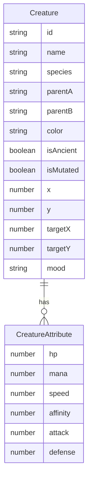

## 1. 架构设计

```mermaid
graph TB
    "前端React应用" --> "App.tsx 状态管理"
    "App.tsx 状态管理" --> "CreatureCanvas 场景渲染"
    "App.tsx 状态管理" --> "CreaturePanel 属性面板"
    "App.tsx 状态管理" --> "蛋池选择组件"
    "App.tsx 状态管理" --> "食物投喂组件"
    "CreatureCanvas 场景渲染" --> "p5实例渲染循环"
    "CreatureCanvas 场景渲染" --> "creatureLogic 纯函数"
    "CreaturePanel 属性面板" --> "creatureLogic 纯函数"
    "p5实例渲染循环" --> "粒子系统"
    "p5实例渲染循环" --> "A*寻路"
    "p5实例渲染循环" --> "场景元素"
```

## 2. 技术说明

- 前端：React@18 + TypeScript + Vite
- 初始化工具：vite-init (react-ts模板)
- 状态管理：useReducer + Context（用户指定）
- 渲染引擎：p5.js（场景渲染、粒子效果、寻路可视化）
- 后端：无（纯前端应用）
- 数据库：无（内存状态，可持久化到localStorage）

## 3. 路由定义

| 路由 | 用途 |
|------|------|
| / | 主页面，包含蛋池、孵化巢、场景、面板 |

单页应用，所有功能在一个页面内完成。

## 4. 数据模型

### 4.1 数据模型定义



### 4.2 核心类型定义

```typescript
interface CreatureAttributes {
  hp: number;
  mana: number;
  speed: number;
  affinity: number;
  attack: number;
  defense: number;
}

interface Creature {
  id: string;
  name: string;
  species: Species;
  hybridParts?: [Species, Species];
  attributes: CreatureAttributes;
  color: string;
  isAncient: boolean;
  isMutated: boolean;
  position: { x: number; y: number };
  target: { x: number; y: number };
  path: Point[];
  mood: Mood;
  stage: 'egg' | 'hatching' | 'baby' | 'adult';
}

type Species = 'dragon' | 'unicorn' | 'phoenix' | 'griffin' | 'gargoyle';
type Food = 'magicBerry' | 'moonDew' | 'fireCrystal' | 'frostGrass' | 'shadowShroom';
type Mood = 'happy' | 'neutral' | 'hungry' | 'excited';
```

## 5. 文件结构

```
├── package.json
├── vite.config.js
├── tsconfig.json
├── index.html
├── src/
│   ├── main.tsx
│   ├── App.tsx
│   ├── App.css
│   ├── components/
│   │   ├── CreatureCanvas.tsx
│   │   └── CreaturePanel.tsx
│   └── utils/
│       └── creatureLogic.ts
```

## 6. 关键算法

### 6.1 A*寻路

在Canvas网格上实现A*寻路，生物随机选择目标点，计算最短路径并沿路径移动。路径节点间距为场景像素网格。

### 6.2 颜色混合

融合时父本颜色权重0.6，母本0.4，RGB线性插值：
```
childR = parentA.r * 0.6 + parentB.r * 0.4
childG = parentA.g * 0.6 + parentB.g * 0.4
childB = parentA.b * 0.6 + parentB.b * 0.4
```

### 6.3 变异与融合规则

- 变异概率：0.3%（每次投喂时判定）
- 远古形态概率：0.2%（每次融合时判定），全属性+20
- 融合属性：父母属性取平均值
