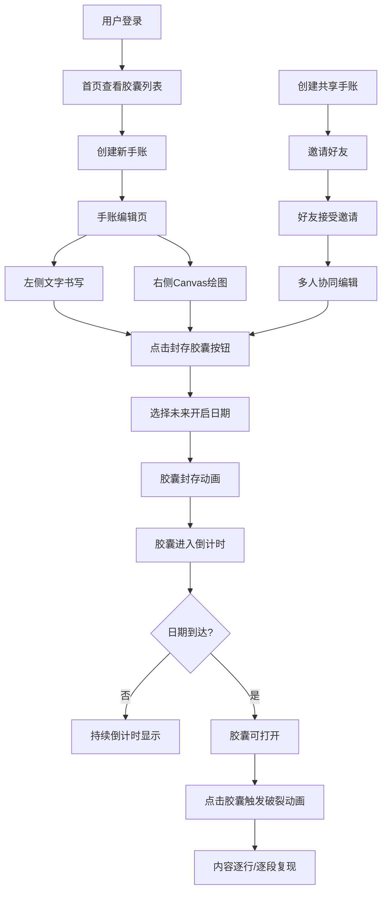

## 1. 产品概述

虚拟手账本与时间胶囊封存平台，让用户在数字世界中拥有一本复古羊皮封面的日记本，记录心情和想法后"封存"进时间胶囊，设定未来开启时间，创造跨越时间的惊喜与纪念感。

- 主要面向喜欢记录生活、珍视回忆的用户群体，通过复古手帐风格和时间胶囊机制，提供独特的情感记录体验
- 核心价值在于将即时记录转化为未来的惊喜礼物，支持单人记录与团队协作共享

## 2. 核心 Features

### 2.1 用户角色

| 角色 | 注册方式 | 核心权限 |
|------|----------|----------|
| 普通用户 | 用户名+邮箱+密码注册 | 手账编辑、胶囊封存、胶囊查看、协作邀请与接受 |

### 2.2 Feature Module

1. **首页**：胶囊列表展示、登录入口、导航到手账编辑
2. **手账编辑页**：双页布局手账（文字编辑+Canvas绘图）、封存胶囊功能、协作编辑状态显示
3. **胶囊详情页**：胶囊打开动画、内容复现（文字逐行淡入+绘图逐段重现）

### 2.3 Page Details

| 页面名称 | 模块名称 | Feature description |
|----------|----------|---------------------|
| 首页 | 胶囊列表 | 展示所有胶囊徽章，显示倒计时，到期胶囊可点击打开 |
| 首页 | 导航栏 | 登录状态、创建新手账、切换视图 |
| 手账编辑页 | 左手账页 | 多行文本编辑器，手写体字体，复古纸张纹理 |
| 手账编辑页 | 右手账页 | Canvas绘图板，支持铅笔/毛笔/橡皮擦，6种复古色系 |
| 手账编辑页 | 封存按钮 | 金色金属质感按钮，弹出日期选择器，胶囊封存动画 |
| 手账编辑页 | 协作状态 | 显示正在编辑的用户头像，半透明覆盖层提示 |
| 胶囊详情页 | 打开动画 | 胶囊破裂粒子效果，内容逐行/逐段复现 |

## 3. Core Process

用户登录后进入首页查看胶囊列表，点击创建新手账进入编辑页，在左右两页分别书写文字和绘制涂鸦，完成后点击"封存胶囊"按钮，选择未来开启日期确认封存，胶囊进入倒计时状态。到达开启日期后，用户点击胶囊触发打开动画，内容以回忆重现的方式展示。支持创建共享手账，邀请好友协同编辑。

## 4. User Interface Design

### 4.1 Design Style

- **主色调**：温暖做旧米黄色（#f5e6c8）和赭石棕色（#8b5e3c）
- **封面纹理**：仿皮革纹理CSS背景，径向渐变模拟凸起颗粒感
- **内页纹理**：细微暗纹网格线（repeating-linear-gradient，间距2px，透明度0.1）
- **按钮风格**：金色金属质感，CSS渐变+内阴影，悬停旋转3度放大1.05倍，点击按压下沉
- **字体**：手写体Caveat（Google Fonts），字号18px
- **布局风格**：左右双页手账布局，复古旅行手帐风
- **复古色系**：碳黑、铁锈红、藏青、橄榄绿、古铜、墨蓝

### 4.2 Page Design Overview

| 页面名称 | 模块名称 | UI Elements |
|----------|----------|-------------|
| 首页 | 胶囊列表 | 圆形金属徽章，半径30px，显示倒计时数字 |
| 手账编辑页 | 双页布局 | 左侧文字区（多行文本框）、右侧绘图区（Canvas），羊皮纸纹理背景 |
| 手账编辑页 | 封存按钮 | 金色金属质感，悬停动画，按压效果 |
| 手账编辑页 | 日期选择器 | 复古钟表盘样式，CSS旋转刻度模拟 |
| 手账编辑页 | 协作头像 | 迷你圆形头像泡泡，半径15px，用户首字母，随机柔和色背景 |
| 胶囊详情页 | 打开动画 | 胶囊破裂粒子效果（20个粒子，金色到白色渐变），文字逐行淡入（每行间隔0.3s），绘图逐段重现（每段0.2s） |

### 4.3 Responsiveness

- Desktop-first设计，主内容区固定宽度模拟实体手账尺寸
- 移动端适配为单页上下布局，绘图区保留触控支持
- 翻页动画使用requestAnimationFrame保持60fps，页面从右侧滑入，0.2s缓动

### 4.4 动画效果

- **胶囊封存**：2D胶囊从页面升起旋转180度，缩小消失，持续1秒ease-in-out
- **胶囊打开**：20个粒子向四周扩散，金色到白色渐变，透明度1到0，持续0.8秒
- **翻页动画**：requestAnimationFrame驱动，右侧滑入，0.2s缓动
- **内容复现**：文字逐行淡入间隔0.3秒，Canvas笔画逐段重现每段0.2秒
