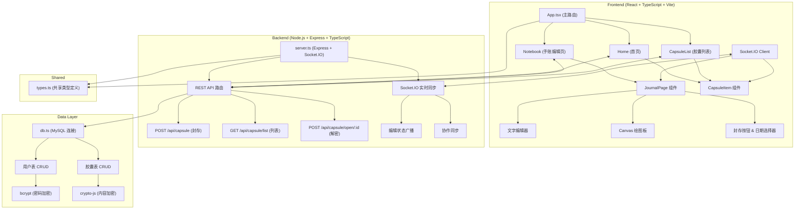
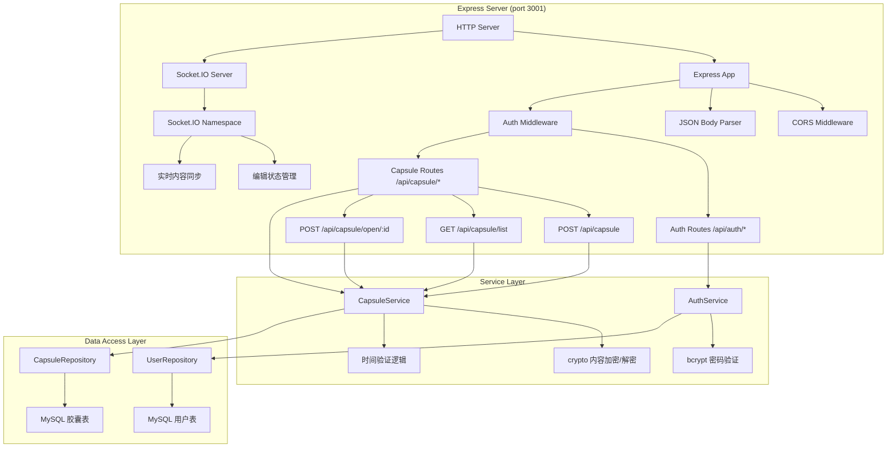
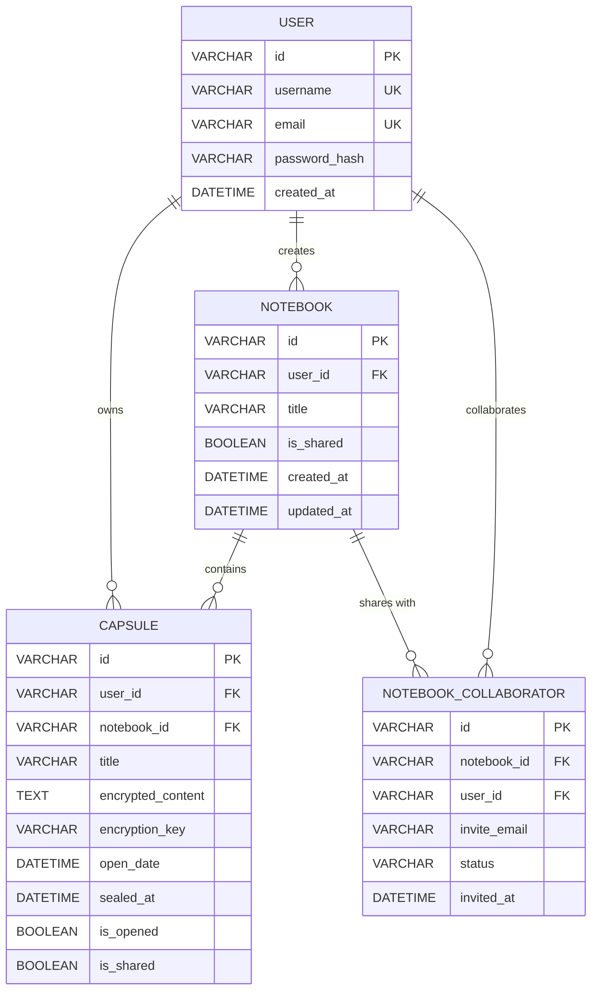

## 1. Architecture Design



## 2. Technology Description

- **Frontend**: React@18 + TypeScript@5 + Vite@5 + React Router DOM@6
- **后端**: Express@4 + TypeScript@5 + Socket.IO@4
- **数据库**: MySQL@8 (mysql2驱动)
- **实时通信**: Socket.IO Client + Socket.IO
- **加密**: crypto-js (前端内容加密预览)、bcrypt (密码哈希)、Node.js crypto (后端内容加密)
- **UI 组件**: react-datepicker (日期选择基础)、自定义Canvas绘图
- **初始化工具**: Vite 手动配置
- **构建工具**: Vite@5 + @vitejs/plugin-react
- **代理配置**: Vite proxy 代理后端到 localhost:3001

## 3. Route Definitions

| Route | Purpose |
|-------|---------|
| / | 首页 - 胶囊列表展示，登录入口 |
| /notebook/:id | 手账编辑页 - 双页布局，文字编辑+绘图 |
| /capsules | 胶囊列表页 - 所有封存胶囊展示 |
| /capsule/:id | 胶囊详情页 - 胶囊打开动画与内容展示 |

## 4. API Definitions

### TypeScript 类型定义

```typescript
// src/shared/types.ts
export interface User {
  id: string;
  username: string;
  email: string;
  passwordHash: string;
  createdAt: Date;
}

export interface PageContent {
  text: string;
  drawingData: DrawingStroke[];
  pageNumber: number;
}

export interface DrawingStroke {
  tool: 'pencil' | 'brush' | 'eraser';
  color: string;
  points: { x: number; y: number; pressure: number }[];
  timestamp: number;
}

export interface Capsule {
  id: string;
  userId: string;
  notebookId: string;
  title: string;
  encryptedContent: string;
  encryptionKey: string;
  openDate: Date;
  sealedAt: Date;
  isOpened: boolean;
  isShared: boolean;
  sharedWith: string[];
}

export enum EncryptionStatus {
  SEALED = 'sealed',
  UNSEALED = 'unsealed',
  EXPIRED = 'expired'
}

export interface EditingState {
  notebookId: string;
  pageNumber: number;
  userId: string;
  username: string;
  isEditing: boolean;
}
```

### API 请求/响应

**POST /api/auth/register**
- Request: `{ username: string; email: string; password: string }`
- Response: `{ success: boolean; user: Omit<User, 'passwordHash'>; token: string }`

**POST /api/auth/login**
- Request: `{ email: string; password: string }`
- Response: `{ success: boolean; user: Omit<User, 'passwordHash'>; token: string }`

**POST /api/capsule**
- Request: `{ notebookId: string; title: string; content: PageContent; openDate: string; sharedWith?: string[] }`
- Response: `{ success: boolean; capsule: Capsule }`

**GET /api/capsule/list**
- Response: `{ capsules: Capsule[] }`

**POST /api/capsule/open/:id**
- Request: `{}`
- Response: `{ success: boolean; content: PageContent; capsule: Capsule }`

**Socket.IO Events**
- `join-notebook`: `{ notebookId: string; userId: string }`
- `leave-notebook`: `{ notebookId: string; userId: string }`
- `editing-state`: `EditingState`
- `page-update`: `{ notebookId: string; pageNumber: number; content: Partial<PageContent> }`

## 5. Server Architecture Diagram



## 6. Data Model

### 6.1 Data Model Definition



### 6.2 Data Definition Language

```sql
-- 用户表
CREATE TABLE IF NOT EXISTS users (
  id VARCHAR(36) PRIMARY KEY,
  username VARCHAR(50) UNIQUE NOT NULL,
  email VARCHAR(255) UNIQUE NOT NULL,
  password_hash VARCHAR(255) NOT NULL,
  created_at DATETIME DEFAULT CURRENT_TIMESTAMP,
  INDEX idx_username (username),
  INDEX idx_email (email)
) ENGINE=InnoDB DEFAULT CHARSET=utf8mb4 COLLATE=utf8mb4_unicode_ci;

-- 手账表
CREATE TABLE IF NOT EXISTS notebooks (
  id VARCHAR(36) PRIMARY KEY,
  user_id VARCHAR(36) NOT NULL,
  title VARCHAR(255) NOT NULL DEFAULT '我的手账',
  is_shared BOOLEAN DEFAULT FALSE,
  created_at DATETIME DEFAULT CURRENT_TIMESTAMP,
  updated_at DATETIME DEFAULT CURRENT_TIMESTAMP ON UPDATE CURRENT_TIMESTAMP,
  FOREIGN KEY (user_id) REFERENCES users(id) ON DELETE CASCADE,
  INDEX idx_user_id (user_id)
) ENGINE=InnoDB DEFAULT CHARSET=utf8mb4 COLLATE=utf8mb4_unicode_ci;

-- 胶囊表
CREATE TABLE IF NOT EXISTS capsules (
  id VARCHAR(36) PRIMARY KEY,
  user_id VARCHAR(36) NOT NULL,
  notebook_id VARCHAR(36) NOT NULL,
  title VARCHAR(255) NOT NULL,
  encrypted_content TEXT NOT NULL,
  encryption_key VARCHAR(255) NOT NULL,
  open_date DATETIME NOT NULL,
  sealed_at DATETIME DEFAULT CURRENT_TIMESTAMP,
  is_opened BOOLEAN DEFAULT FALSE,
  is_shared BOOLEAN DEFAULT FALSE,
  FOREIGN KEY (user_id) REFERENCES users(id) ON DELETE CASCADE,
  FOREIGN KEY (notebook_id) REFERENCES notebooks(id) ON DELETE CASCADE,
  INDEX idx_user_id (user_id),
  INDEX idx_notebook_id (notebook_id),
  INDEX idx_open_date (open_date),
  INDEX idx_is_opened (is_opened)
) ENGINE=InnoDB DEFAULT CHARSET=utf8mb4 COLLATE=utf8mb4_unicode_ci;

-- 协作表
CREATE TABLE IF NOT EXISTS notebook_collaborators (
  id VARCHAR(36) PRIMARY KEY,
  notebook_id VARCHAR(36) NOT NULL,
  user_id VARCHAR(36),
  invite_email VARCHAR(255) NOT NULL,
  status ENUM('pending', 'accepted', 'declined') DEFAULT 'pending',
  invited_at DATETIME DEFAULT CURRENT_TIMESTAMP,
  FOREIGN KEY (notebook_id) REFERENCES notebooks(id) ON DELETE CASCADE,
  FOREIGN KEY (user_id) REFERENCES users(id) ON DELETE SET NULL,
  INDEX idx_notebook_id (notebook_id),
  INDEX idx_invite_email (invite_email),
  INDEX idx_status (status)
) ENGINE=InnoDB DEFAULT CHARSET=utf8mb4 COLLATE=utf8mb4_unicode_ci;
```
