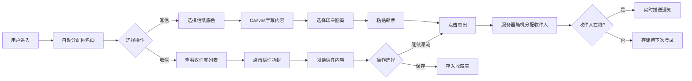

## 1. 产品概述

在线虚拟邮局与手写信件漂流平台，让用户在数字世界中体验复古邮局的温暖。用户可以撰写带有手写字体和印章的电子信件，随机漂流给陌生人，创造随机而温暖的社交体验。

- 核心目标：通过复古美学和随机连接，打造有温度的陌生人社交平台
- 目标用户：喜欢慢生活、手写文化、期待温暖邂逅的互联网用户
- 市场价值：在快节奏的即时通讯时代，提供一种慢节奏、有仪式感的沟通方式

## 2. 核心功能

### 2.1 用户角色
| 角色 | 注册方式 | 核心权限 |
|------|----------|----------|
| 普通用户 | 自动分配匿名ID | 写信、寄信、收信、保存信件、邮票收集 |

### 2.2 功能模块
1. **主界面**：仿木质柜台布局，顶部绿色搪瓷招牌，左侧写信区，右侧收件箱
2. **写信模块**：Canvas手写输入、信纸底色选择、印章盖印、邮票粘贴
3. **收信模块**：收件箱列表、信封拆封动画、信件内容逐行显现、继续漂流
4. **邮票收集册**：每日签到获取邮票、写信奖励邮票、邮票拖拽粘贴
5. **实时推送**：新信到达通知、在线用户信件即时送达

### 2.3 页面详情
| 页面名称 | 模块名称 | 功能描述 |
|---------|----------|----------|
| 主界面 | 顶部招牌 | 邮局标志性绿色搪瓷招牌，显示"时光邮局"字样 |
| 主界面 | 写信区 | 带有旧信纸暗纹的书写区域，支持Canvas手写、信纸切换、印章盖印 |
| 主界面 | 收件箱 | 信件列表，每封信以封套图标+日期显示，未读带红色蜡封圆点 |
| 主界面 | 邮票册 | 邮票收集展示区，支持拖拽粘贴到信件 |
| 信件阅读 | 拆封动画 | CSS clip-path实现蜡封碎裂效果，持续0.4秒 |
| 信件阅读 | 内容显现 | 手写字体逐行滑入，每行动画间隔0.15秒 |

## 3. 核心流程

用户进入应用后，自动分配匿名身份。可以选择撰写新手信或查看收件箱。写信时可选择信纸、手写内容、盖印章、贴邮票，点击寄出后信件随机分配给另一位在线用户。收件人可阅读、保存或继续漂流。

## 4. 用户界面设计

### 4.1 设计风格
- **主色调**：暖橡木色 #8b5e3c、奶油白 #fff8e7、邮局绿 #2d6a4f、朱红印章 #c0392b
- **背景**：浅色木纹纹理（CSS渐变 + box-shadow叠加模拟）
- **信纸暗纹**：repeating-linear-gradient模拟水印线条，间距4px，透明度0.15
- **字体**：Google Fonts - Caveat / Homemade Apple（手写体）
- **按钮风格**：复古木质按钮，带有立体感和轻微阴影
- **图标风格**：复古手绘风格，封套、邮票、邮戳等元素

### 4.2 页面设计概述
| 页面名称 | 模块名称 | UI元素 |
|---------|----------|--------|
| 主界面 | 顶部招牌 | 绿色搪瓷质感，白色复古字体，金属边框效果 |
| 主界面 | 木质柜台 | 左右分栏布局，木纹纹理背景，阴影营造立体感 |
| 写信区 | 信纸区域 | 可切换底色（米黄、浅粉、淡蓝、薄荷绿、灰色），暗纹水印 |
| 写信区 | 工具栏 | 颜色选择器、笔触粗细、印章选择、寄出按钮 |
| 收件箱 | 信件列表 | 封套图标悬停弹起1.2倍并旋转2度，未读带红色蜡封圆点 |
| 信件阅读 | 拆封效果 | 蜡封碎裂飞散，信纸缓缓展开 |
| 信件阅读 | 内容展示 | 手写字体逐行从左上角滑入 |
| 邮票册 | 邮票展示 | Canvas绘制锯齿边缘邮票，半透明邮戳文字 |

### 4.3 响应式
- 桌面端优先设计，左右分栏布局
- 移动端自适应为上下堆叠布局
- 触摸设备优化手写输入体验

### 4.4 动画规范
| 动画 | 时长 | 缓动函数 | 说明 |
|------|------|----------|------|
| 信封悬停 | 0.2s | ease-out | 弹起1.2倍 + 旋转2度 |
| 印章盖印 | 0.3s | ease-out | 缩放动画 |
| 信封拆封 | 0.4s | ease-out | clip-path碎片飞散 |
| 文字显现 | 每行0.15s间隔 | ease-in | 逐行滑入 |
| 邮票粘贴 | 0.2s | ease-out | 放大1.2倍后恢复 |
| 粘贴音效 | 0.1s | - | Web Audio API生成短促哒声 |

## 5. 性能要求
- 页面交互流畅，动画帧率不低于50fps
- 投信-收信全过程延迟不超过2秒（局域网环境）
- Canvas手写响应延迟低于50ms
- 初始加载时间控制在3秒内
